# Projects and dependencies analysis

This document provides a comprehensive overview of the projects and their dependencies in the context of upgrading to .NET 9.0.

## Table of Contents

- [Projects Relationship Graph](#projects-relationship-graph)
- [Project Details](#project-details)

  - [Application.Contracts\Application.Contracts.csproj](#applicationcontractsapplicationcontractscsproj)
  - [Application.MessageHandlers\Application.MessageHandlers.csproj](#applicationmessagehandlersapplicationmessagehandlerscsproj)
  - [Application.Services\Application.Services.csproj](#applicationservicesapplicationservicescsproj)
  - [Aspire\AppHost\SampleApp.AppHost.csproj](#aspireapphostsampleappapphostcsproj)
  - [Aspire\ServiceDefaults\SampleApp.ServiceDefaults.csproj](#aspireservicedefaultssampleappservicedefaultscsproj)
  - [Domain.Model\Domain.Model.csproj](#domainmodeldomainmodelcsproj)
  - [Domain.Rules\Domain.Rules.csproj](#domainrulesdomainrulescsproj)
  - [Domain.Shared\Domain.Shared.csproj](#domainshareddomainsharedcsproj)
  - [Functions\Functions.csproj](#functionsfunctionscsproj)
  - [Infrastructure.Configuration\Infrastructure.Configuration.csproj](#infrastructureconfigurationinfrastructureconfigurationcsproj)
  - [Infrastructure.Data\Infrastructure.Data.csproj](#infrastructuredatainfrastructuredatacsproj)
  - [Infrastructure.JobsApi\Infrastructure.JobsApi.csproj](#infrastructurejobsapiinfrastructurejobsapicsproj)
  - [Infrastructure.MSGraphB2C\Infrastructure.MSGraphB2C.csproj](#infrastructuremsgraphb2cinfrastructuremsgraphb2ccsproj)
  - [Infrastructure.RapidApi\Infrastructure.RapidApi.csproj](#infrastructurerapidapiinfrastructurerapidapicsproj)
  - [Infrastructure.Repositories\Infrastructure.Repositories.csproj](#infrastructurerepositoriesinfrastructurerepositoriescsproj)
  - [Infrastructure.SampleApi\Infrastructure.SampleApi.csproj](#infrastructuresampleapiinfrastructuresampleapicsproj)
  - [Package\Package.Infrastructure.AspNetCore\Package.Infrastructure.AspNetCore.csproj](#packagepackageinfrastructureaspnetcorepackageinfrastructureaspnetcorecsproj)
  - [Package\Package.Infrastructure.Auth\Package.Infrastructure.Auth.csproj](#packagepackageinfrastructureauthpackageinfrastructureauthcsproj)
  - [Package\Package.Infrastructure.AzureOpenAI\Package.Infrastructure.AzureOpenAI.csproj](#packagepackageinfrastructureazureopenaipackageinfrastructureazureopenaicsproj)
  - [Package\Package.Infrastructure.BackgroundService\Package.Infrastructure.BackgroundServices.csproj](#packagepackageinfrastructurebackgroundservicepackageinfrastructurebackgroundservicescsproj)
  - [Package\Package.Infrastructure.BlandAI\Package.Infrastructure.BlandAI.csproj](#packagepackageinfrastructureblandaipackageinfrastructureblandaicsproj)
  - [Package\Package.Infrastructure.Cache\Package.Infrastructure.Cache.csproj](#packagepackageinfrastructurecachepackageinfrastructurecachecsproj)
  - [Package\Package.Infrastructure.Common.Contracts\Package.Infrastructure.Common.Contracts.csproj](#packagepackageinfrastructurecommoncontractspackageinfrastructurecommoncontractscsproj)
  - [Package\Package.Infrastructure.Common\Package.Infrastructure.Common.csproj](#packagepackageinfrastructurecommonpackageinfrastructurecommoncsproj)
  - [Package\Package.Infrastructure.CosmosDb\Package.Infrastructure.CosmosDb.csproj](#packagepackageinfrastructurecosmosdbpackageinfrastructurecosmosdbcsproj)
  - [Package\Package.Infrastructure.Data.Contracts\Package.Infrastructure.Data.Contracts.csproj](#packagepackageinfrastructuredatacontractspackageinfrastructuredatacontractscsproj)
  - [Package\Package.Infrastructure.Data\Package.Infrastructure.Data.csproj](#packagepackageinfrastructuredatapackageinfrastructuredatacsproj)
  - [Package\Package.Infrastructure.Domain\Package.Infrastructure.Domain.csproj](#packagepackageinfrastructuredomainpackageinfrastructuredomaincsproj)
  - [Package\Package.Infrastructure.Grpc\Package.Infrastructure.Grpc.csproj](#packagepackageinfrastructuregrpcpackageinfrastructuregrpccsproj)
  - [Package\Package.Infrastructure.Host\Package.Infrastructure.Host.csproj](#packagepackageinfrastructurehostpackageinfrastructurehostcsproj)
  - [Package\Package.Infrastructure.KeyVault\Package.Infrastructure.KeyVault.csproj](#packagepackageinfrastructurekeyvaultpackageinfrastructurekeyvaultcsproj)
  - [Package\Package.Infrastructure.Messaging\Package.Infrastructure.Messaging.csproj](#packagepackageinfrastructuremessagingpackageinfrastructuremessagingcsproj)
  - [Package\Package.Infrastructure.MSGraph\Package.Infrastructure.MSGraph.csproj](#packagepackageinfrastructuremsgraphpackageinfrastructuremsgraphcsproj)
  - [Package\Package.Infrastructure.OpenAI\Package.Infrastructure.OpenAI.csproj](#packagepackageinfrastructureopenaipackageinfrastructureopenaicsproj)
  - [Package\Package.Infrastructure.Storage\Package.Infrastructure.Storage.csproj](#packagepackageinfrastructurestoragepackageinfrastructurestoragecsproj)
  - [Package\Package.Infrastructure.Table\Package.Infrastructure.Table.csproj](#packagepackageinfrastructuretablepackageinfrastructuretablecsproj)
  - [Package\Package.Infrastructure.Test.Benchmarks\Package.Infrastructure.Test.Benchmarks.csproj](#packagepackageinfrastructuretestbenchmarkspackageinfrastructuretestbenchmarkscsproj)
  - [Package\Package.Infrastructure.Test.Integration\Package.Infrastructure.Test.Integration.csproj](#packagepackageinfrastructuretestintegrationpackageinfrastructuretestintegrationcsproj)
  - [Package\Package.Infrastructure.Test.Unit\Package.Infrastructure.Test.Unit.csproj](#packagepackageinfrastructuretestunitpackageinfrastructuretestunitcsproj)
  - [Package\Package.Infrastructure.Utility.UI\Package.Infrastructure.Utility.UI.csproj](#packagepackageinfrastructureutilityuipackageinfrastructureutilityuicsproj)
  - [Package\Package.Infrastructure.Utility\Package.Infrastructure.Utility.csproj](#packagepackageinfrastructureutilitypackageinfrastructureutilitycsproj)
  - [Play\Console.AI1\Console.AI1.csproj](#playconsoleai1consoleai1csproj)
  - [SampleApp.Api\SampleApp.Api.csproj](#sampleappapisampleappapicsproj)
  - [SampleApp.BackgroundServices\SampleApp.BackgroundServices.csproj](#sampleappbackgroundservicessampleappbackgroundservicescsproj)
  - [SampleApp.Bootstrapper\SampleApp.Bootstrapper.csproj](#sampleappbootstrappersampleappbootstrappercsproj)
  - [SampleApp.Gateway\SampleApp.Gateway.csproj](#sampleappgatewaysampleappgatewaycsproj)
  - [SampleApp.Grpc\SampleApp.Grpc.csproj](#sampleappgrpcsampleappgrpccsproj)
  - [SampleApp.Support\SampleApp.Support.csproj](#sampleappsupportsampleappsupportcsproj)
  - [SampleApp.UI1\SampleApp.UI1.csproj](#sampleappui1sampleappui1csproj)
  - [Test.Architecture\Test.Architecture.csproj](#testarchitecturetestarchitecturecsproj)
  - [Test.Benchmarks\Test.Benchmarks.csproj](#testbenchmarkstestbenchmarkscsproj)
  - [Test.Console\Test.Console.csproj](#testconsoletestconsolecsproj)
  - [Test.Endpoints\Test.Endpoints.csproj](#testendpointstestendpointscsproj)
  - [Test.Integration\Test.Integration.csproj](#testintegrationtestintegrationcsproj)
  - [Test.Load\Test.Load.csproj](#testloadtestloadcsproj)
  - [Test.PlaywrightUI\Test.PlaywrightUI.csproj](#testplaywrightuitestplaywrightuicsproj)
  - [Test.SeleniumUI\Test.SeleniumUI.csproj](#testseleniumuitestseleniumuicsproj)
  - [Test.Support\Test.Support.csproj](#testsupporttestsupportcsproj)
  - [Test.Unit\Test.Unit.csproj](#testunittestunitcsproj)
  - [Worker.Scheduler\Worker.Scheduler.csproj](#workerschedulerworkerschedulercsproj)
- [Aggregate NuGet packages details](#aggregate-nuget-packages-details)


## Projects Relationship Graph

Legend:
📦 SDK-style project
⚙️ Classic project

```mermaid
flowchart LR
    P1["<b>📦&nbsp;SampleApp.Api.csproj</b><br/><small>net9.0</small>"]
    P2["<b>📦&nbsp;Application.Services.csproj</b><br/><small>net9.0</small>"]
    P3["<b>📦&nbsp;Domain.Model.csproj</b><br/><small>net9.0</small>"]
    P4["<b>📦&nbsp;Infrastructure.Data.csproj</b><br/><small>net9.0</small>"]
    P5["<b>📦&nbsp;Infrastructure.Repositories.csproj</b><br/><small>net9.0</small>"]
    P6["<b>📦&nbsp;Test.Unit.csproj</b><br/><small>net9.0</small>"]
    P7["<b>📦&nbsp;Test.Integration.csproj</b><br/><small>net9.0</small>"]
    P8["<b>📦&nbsp;Test.Endpoints.csproj</b><br/><small>net9.0</small>"]
    P9["<b>📦&nbsp;SampleApp.Bootstrapper.csproj</b><br/><small>net9.0</small>"]
    P10["<b>📦&nbsp;Domain.Rules.csproj</b><br/><small>net9.0</small>"]
    P11["<b>📦&nbsp;Application.Contracts.csproj</b><br/><small>net9.0</small>"]
    P12["<b>📦&nbsp;Domain.Shared.csproj</b><br/><small>net9.0</small>"]
    P13["<b>📦&nbsp;Package.Infrastructure.Data.csproj</b><br/><small>net9.0</small>"]
    P14["<b>📦&nbsp;Package.Infrastructure.BackgroundServices.csproj</b><br/><small>net9.0</small>"]
    P15["<b>📦&nbsp;Package.Infrastructure.Test.Integration.csproj</b><br/><small>net9.0</small>"]
    P16["<b>📦&nbsp;Package.Infrastructure.Test.Unit.csproj</b><br/><small>net9.0</small>"]
    P17["<b>📦&nbsp;Test.Support.csproj</b><br/><small>net9.0</small>"]
    P18["<b>📦&nbsp;Test.Load.csproj</b><br/><small>net9.0</small>"]
    P19["<b>📦&nbsp;Test.Benchmarks.csproj</b><br/><small>net9.0</small>"]
    P20["<b>📦&nbsp;Package.Infrastructure.Common.csproj</b><br/><small>net9.0</small>"]
    P21["<b>📦&nbsp;Package.Infrastructure.Data.Contracts.csproj</b><br/><small>net9.0</small>"]
    P22["<b>📦&nbsp;Package.Infrastructure.Auth.csproj</b><br/><small>net9.0</small>"]
    P23["<b>📦&nbsp;Infrastructure.RapidApi.csproj</b><br/><small>net9.0</small>"]
    P24["<b>📦&nbsp;SampleApp.BackgroundServices.csproj</b><br/><small>net9.0</small>"]
    P25["<b>📦&nbsp;Worker.Scheduler.csproj</b><br/><small>net9.0</small>"]
    P26["<b>📦&nbsp;SampleApp.Grpc.csproj</b><br/><small>net9.0</small>"]
    P27["<b>📦&nbsp;Test.Console.csproj</b><br/><small>net9.0</small>"]
    P28["<b>📦&nbsp;Package.Infrastructure.AspNetCore.csproj</b><br/><small>net9.0</small>"]
    P29["<b>📦&nbsp;Package.Infrastructure.CosmosDb.csproj</b><br/><small>net9.0</small>"]
    P30["<b>📦&nbsp;Package.Infrastructure.Grpc.csproj</b><br/><small>net9.0</small>"]
    P31["<b>📦&nbsp;Package.Infrastructure.Storage.csproj</b><br/><small>net9.0</small>"]
    P32["<b>📦&nbsp;Infrastructure.SampleApi.csproj</b><br/><small>net9.0</small>"]
    P33["<b>📦&nbsp;Package.Infrastructure.Messaging.csproj</b><br/><small>net9.0</small>"]
    P34["<b>📦&nbsp;Package.Infrastructure.Table.csproj</b><br/><small>net9.0</small>"]
    P35["<b>📦&nbsp;Package.Infrastructure.KeyVault.csproj</b><br/><small>net9.0</small>"]
    P36["<b>📦&nbsp;Infrastructure.Configuration.csproj</b><br/><small>net9.0</small>"]
    P37["<b>📦&nbsp;Test.Architecture.csproj</b><br/><small>net9.0</small>"]
    P38["<b>📦&nbsp;Package.Infrastructure.Common.Contracts.csproj</b><br/><small>net9.0</small>"]
    P39["<b>📦&nbsp;Test.PlaywrightUI.csproj</b><br/><small>net9.0</small>"]
    P40["<b>📦&nbsp;Test.SeleniumUI.csproj</b><br/><small>net9.0</small>"]
    P41["<b>📦&nbsp;SampleApp.Support.csproj</b><br/><small>net9.0</small>"]
    P42["<b>📦&nbsp;Functions.csproj</b><br/><small>net9.0</small>"]
    P43["<b>📦&nbsp;Package.Infrastructure.Host.csproj</b><br/><small>net9.0</small>"]
    P44["<b>📦&nbsp;Package.Infrastructure.Cache.csproj</b><br/><small>net9.0</small>"]
    P45["<b>📦&nbsp;Application.MessageHandlers.csproj</b><br/><small>net9.0</small>"]
    P46["<b>📦&nbsp;Package.Infrastructure.OpenAI.csproj</b><br/><small>net9.0</small>"]
    P47["<b>📦&nbsp;Package.Infrastructure.AzureOpenAI.csproj</b><br/><small>net9.0</small>"]
    P48["<b>📦&nbsp;Infrastructure.JobsApi.csproj</b><br/><small>net9.0</small>"]
    P49["<b>📦&nbsp;Package.Infrastructure.Utility.csproj</b><br/><small>net9.0</small>"]
    P50["<b>📦&nbsp;Package.Infrastructure.BlandAI.csproj</b><br/><small>net9.0</small>"]
    P51["<b>📦&nbsp;Console.AI1.csproj</b><br/><small>net9.0</small>"]
    P52["<b>📦&nbsp;SampleApp.Gateway.csproj</b><br/><small>net9.0</small>"]
    P53["<b>📦&nbsp;SampleApp.UI1.csproj</b><br/><small>net9.0</small>"]
    P54["<b>📦&nbsp;Package.Infrastructure.Utility.UI.csproj</b><br/><small>net9.0</small>"]
    P55["<b>📦&nbsp;SampleApp.ServiceDefaults.csproj</b><br/><small>net9.0</small>"]
    P56["<b>📦&nbsp;SampleApp.AppHost.csproj</b><br/><small>net9.0</small>"]
    P57["<b>📦&nbsp;Package.Infrastructure.Test.Benchmarks.csproj</b><br/><small>net9.0</small>"]
    P58["<b>📦&nbsp;Package.Infrastructure.MSGraph.csproj</b><br/><small>net9.0</small>"]
    P59["<b>📦&nbsp;Infrastructure.MSGraphB2C.csproj</b><br/><small>net9.0</small>"]
    P60["<b>📦&nbsp;Package.Infrastructure.Domain.csproj</b><br/><small>net9.0</small>"]
    P1 --> P28
    P1 --> P26
    P1 --> P9
    P1 --> P11
    P1 --> P43
    P1 --> P30
    P1 --> P55
    P1 --> P38
    P1 --> P41
    P2 --> P3
    P2 --> P5
    P2 --> P11
    P2 --> P47
    P2 --> P10
    P2 --> P14
    P2 --> P48
    P2 --> P12
    P2 --> P32
    P2 --> P59
    P3 --> P60
    P3 --> P12
    P4 --> P3
    P4 --> P13
    P4 --> P14
    P5 --> P3
    P5 --> P4
    P5 --> P20
    P5 --> P11
    P5 --> P13
    P6 --> P20
    P6 --> P9
    P6 --> P17
    P6 --> P10
    P6 --> P2
    P6 --> P41
    P7 --> P20
    P7 --> P9
    P7 --> P17
    P7 --> P23
    P7 --> P47
    P8 --> P3
    P8 --> P4
    P8 --> P17
    P8 --> P1
    P8 --> P22
    P9 --> P28
    P9 --> P4
    P9 --> P26
    P9 --> P36
    P9 --> P33
    P9 --> P31
    P9 --> P23
    P9 --> P11
    P9 --> P45
    P9 --> P14
    P9 --> P48
    P9 --> P32
    P9 --> P2
    P9 --> P24
    P9 --> P44
    P9 --> P50
    P10 --> P3
    P10 --> P20
    P11 --> P3
    P11 --> P21
    P11 --> P12
    P11 --> P38
    P13 --> P21
    P13 --> P20
    P13 --> P60
    P13 --> P14
    P14 --> P38
    P15 --> P47
    P15 --> P35
    P15 --> P23
    P15 --> P20
    P15 --> P31
    P15 --> P33
    P15 --> P58
    P15 --> P44
    P15 --> P46
    P15 --> P14
    P15 --> P29
    P15 --> P34
    P16 --> P20
    P17 --> P3
    P17 --> P4
    P17 --> P20
    P17 --> P9
    P17 --> P13
    P17 --> P47
    P17 --> P44
    P18 --> P17
    P18 --> P11
    P19 --> P9
    P19 --> P17
    P19 --> P41
    P20 --> P60
    P20 --> P38
    P21 --> P60
    P21 --> P38
    P23 --> P20
    P23 --> P11
    P24 --> P11
    P24 --> P14
    P25 --> P9
    P25 --> P24
    P26 --> P20
    P26 --> P11
    P27 --> P26
    P27 --> P20
    P27 --> P17
    P27 --> P11
    P27 --> P30
    P29 --> P21
    P31 --> P20
    P32 --> P20
    P32 --> P11
    P32 --> P22
    P34 --> P20
    P36 --> P4
    P37 --> P3
    P37 --> P1
    P37 --> P10
    P37 --> P12
    P37 --> P2
    P40 --> P17
    P41 --> P11
    P42 --> P9
    P42 --> P43
    P44 --> P20
    P45 --> P11
    P45 --> P14
    P47 --> P44
    P48 --> P20
    P50 --> P20
    P51 --> P20
    P52 --> P28
    P52 --> P20
    P52 --> P43
    P52 --> P22
    P52 --> P55
    P53 --> P54
    P53 --> P38
    P56 --> P53
    P56 --> P1
    P56 --> P52
    P57 --> P14
    P59 --> P58
    click P1 "#sampleappapisampleappapicsproj"
    click P2 "#applicationservicesapplicationservicescsproj"
    click P3 "#domainmodeldomainmodelcsproj"
    click P4 "#infrastructuredatainfrastructuredatacsproj"
    click P5 "#infrastructurerepositoriesinfrastructurerepositoriescsproj"
    click P6 "#testunittestunitcsproj"
    click P7 "#testintegrationtestintegrationcsproj"
    click P8 "#testendpointstestendpointscsproj"
    click P9 "#sampleappbootstrappersampleappbootstrappercsproj"
    click P10 "#domainrulesdomainrulescsproj"
    click P11 "#applicationcontractsapplicationcontractscsproj"
    click P12 "#domainshareddomainsharedcsproj"
    click P13 "#packagepackageinfrastructuredatapackageinfrastructuredatacsproj"
    click P14 "#packagepackageinfrastructurebackgroundservicepackageinfrastructurebackgroundservicescsproj"
    click P15 "#packagepackageinfrastructuretestintegrationpackageinfrastructuretestintegrationcsproj"
    click P16 "#packagepackageinfrastructuretestunitpackageinfrastructuretestunitcsproj"
    click P17 "#testsupporttestsupportcsproj"
    click P18 "#testloadtestloadcsproj"
    click P19 "#testbenchmarkstestbenchmarkscsproj"
    click P20 "#packagepackageinfrastructurecommonpackageinfrastructurecommoncsproj"
    click P21 "#packagepackageinfrastructuredatacontractspackageinfrastructuredatacontractscsproj"
    click P22 "#packagepackageinfrastructureauthpackageinfrastructureauthcsproj"
    click P23 "#infrastructurerapidapiinfrastructurerapidapicsproj"
    click P24 "#sampleappbackgroundservicessampleappbackgroundservicescsproj"
    click P25 "#workerschedulerworkerschedulercsproj"
    click P26 "#sampleappgrpcsampleappgrpccsproj"
    click P27 "#testconsoletestconsolecsproj"
    click P28 "#packagepackageinfrastructureaspnetcorepackageinfrastructureaspnetcorecsproj"
    click P29 "#packagepackageinfrastructurecosmosdbpackageinfrastructurecosmosdbcsproj"
    click P30 "#packagepackageinfrastructuregrpcpackageinfrastructuregrpccsproj"
    click P31 "#packagepackageinfrastructurestoragepackageinfrastructurestoragecsproj"
    click P32 "#infrastructuresampleapiinfrastructuresampleapicsproj"
    click P33 "#packagepackageinfrastructuremessagingpackageinfrastructuremessagingcsproj"
    click P34 "#packagepackageinfrastructuretablepackageinfrastructuretablecsproj"
    click P35 "#packagepackageinfrastructurekeyvaultpackageinfrastructurekeyvaultcsproj"
    click P36 "#infrastructureconfigurationinfrastructureconfigurationcsproj"
    click P37 "#testarchitecturetestarchitecturecsproj"
    click P38 "#packagepackageinfrastructurecommoncontractspackageinfrastructurecommoncontractscsproj"
    click P39 "#testplaywrightuitestplaywrightuicsproj"
    click P40 "#testseleniumuitestseleniumuicsproj"
    click P41 "#sampleappsupportsampleappsupportcsproj"
    click P42 "#functionsfunctionscsproj"
    click P43 "#packagepackageinfrastructurehostpackageinfrastructurehostcsproj"
    click P44 "#packagepackageinfrastructurecachepackageinfrastructurecachecsproj"
    click P45 "#applicationmessagehandlersapplicationmessagehandlerscsproj"
    click P46 "#packagepackageinfrastructureopenaipackageinfrastructureopenaicsproj"
    click P47 "#packagepackageinfrastructureazureopenaipackageinfrastructureazureopenaicsproj"
    click P48 "#infrastructurejobsapiinfrastructurejobsapicsproj"
    click P49 "#packagepackageinfrastructureutilitypackageinfrastructureutilitycsproj"
    click P50 "#packagepackageinfrastructureblandaipackageinfrastructureblandaicsproj"
    click P51 "#playconsoleai1consoleai1csproj"
    click P52 "#sampleappgatewaysampleappgatewaycsproj"
    click P53 "#sampleappui1sampleappui1csproj"
    click P54 "#packagepackageinfrastructureutilityuipackageinfrastructureutilityuicsproj"
    click P55 "#aspireservicedefaultssampleappservicedefaultscsproj"
    click P56 "#aspireapphostsampleappapphostcsproj"
    click P57 "#packagepackageinfrastructuretestbenchmarkspackageinfrastructuretestbenchmarkscsproj"
    click P58 "#packagepackageinfrastructuremsgraphpackageinfrastructuremsgraphcsproj"
    click P59 "#infrastructuremsgraphb2cinfrastructuremsgraphb2ccsproj"
    click P60 "#packagepackageinfrastructuredomainpackageinfrastructuredomaincsproj"

```

## Project Details

<a id="applicationcontractsapplicationcontractscsproj"></a>
### Application.Contracts\Application.Contracts.csproj

#### Project Info

- **Current Target Framework:** net9.0
- **Proposed Target Framework:** net10.0
- **SDK-style**: True
- **Project Kind:** ClassLibrary
- **Dependencies**: 4
- **Dependants**: 12
- **Number of Files**: 19
- **Lines of Code**: 527

#### Dependency Graph

Legend:
📦 SDK-style project
⚙️ Classic project

```mermaid
flowchart TB
    subgraph upstream["Dependants (12)"]
        P1["<b>📦&nbsp;SampleApp.Api.csproj</b><br/><small>net9.0</small>"]
        P2["<b>📦&nbsp;Application.Services.csproj</b><br/><small>net9.0</small>"]
        P5["<b>📦&nbsp;Infrastructure.Repositories.csproj</b><br/><small>net9.0</small>"]
        P9["<b>📦&nbsp;SampleApp.Bootstrapper.csproj</b><br/><small>net9.0</small>"]
        P18["<b>📦&nbsp;Test.Load.csproj</b><br/><small>net9.0</small>"]
        P23["<b>📦&nbsp;Infrastructure.RapidApi.csproj</b><br/><small>net9.0</small>"]
        P24["<b>📦&nbsp;SampleApp.BackgroundServices.csproj</b><br/><small>net9.0</small>"]
        P26["<b>📦&nbsp;SampleApp.Grpc.csproj</b><br/><small>net9.0</small>"]
        P27["<b>📦&nbsp;Test.Console.csproj</b><br/><small>net9.0</small>"]
        P32["<b>📦&nbsp;Infrastructure.SampleApi.csproj</b><br/><small>net9.0</small>"]
        P41["<b>📦&nbsp;SampleApp.Support.csproj</b><br/><small>net9.0</small>"]
        P45["<b>📦&nbsp;Application.MessageHandlers.csproj</b><br/><small>net9.0</small>"]
        click P1 "#sampleappapisampleappapicsproj"
        click P2 "#applicationservicesapplicationservicescsproj"
        click P5 "#infrastructurerepositoriesinfrastructurerepositoriescsproj"
        click P9 "#sampleappbootstrappersampleappbootstrappercsproj"
        click P18 "#testloadtestloadcsproj"
        click P23 "#infrastructurerapidapiinfrastructurerapidapicsproj"
        click P24 "#sampleappbackgroundservicessampleappbackgroundservicescsproj"
        click P26 "#sampleappgrpcsampleappgrpccsproj"
        click P27 "#testconsoletestconsolecsproj"
        click P32 "#infrastructuresampleapiinfrastructuresampleapicsproj"
        click P41 "#sampleappsupportsampleappsupportcsproj"
        click P45 "#applicationmessagehandlersapplicationmessagehandlerscsproj"
    end
    subgraph current["Application.Contracts.csproj"]
        MAIN["<b>📦&nbsp;Application.Contracts.csproj</b><br/><small>net9.0</small>"]
        click MAIN "#applicationcontractsapplicationcontractscsproj"
    end
    subgraph downstream["Dependencies (4"]
        P3["<b>📦&nbsp;Domain.Model.csproj</b><br/><small>net9.0</small>"]
        P21["<b>📦&nbsp;Package.Infrastructure.Data.Contracts.csproj</b><br/><small>net9.0</small>"]
        P12["<b>📦&nbsp;Domain.Shared.csproj</b><br/><small>net9.0</small>"]
        P38["<b>📦&nbsp;Package.Infrastructure.Common.Contracts.csproj</b><br/><small>net9.0</small>"]
        click P3 "#domainmodeldomainmodelcsproj"
        click P21 "#packagepackageinfrastructuredatacontractspackageinfrastructuredatacontractscsproj"
        click P12 "#domainshareddomainsharedcsproj"
        click P38 "#packagepackageinfrastructurecommoncontractspackageinfrastructurecommoncontractscsproj"
    end
    P1 --> MAIN
    P2 --> MAIN
    P5 --> MAIN
    P9 --> MAIN
    P18 --> MAIN
    P23 --> MAIN
    P24 --> MAIN
    P26 --> MAIN
    P27 --> MAIN
    P32 --> MAIN
    P41 --> MAIN
    P45 --> MAIN
    MAIN --> P3
    MAIN --> P21
    MAIN --> P12
    MAIN --> P38

```

#### Project Package References

| Package | Type | Current Version | Suggested Version | Description |
| :--- | :---: | :---: | :---: | :--- |

<a id="applicationmessagehandlersapplicationmessagehandlerscsproj"></a>
### Application.MessageHandlers\Application.MessageHandlers.csproj

#### Project Info

- **Current Target Framework:** net9.0
- **Proposed Target Framework:** net10.0
- **SDK-style**: True
- **Project Kind:** ClassLibrary
- **Dependencies**: 2
- **Dependants**: 1
- **Number of Files**: 2
- **Lines of Code**: 30

#### Dependency Graph

Legend:
📦 SDK-style project
⚙️ Classic project

```mermaid
flowchart TB
    subgraph upstream["Dependants (1)"]
        P9["<b>📦&nbsp;SampleApp.Bootstrapper.csproj</b><br/><small>net9.0</small>"]
        click P9 "#sampleappbootstrappersampleappbootstrappercsproj"
    end
    subgraph current["Application.MessageHandlers.csproj"]
        MAIN["<b>📦&nbsp;Application.MessageHandlers.csproj</b><br/><small>net9.0</small>"]
        click MAIN "#applicationmessagehandlersapplicationmessagehandlerscsproj"
    end
    subgraph downstream["Dependencies (2"]
        P11["<b>📦&nbsp;Application.Contracts.csproj</b><br/><small>net9.0</small>"]
        P14["<b>📦&nbsp;Package.Infrastructure.BackgroundServices.csproj</b><br/><small>net9.0</small>"]
        click P11 "#applicationcontractsapplicationcontractscsproj"
        click P14 "#packagepackageinfrastructurebackgroundservicepackageinfrastructurebackgroundservicescsproj"
    end
    P9 --> MAIN
    MAIN --> P11
    MAIN --> P14

```

#### Project Package References

| Package | Type | Current Version | Suggested Version | Description |
| :--- | :---: | :---: | :---: | :--- |

<a id="applicationservicesapplicationservicescsproj"></a>
### Application.Services\Application.Services.csproj

#### Project Info

- **Current Target Framework:** net9.0
- **Proposed Target Framework:** net10.0
- **SDK-style**: True
- **Project Kind:** ClassLibrary
- **Dependencies**: 10
- **Dependants**: 3
- **Number of Files**: 23
- **Lines of Code**: 1110

#### Dependency Graph

Legend:
📦 SDK-style project
⚙️ Classic project

```mermaid
flowchart TB
    subgraph upstream["Dependants (3)"]
        P6["<b>📦&nbsp;Test.Unit.csproj</b><br/><small>net9.0</small>"]
        P9["<b>📦&nbsp;SampleApp.Bootstrapper.csproj</b><br/><small>net9.0</small>"]
        P37["<b>📦&nbsp;Test.Architecture.csproj</b><br/><small>net9.0</small>"]
        click P6 "#testunittestunitcsproj"
        click P9 "#sampleappbootstrappersampleappbootstrappercsproj"
        click P37 "#testarchitecturetestarchitecturecsproj"
    end
    subgraph current["Application.Services.csproj"]
        MAIN["<b>📦&nbsp;Application.Services.csproj</b><br/><small>net9.0</small>"]
        click MAIN "#applicationservicesapplicationservicescsproj"
    end
    subgraph downstream["Dependencies (10"]
        P3["<b>📦&nbsp;Domain.Model.csproj</b><br/><small>net9.0</small>"]
        P5["<b>📦&nbsp;Infrastructure.Repositories.csproj</b><br/><small>net9.0</small>"]
        P11["<b>📦&nbsp;Application.Contracts.csproj</b><br/><small>net9.0</small>"]
        P47["<b>📦&nbsp;Package.Infrastructure.AzureOpenAI.csproj</b><br/><small>net9.0</small>"]
        P10["<b>📦&nbsp;Domain.Rules.csproj</b><br/><small>net9.0</small>"]
        P14["<b>📦&nbsp;Package.Infrastructure.BackgroundServices.csproj</b><br/><small>net9.0</small>"]
        P48["<b>📦&nbsp;Infrastructure.JobsApi.csproj</b><br/><small>net9.0</small>"]
        P12["<b>📦&nbsp;Domain.Shared.csproj</b><br/><small>net9.0</small>"]
        P32["<b>📦&nbsp;Infrastructure.SampleApi.csproj</b><br/><small>net9.0</small>"]
        P59["<b>📦&nbsp;Infrastructure.MSGraphB2C.csproj</b><br/><small>net9.0</small>"]
        click P3 "#domainmodeldomainmodelcsproj"
        click P5 "#infrastructurerepositoriesinfrastructurerepositoriescsproj"
        click P11 "#applicationcontractsapplicationcontractscsproj"
        click P47 "#packagepackageinfrastructureazureopenaipackageinfrastructureazureopenaicsproj"
        click P10 "#domainrulesdomainrulescsproj"
        click P14 "#packagepackageinfrastructurebackgroundservicepackageinfrastructurebackgroundservicescsproj"
        click P48 "#infrastructurejobsapiinfrastructurejobsapicsproj"
        click P12 "#domainshareddomainsharedcsproj"
        click P32 "#infrastructuresampleapiinfrastructuresampleapicsproj"
        click P59 "#infrastructuremsgraphb2cinfrastructuremsgraphb2ccsproj"
    end
    P6 --> MAIN
    P9 --> MAIN
    P37 --> MAIN
    MAIN --> P3
    MAIN --> P5
    MAIN --> P11
    MAIN --> P47
    MAIN --> P10
    MAIN --> P14
    MAIN --> P48
    MAIN --> P12
    MAIN --> P32
    MAIN --> P59

```

#### Project Package References

| Package | Type | Current Version | Suggested Version | Description |
| :--- | :---: | :---: | :---: | :--- |
| FluentValidation | Explicit | 12.1.0 |  | ✅Compatible |
| Microsoft.Extensions.Logging.Abstractions | Explicit | 9.0.10 | 10.0.0 | NuGet package upgrade is recommended |
| Microsoft.KernelMemory.AI.AzureOpenAI | Explicit | 0.98.250508.3 |  | ✅Compatible |
| Microsoft.KernelMemory.Core | Explicit | 0.98.250508.3 |  | ✅Compatible |
| Microsoft.KernelMemory.SemanticKernelPlugin | Explicit | 0.98.250508.3 |  | ✅Compatible |
| Microsoft.SemanticKernel.Connectors.AzureOpenAI | Explicit | 1.67.1 |  | ✅Compatible |
| Microsoft.SemanticKernel.Core | Explicit | 1.67.1 |  | ✅Compatible |
| Microsoft.SemanticKernel.Plugins.Memory | Explicit | 1.67.1-alpha |  | ✅Compatible |
| Microsoft.SemanticKernel.Plugins.OpenApi | Explicit | 1.67.1 |  | ✅Compatible |
| OpenAI | Explicit | 2.6.0 |  | ✅Compatible |

<a id="aspireapphostsampleappapphostcsproj"></a>
### Aspire\AppHost\SampleApp.AppHost.csproj

#### Project Info

- **Current Target Framework:** net9.0
- **Proposed Target Framework:** net10.0
- **SDK-style**: True
- **Project Kind:** DotNetCoreApp
- **Dependencies**: 3
- **Dependants**: 0
- **Number of Files**: 1
- **Lines of Code**: 14

#### Dependency Graph

Legend:
📦 SDK-style project
⚙️ Classic project

```mermaid
flowchart TB
    subgraph current["SampleApp.AppHost.csproj"]
        MAIN["<b>📦&nbsp;SampleApp.AppHost.csproj</b><br/><small>net9.0</small>"]
        click MAIN "#aspireapphostsampleappapphostcsproj"
    end
    subgraph downstream["Dependencies (3"]
        P53["<b>📦&nbsp;SampleApp.UI1.csproj</b><br/><small>net9.0</small>"]
        P1["<b>📦&nbsp;SampleApp.Api.csproj</b><br/><small>net9.0</small>"]
        P52["<b>📦&nbsp;SampleApp.Gateway.csproj</b><br/><small>net9.0</small>"]
        click P53 "#sampleappui1sampleappui1csproj"
        click P1 "#sampleappapisampleappapicsproj"
        click P52 "#sampleappgatewaysampleappgatewaycsproj"
    end
    MAIN --> P53
    MAIN --> P1
    MAIN --> P52

```

#### Project Package References

| Package | Type | Current Version | Suggested Version | Description |
| :--- | :---: | :---: | :---: | :--- |
| Aspire.Hosting.AppHost | Explicit | 9.5.2 | 13.0.0 | NuGet package upgrade is recommended |

<a id="aspireservicedefaultssampleappservicedefaultscsproj"></a>
### Aspire\ServiceDefaults\SampleApp.ServiceDefaults.csproj

#### Project Info

- **Current Target Framework:** net9.0
- **Proposed Target Framework:** net10.0
- **SDK-style**: True
- **Project Kind:** ClassLibrary
- **Dependencies**: 0
- **Dependants**: 2
- **Number of Files**: 1
- **Lines of Code**: 146

#### Dependency Graph

Legend:
📦 SDK-style project
⚙️ Classic project


#### Project Package References

| Package | Type | Current Version | Suggested Version | Description |
| :--- | :---: | :---: | :---: | :--- |
| Azure.Monitor.OpenTelemetry.AspNetCore | Explicit | 1.3.0 |  | ✅Compatible |
| Microsoft.Extensions.Http.Resilience | Explicit | 9.10.0 | 10.0.0 | NuGet package upgrade is recommended |
| Microsoft.Extensions.ServiceDiscovery | Explicit | 9.5.2 | 10.0.0 | NuGet package upgrade is recommended |
| OpenTelemetry.Exporter.OpenTelemetryProtocol | Explicit | 1.13.1 |  | ✅Compatible |
| OpenTelemetry.Extensions.Hosting | Explicit | 1.13.1 |  | ✅Compatible |
| OpenTelemetry.Instrumentation.AspNetCore | Explicit | 1.13.0 | 1.14.0 | NuGet package upgrade is recommended |
| OpenTelemetry.Instrumentation.Http | Explicit | 1.13.0 | 1.14.0 | NuGet package upgrade is recommended |
| OpenTelemetry.Instrumentation.Runtime | Explicit | 1.13.0 |  | ✅Compatible |

<a id="domainmodeldomainmodelcsproj"></a>
### Domain.Model\Domain.Model.csproj

#### Project Info

- **Current Target Framework:** net9.0
- **Proposed Target Framework:** net10.0
- **SDK-style**: True
- **Project Kind:** ClassLibrary
- **Dependencies**: 2
- **Dependants**: 8
- **Number of Files**: 2
- **Lines of Code**: 65

#### Dependency Graph

Legend:
📦 SDK-style project
⚙️ Classic project

```mermaid
flowchart TB
    subgraph upstream["Dependants (8)"]
        P2["<b>📦&nbsp;Application.Services.csproj</b><br/><small>net9.0</small>"]
        P4["<b>📦&nbsp;Infrastructure.Data.csproj</b><br/><small>net9.0</small>"]
        P5["<b>📦&nbsp;Infrastructure.Repositories.csproj</b><br/><small>net9.0</small>"]
        P8["<b>📦&nbsp;Test.Endpoints.csproj</b><br/><small>net9.0</small>"]
        P10["<b>📦&nbsp;Domain.Rules.csproj</b><br/><small>net9.0</small>"]
        P11["<b>📦&nbsp;Application.Contracts.csproj</b><br/><small>net9.0</small>"]
        P17["<b>📦&nbsp;Test.Support.csproj</b><br/><small>net9.0</small>"]
        P37["<b>📦&nbsp;Test.Architecture.csproj</b><br/><small>net9.0</small>"]
        click P2 "#applicationservicesapplicationservicescsproj"
        click P4 "#infrastructuredatainfrastructuredatacsproj"
        click P5 "#infrastructurerepositoriesinfrastructurerepositoriescsproj"
        click P8 "#testendpointstestendpointscsproj"
        click P10 "#domainrulesdomainrulescsproj"
        click P11 "#applicationcontractsapplicationcontractscsproj"
        click P17 "#testsupporttestsupportcsproj"
        click P37 "#testarchitecturetestarchitecturecsproj"
    end
    subgraph current["Domain.Model.csproj"]
        MAIN["<b>📦&nbsp;Domain.Model.csproj</b><br/><small>net9.0</small>"]
        click MAIN "#domainmodeldomainmodelcsproj"
    end
    subgraph downstream["Dependencies (2"]
        P60["<b>📦&nbsp;Package.Infrastructure.Domain.csproj</b><br/><small>net9.0</small>"]
        P12["<b>📦&nbsp;Domain.Shared.csproj</b><br/><small>net9.0</small>"]
        click P60 "#packagepackageinfrastructuredomainpackageinfrastructuredomaincsproj"
        click P12 "#domainshareddomainsharedcsproj"
    end
    P2 --> MAIN
    P4 --> MAIN
    P5 --> MAIN
    P8 --> MAIN
    P10 --> MAIN
    P11 --> MAIN
    P17 --> MAIN
    P37 --> MAIN
    MAIN --> P60
    MAIN --> P12

```

#### Project Package References

| Package | Type | Current Version | Suggested Version | Description |
| :--- | :---: | :---: | :---: | :--- |

<a id="domainrulesdomainrulescsproj"></a>
### Domain.Rules\Domain.Rules.csproj

#### Project Info

- **Current Target Framework:** net9.0
- **Proposed Target Framework:** net10.0
- **SDK-style**: True
- **Project Kind:** ClassLibrary
- **Dependencies**: 2
- **Dependants**: 3
- **Number of Files**: 1
- **Lines of Code**: 28

#### Dependency Graph

Legend:
📦 SDK-style project
⚙️ Classic project

```mermaid
flowchart TB
    subgraph upstream["Dependants (3)"]
        P2["<b>📦&nbsp;Application.Services.csproj</b><br/><small>net9.0</small>"]
        P6["<b>📦&nbsp;Test.Unit.csproj</b><br/><small>net9.0</small>"]
        P37["<b>📦&nbsp;Test.Architecture.csproj</b><br/><small>net9.0</small>"]
        click P2 "#applicationservicesapplicationservicescsproj"
        click P6 "#testunittestunitcsproj"
        click P37 "#testarchitecturetestarchitecturecsproj"
    end
    subgraph current["Domain.Rules.csproj"]
        MAIN["<b>📦&nbsp;Domain.Rules.csproj</b><br/><small>net9.0</small>"]
        click MAIN "#domainrulesdomainrulescsproj"
    end
    subgraph downstream["Dependencies (2"]
        P3["<b>📦&nbsp;Domain.Model.csproj</b><br/><small>net9.0</small>"]
        P20["<b>📦&nbsp;Package.Infrastructure.Common.csproj</b><br/><small>net9.0</small>"]
        click P3 "#domainmodeldomainmodelcsproj"
        click P20 "#packagepackageinfrastructurecommonpackageinfrastructurecommoncsproj"
    end
    P2 --> MAIN
    P6 --> MAIN
    P37 --> MAIN
    MAIN --> P3
    MAIN --> P20

```

#### Project Package References

| Package | Type | Current Version | Suggested Version | Description |
| :--- | :---: | :---: | :---: | :--- |

<a id="domainshareddomainsharedcsproj"></a>
### Domain.Shared\Domain.Shared.csproj

#### Project Info

- **Current Target Framework:** net9.0
- **Proposed Target Framework:** net10.0
- **SDK-style**: True
- **Project Kind:** ClassLibrary
- **Dependencies**: 0
- **Dependants**: 4
- **Number of Files**: 3
- **Lines of Code**: 28

#### Dependency Graph

Legend:
📦 SDK-style project
⚙️ Classic project

```mermaid
flowchart TB
    subgraph upstream["Dependants (4)"]
        P2["<b>📦&nbsp;Application.Services.csproj</b><br/><small>net9.0</small>"]
        P3["<b>📦&nbsp;Domain.Model.csproj</b><br/><small>net9.0</small>"]
        P11["<b>📦&nbsp;Application.Contracts.csproj</b><br/><small>net9.0</small>"]
        P37["<b>📦&nbsp;Test.Architecture.csproj</b><br/><small>net9.0</small>"]
        click P2 "#applicationservicesapplicationservicescsproj"
        click P3 "#domainmodeldomainmodelcsproj"
        click P11 "#applicationcontractsapplicationcontractscsproj"
        click P37 "#testarchitecturetestarchitecturecsproj"
    end
    subgraph current["Domain.Shared.csproj"]
        MAIN["<b>📦&nbsp;Domain.Shared.csproj</b><br/><small>net9.0</small>"]
        click MAIN "#domainshareddomainsharedcsproj"
    end
    P2 --> MAIN
    P3 --> MAIN
    P11 --> MAIN
    P37 --> MAIN

```

#### Project Package References

| Package | Type | Current Version | Suggested Version | Description |
| :--- | :---: | :---: | :---: | :--- |

<a id="functionsfunctionscsproj"></a>
### Functions\Functions.csproj

#### Project Info

- **Current Target Framework:** net9.0
- **Proposed Target Framework:** net10.0
- **SDK-style**: True
- **Project Kind:** AzureFunctions
- **Dependencies**: 2
- **Dependants**: 0
- **Number of Files**: 18
- **Lines of Code**: 644

#### Dependency Graph

Legend:
📦 SDK-style project
⚙️ Classic project

```mermaid
flowchart TB
    subgraph current["Functions.csproj"]
        MAIN["<b>📦&nbsp;Functions.csproj</b><br/><small>net9.0</small>"]
        click MAIN "#functionsfunctionscsproj"
    end
    subgraph downstream["Dependencies (2"]
        P9["<b>📦&nbsp;SampleApp.Bootstrapper.csproj</b><br/><small>net9.0</small>"]
        P43["<b>📦&nbsp;Package.Infrastructure.Host.csproj</b><br/><small>net9.0</small>"]
        click P9 "#sampleappbootstrappersampleappbootstrappercsproj"
        click P43 "#packagepackageinfrastructurehostpackageinfrastructurehostcsproj"
    end
    MAIN --> P9
    MAIN --> P43

```

#### Project Package References

| Package | Type | Current Version | Suggested Version | Description |
| :--- | :---: | :---: | :---: | :--- |
| Azure.Identity | Explicit | 1.17.0 |  | ✅Compatible |
| Azure.Monitor.OpenTelemetry.Exporter | Explicit | 1.4.0 |  | ✅Compatible |
| Microsoft.ApplicationInsights.WorkerService | Explicit | 2.23.0 |  | ✅Compatible |
| Microsoft.Azure.AppConfiguration.Functions.Worker | Explicit | 8.4.0 |  | ✅Compatible |
| Microsoft.Azure.Functions.Worker | Explicit | 2.2.0 | 2.51.0 | NuGet package upgrade is recommended |
| Microsoft.Azure.Functions.Worker.ApplicationInsights | Explicit | 2.0.0 | 2.50.0 | NuGet package upgrade is recommended |
| Microsoft.Azure.Functions.Worker.Extensions.Abstractions | Explicit | 1.3.0 |  | ✅Compatible |
| Microsoft.Azure.Functions.Worker.Extensions.EventGrid | Explicit | 3.6.0 |  | ✅Compatible |
| Microsoft.Azure.Functions.Worker.Extensions.Http | Explicit | 3.3.0 |  | ✅Compatible |
| Microsoft.Azure.Functions.Worker.Extensions.Http.AspNetCore | Explicit | 2.1.0 |  | ✅Compatible |
| Microsoft.Azure.Functions.Worker.Extensions.ServiceBus | Explicit | 5.24.0 |  | Needs to be replaced with Replace with new package Microsoft.Azure.Functions.Worker.Extensions.ServiceBus=5.24.0;Microsoft.Azure.Functions.Worker.Extensions.EventHubs=5.6.0 |
| Microsoft.Azure.Functions.Worker.Extensions.Storage | Explicit | 6.8.0 |  | ✅Compatible |
| Microsoft.Azure.Functions.Worker.Extensions.Timer | Explicit | 4.3.1 |  | ✅Compatible |
| Microsoft.Azure.Functions.Worker.Extensions.Warmup | Explicit | 4.0.2 |  | ✅Compatible |
| Microsoft.Azure.Functions.Worker.Sdk | Explicit | 2.0.6 | 2.0.7 | NuGet package upgrade is recommended |
| Microsoft.Extensions.DependencyInjection | Explicit | 9.0.10 | 10.0.0 | NuGet package upgrade is recommended |
| OpenTelemetry | Explicit | 1.13.1 |  | ✅Compatible |
| OpenTelemetry.Exporter.Console | Explicit | 1.13.1 |  | ✅Compatible |
| OpenTelemetry.Extensions.Hosting | Explicit | 1.13.1 |  | ✅Compatible |
| OpenTelemetry.Instrumentation.AspNetCore | Explicit | 1.13.0 | 1.14.0 | NuGet package upgrade is recommended |
| OpenTelemetry.Instrumentation.Http | Explicit | 1.13.0 | 1.14.0 | NuGet package upgrade is recommended |
| OpenTelemetry.Instrumentation.Runtime | Explicit | 1.13.0 |  | ✅Compatible |
| System.Data.SqlClient | Explicit | 4.9.0 |  | ✅Compatible |

<a id="infrastructureconfigurationinfrastructureconfigurationcsproj"></a>
### Infrastructure.Configuration\Infrastructure.Configuration.csproj

#### Project Info

- **Current Target Framework:** net9.0
- **Proposed Target Framework:** net10.0
- **SDK-style**: True
- **Project Kind:** ClassLibrary
- **Dependencies**: 1
- **Dependants**: 1
- **Number of Files**: 5
- **Lines of Code**: 181

#### Dependency Graph

Legend:
📦 SDK-style project
⚙️ Classic project

```mermaid
flowchart TB
    subgraph upstream["Dependants (1)"]
        P9["<b>📦&nbsp;SampleApp.Bootstrapper.csproj</b><br/><small>net9.0</small>"]
        click P9 "#sampleappbootstrappersampleappbootstrappercsproj"
    end
    subgraph current["Infrastructure.Configuration.csproj"]
        MAIN["<b>📦&nbsp;Infrastructure.Configuration.csproj</b><br/><small>net9.0</small>"]
        click MAIN "#infrastructureconfigurationinfrastructureconfigurationcsproj"
    end
    subgraph downstream["Dependencies (1"]
        P4["<b>📦&nbsp;Infrastructure.Data.csproj</b><br/><small>net9.0</small>"]
        click P4 "#infrastructuredatainfrastructuredatacsproj"
    end
    P9 --> MAIN
    MAIN --> P4

```

#### Project Package References

| Package | Type | Current Version | Suggested Version | Description |
| :--- | :---: | :---: | :---: | :--- |
| Microsoft.EntityFrameworkCore | Explicit | 9.0.10 | 10.0.0 | NuGet package upgrade is recommended |
| Microsoft.EntityFrameworkCore.InMemory | Explicit | 9.0.10 | 10.0.0 | NuGet package upgrade is recommended |
| Microsoft.Extensions.Configuration | Explicit | 9.0.10 | 10.0.0 | NuGet package upgrade is recommended |
| Microsoft.Extensions.Configuration.Abstractions | Explicit | 9.0.10 | 10.0.0 | NuGet package upgrade is recommended |
| Microsoft.Extensions.Primitives | Explicit | 9.0.10 | 10.0.0 | NuGet package upgrade is recommended |

<a id="infrastructuredatainfrastructuredatacsproj"></a>
### Infrastructure.Data\Infrastructure.Data.csproj

#### Project Info

- **Current Target Framework:** net9.0
- **Proposed Target Framework:** net10.0
- **SDK-style**: True
- **Project Kind:** ClassLibrary
- **Dependencies**: 3
- **Dependants**: 5
- **Number of Files**: 12
- **Lines of Code**: 661

#### Dependency Graph

Legend:
📦 SDK-style project
⚙️ Classic project

```mermaid
flowchart TB
    subgraph upstream["Dependants (5)"]
        P5["<b>📦&nbsp;Infrastructure.Repositories.csproj</b><br/><small>net9.0</small>"]
        P8["<b>📦&nbsp;Test.Endpoints.csproj</b><br/><small>net9.0</small>"]
        P9["<b>📦&nbsp;SampleApp.Bootstrapper.csproj</b><br/><small>net9.0</small>"]
        P17["<b>📦&nbsp;Test.Support.csproj</b><br/><small>net9.0</small>"]
        P36["<b>📦&nbsp;Infrastructure.Configuration.csproj</b><br/><small>net9.0</small>"]
        click P5 "#infrastructurerepositoriesinfrastructurerepositoriescsproj"
        click P8 "#testendpointstestendpointscsproj"
        click P9 "#sampleappbootstrappersampleappbootstrappercsproj"
        click P17 "#testsupporttestsupportcsproj"
        click P36 "#infrastructureconfigurationinfrastructureconfigurationcsproj"
    end
    subgraph current["Infrastructure.Data.csproj"]
        MAIN["<b>📦&nbsp;Infrastructure.Data.csproj</b><br/><small>net9.0</small>"]
        click MAIN "#infrastructuredatainfrastructuredatacsproj"
    end
    subgraph downstream["Dependencies (3"]
        P3["<b>📦&nbsp;Domain.Model.csproj</b><br/><small>net9.0</small>"]
        P13["<b>📦&nbsp;Package.Infrastructure.Data.csproj</b><br/><small>net9.0</small>"]
        P14["<b>📦&nbsp;Package.Infrastructure.BackgroundServices.csproj</b><br/><small>net9.0</small>"]
        click P3 "#domainmodeldomainmodelcsproj"
        click P13 "#packagepackageinfrastructuredatapackageinfrastructuredatacsproj"
        click P14 "#packagepackageinfrastructurebackgroundservicepackageinfrastructurebackgroundservicescsproj"
    end
    P5 --> MAIN
    P8 --> MAIN
    P9 --> MAIN
    P17 --> MAIN
    P36 --> MAIN
    MAIN --> P3
    MAIN --> P13
    MAIN --> P14

```

#### Project Package References

| Package | Type | Current Version | Suggested Version | Description |
| :--- | :---: | :---: | :---: | :--- |
| Microsoft.EntityFrameworkCore | Explicit | 9.0.10 | 10.0.0 | NuGet package upgrade is recommended |
| Microsoft.EntityFrameworkCore.Design | Explicit | 9.0.10 | 10.0.0 | NuGet package upgrade is recommended |
| Microsoft.EntityFrameworkCore.Relational | Explicit | 9.0.10 | 10.0.0 | NuGet package upgrade is recommended |
| Microsoft.EntityFrameworkCore.SqlServer | Explicit | 9.0.10 | 10.0.0 | NuGet package upgrade is recommended |
| Microsoft.EntityFrameworkCore.Tools | Explicit | 9.0.10 | 10.0.0 | NuGet package upgrade is recommended |

<a id="infrastructurejobsapiinfrastructurejobsapicsproj"></a>
### Infrastructure.JobsApi\Infrastructure.JobsApi.csproj

#### Project Info

- **Current Target Framework:** net9.0
- **Proposed Target Framework:** net10.0
- **SDK-style**: True
- **Project Kind:** ClassLibrary
- **Dependencies**: 1
- **Dependants**: 2
- **Number of Files**: 6
- **Lines of Code**: 354

#### Dependency Graph

Legend:
📦 SDK-style project
⚙️ Classic project

```mermaid
flowchart TB
    subgraph upstream["Dependants (2)"]
        P2["<b>📦&nbsp;Application.Services.csproj</b><br/><small>net9.0</small>"]
        P9["<b>📦&nbsp;SampleApp.Bootstrapper.csproj</b><br/><small>net9.0</small>"]
        click P2 "#applicationservicesapplicationservicescsproj"
        click P9 "#sampleappbootstrappersampleappbootstrappercsproj"
    end
    subgraph current["Infrastructure.JobsApi.csproj"]
        MAIN["<b>📦&nbsp;Infrastructure.JobsApi.csproj</b><br/><small>net9.0</small>"]
        click MAIN "#infrastructurejobsapiinfrastructurejobsapicsproj"
    end
    subgraph downstream["Dependencies (1"]
        P20["<b>📦&nbsp;Package.Infrastructure.Common.csproj</b><br/><small>net9.0</small>"]
        click P20 "#packagepackageinfrastructurecommonpackageinfrastructurecommoncsproj"
    end
    P2 --> MAIN
    P9 --> MAIN
    MAIN --> P20

```

#### Project Package References

| Package | Type | Current Version | Suggested Version | Description |
| :--- | :---: | :---: | :---: | :--- |
| Microsoft.Extensions.Logging.Abstractions | Explicit | 9.0.10 | 10.0.0 | NuGet package upgrade is recommended |
| Microsoft.Extensions.Options | Explicit | 9.0.10 | 10.0.0 | NuGet package upgrade is recommended |
| ZiggyCreatures.FusionCache.Serialization.CysharpMemoryPack | Explicit | 2.4.0 |  | ✅Compatible |

<a id="infrastructuremsgraphb2cinfrastructuremsgraphb2ccsproj"></a>
### Infrastructure.MSGraphB2C\Infrastructure.MSGraphB2C.csproj

#### Project Info

- **Current Target Framework:** net9.0
- **Proposed Target Framework:** net10.0
- **SDK-style**: True
- **Project Kind:** ClassLibrary
- **Dependencies**: 1
- **Dependants**: 1
- **Number of Files**: 4
- **Lines of Code**: 339

#### Dependency Graph

Legend:
📦 SDK-style project
⚙️ Classic project

```mermaid
flowchart TB
    subgraph upstream["Dependants (1)"]
        P2["<b>📦&nbsp;Application.Services.csproj</b><br/><small>net9.0</small>"]
        click P2 "#applicationservicesapplicationservicescsproj"
    end
    subgraph current["Infrastructure.MSGraphB2C.csproj"]
        MAIN["<b>📦&nbsp;Infrastructure.MSGraphB2C.csproj</b><br/><small>net9.0</small>"]
        click MAIN "#infrastructuremsgraphb2cinfrastructuremsgraphb2ccsproj"
    end
    subgraph downstream["Dependencies (1"]
        P58["<b>📦&nbsp;Package.Infrastructure.MSGraph.csproj</b><br/><small>net9.0</small>"]
        click P58 "#packagepackageinfrastructuremsgraphpackageinfrastructuremsgraphcsproj"
    end
    P2 --> MAIN
    MAIN --> P58

```

#### Project Package References

| Package | Type | Current Version | Suggested Version | Description |
| :--- | :---: | :---: | :---: | :--- |

<a id="infrastructurerapidapiinfrastructurerapidapicsproj"></a>
### Infrastructure.RapidApi\Infrastructure.RapidApi.csproj

#### Project Info

- **Current Target Framework:** net9.0
- **Proposed Target Framework:** net10.0
- **SDK-style**: True
- **Project Kind:** ClassLibrary
- **Dependencies**: 2
- **Dependants**: 3
- **Number of Files**: 2
- **Lines of Code**: 43

#### Dependency Graph

Legend:
📦 SDK-style project
⚙️ Classic project


#### Project Package References

| Package | Type | Current Version | Suggested Version | Description |
| :--- | :---: | :---: | :---: | :--- |
| Microsoft.Extensions.Http | Explicit | 9.0.10 | 10.0.0 | NuGet package upgrade is recommended |
| Microsoft.Extensions.Logging.Abstractions | Explicit | 9.0.10 | 10.0.0 | NuGet package upgrade is recommended |
| Microsoft.Extensions.Options | Explicit | 9.0.10 | 10.0.0 | NuGet package upgrade is recommended |

<a id="infrastructurerepositoriesinfrastructurerepositoriescsproj"></a>
### Infrastructure.Repositories\Infrastructure.Repositories.csproj

#### Project Info

- **Current Target Framework:** net9.0
- **Proposed Target Framework:** net10.0
- **SDK-style**: True
- **Project Kind:** ClassLibrary
- **Dependencies**: 5
- **Dependants**: 1
- **Number of Files**: 2
- **Lines of Code**: 85

#### Dependency Graph

Legend:
📦 SDK-style project
⚙️ Classic project

```mermaid
flowchart TB
    subgraph upstream["Dependants (1)"]
        P2["<b>📦&nbsp;Application.Services.csproj</b><br/><small>net9.0</small>"]
        click P2 "#applicationservicesapplicationservicescsproj"
    end
    subgraph current["Infrastructure.Repositories.csproj"]
        MAIN["<b>📦&nbsp;Infrastructure.Repositories.csproj</b><br/><small>net9.0</small>"]
        click MAIN "#infrastructurerepositoriesinfrastructurerepositoriescsproj"
    end
    subgraph downstream["Dependencies (5"]
        P3["<b>📦&nbsp;Domain.Model.csproj</b><br/><small>net9.0</small>"]
        P4["<b>📦&nbsp;Infrastructure.Data.csproj</b><br/><small>net9.0</small>"]
        P20["<b>📦&nbsp;Package.Infrastructure.Common.csproj</b><br/><small>net9.0</small>"]
        P11["<b>📦&nbsp;Application.Contracts.csproj</b><br/><small>net9.0</small>"]
        P13["<b>📦&nbsp;Package.Infrastructure.Data.csproj</b><br/><small>net9.0</small>"]
        click P3 "#domainmodeldomainmodelcsproj"
        click P4 "#infrastructuredatainfrastructuredatacsproj"
        click P20 "#packagepackageinfrastructurecommonpackageinfrastructurecommoncsproj"
        click P11 "#applicationcontractsapplicationcontractscsproj"
        click P13 "#packagepackageinfrastructuredatapackageinfrastructuredatacsproj"
    end
    P2 --> MAIN
    MAIN --> P3
    MAIN --> P4
    MAIN --> P20
    MAIN --> P11
    MAIN --> P13

```

#### Project Package References

| Package | Type | Current Version | Suggested Version | Description |
| :--- | :---: | :---: | :---: | :--- |

<a id="infrastructuresampleapiinfrastructuresampleapicsproj"></a>
### Infrastructure.SampleApi\Infrastructure.SampleApi.csproj

#### Project Info

- **Current Target Framework:** net9.0
- **Proposed Target Framework:** net10.0
- **SDK-style**: True
- **Project Kind:** ClassLibrary
- **Dependencies**: 3
- **Dependants**: 2
- **Number of Files**: 3
- **Lines of Code**: 127

#### Dependency Graph

Legend:
📦 SDK-style project
⚙️ Classic project

```mermaid
flowchart TB
    subgraph upstream["Dependants (2)"]
        P2["<b>📦&nbsp;Application.Services.csproj</b><br/><small>net9.0</small>"]
        P9["<b>📦&nbsp;SampleApp.Bootstrapper.csproj</b><br/><small>net9.0</small>"]
        click P2 "#applicationservicesapplicationservicescsproj"
        click P9 "#sampleappbootstrappersampleappbootstrappercsproj"
    end
    subgraph current["Infrastructure.SampleApi.csproj"]
        MAIN["<b>📦&nbsp;Infrastructure.SampleApi.csproj</b><br/><small>net9.0</small>"]
        click MAIN "#infrastructuresampleapiinfrastructuresampleapicsproj"
    end
    subgraph downstream["Dependencies (3"]
        P20["<b>📦&nbsp;Package.Infrastructure.Common.csproj</b><br/><small>net9.0</small>"]
        P11["<b>📦&nbsp;Application.Contracts.csproj</b><br/><small>net9.0</small>"]
        P22["<b>📦&nbsp;Package.Infrastructure.Auth.csproj</b><br/><small>net9.0</small>"]
        click P20 "#packagepackageinfrastructurecommonpackageinfrastructurecommoncsproj"
        click P11 "#applicationcontractsapplicationcontractscsproj"
        click P22 "#packagepackageinfrastructureauthpackageinfrastructureauthcsproj"
    end
    P2 --> MAIN
    P9 --> MAIN
    MAIN --> P20
    MAIN --> P11
    MAIN --> P22

```

#### Project Package References

| Package | Type | Current Version | Suggested Version | Description |
| :--- | :---: | :---: | :---: | :--- |

<a id="packagepackageinfrastructureaspnetcorepackageinfrastructureaspnetcorecsproj"></a>
### Package\Package.Infrastructure.AspNetCore\Package.Infrastructure.AspNetCore.csproj

#### Project Info

- **Current Target Framework:** net9.0
- **Proposed Target Framework:** net10.0
- **SDK-style**: True
- **Project Kind:** ClassLibrary
- **Dependencies**: 0
- **Dependants**: 3
- **Number of Files**: 18
- **Lines of Code**: 724

#### Dependency Graph

Legend:
📦 SDK-style project
⚙️ Classic project

```mermaid
flowchart TB
    subgraph upstream["Dependants (3)"]
        P1["<b>📦&nbsp;SampleApp.Api.csproj</b><br/><small>net9.0</small>"]
        P9["<b>📦&nbsp;SampleApp.Bootstrapper.csproj</b><br/><small>net9.0</small>"]
        P52["<b>📦&nbsp;SampleApp.Gateway.csproj</b><br/><small>net9.0</small>"]
        click P1 "#sampleappapisampleappapicsproj"
        click P9 "#sampleappbootstrappersampleappbootstrappercsproj"
        click P52 "#sampleappgatewaysampleappgatewaycsproj"
    end
    subgraph current["Package.Infrastructure.AspNetCore.csproj"]
        MAIN["<b>📦&nbsp;Package.Infrastructure.AspNetCore.csproj</b><br/><small>net9.0</small>"]
        click MAIN "#packagepackageinfrastructureaspnetcorepackageinfrastructureaspnetcorecsproj"
    end
    P1 --> MAIN
    P9 --> MAIN
    P52 --> MAIN

```

#### Project Package References

| Package | Type | Current Version | Suggested Version | Description |
| :--- | :---: | :---: | :---: | :--- |
| Asp.Versioning.Mvc.ApiExplorer | Explicit | 8.1.0 |  | ✅Compatible |
| AspNetCore.HealthChecks.UI.Client | Explicit | 9.0.0 |  | ✅Compatible |
| Azure.Extensions.AspNetCore.Configuration.Secrets | Explicit | 1.4.0 |  | ✅Compatible |
| Azure.Identity | Explicit | 1.17.0 |  | ✅Compatible |
| Azure.Monitor.OpenTelemetry.Exporter | Explicit | 1.4.0 |  | ✅Compatible |
| FluentValidation | Explicit | 12.1.0 |  | ✅Compatible |
| Microsoft.Extensions.Configuration.AzureAppConfiguration | Explicit | 8.4.0 |  | ✅Compatible |
| Microsoft.Extensions.Diagnostics.HealthChecks.Abstractions | Explicit | 9.0.10 | 10.0.0 | NuGet package upgrade is recommended |
| Microsoft.Extensions.Http.Resilience | Explicit | 9.10.0 | 10.0.0 | NuGet package upgrade is recommended |
| Microsoft.SourceLink.GitHub | Explicit | 8.0.0 |  | ✅Compatible |
| Polly.Core | Explicit | 8.6.4 |  | ✅Compatible |

<a id="packagepackageinfrastructureauthpackageinfrastructureauthcsproj"></a>
### Package\Package.Infrastructure.Auth\Package.Infrastructure.Auth.csproj

#### Project Info

- **Current Target Framework:** net9.0
- **Proposed Target Framework:** net10.0
- **SDK-style**: True
- **Project Kind:** ClassLibrary
- **Dependencies**: 0
- **Dependants**: 3
- **Number of Files**: 8
- **Lines of Code**: 317

#### Dependency Graph

Legend:
📦 SDK-style project
⚙️ Classic project

```mermaid
flowchart TB
    subgraph upstream["Dependants (3)"]
        P8["<b>📦&nbsp;Test.Endpoints.csproj</b><br/><small>net9.0</small>"]
        P32["<b>📦&nbsp;Infrastructure.SampleApi.csproj</b><br/><small>net9.0</small>"]
        P52["<b>📦&nbsp;SampleApp.Gateway.csproj</b><br/><small>net9.0</small>"]
        click P8 "#testendpointstestendpointscsproj"
        click P32 "#infrastructuresampleapiinfrastructuresampleapicsproj"
        click P52 "#sampleappgatewaysampleappgatewaycsproj"
    end
    subgraph current["Package.Infrastructure.Auth.csproj"]
        MAIN["<b>📦&nbsp;Package.Infrastructure.Auth.csproj</b><br/><small>net9.0</small>"]
        click MAIN "#packagepackageinfrastructureauthpackageinfrastructureauthcsproj"
    end
    P8 --> MAIN
    P32 --> MAIN
    P52 --> MAIN

```

#### Project Package References

| Package | Type | Current Version | Suggested Version | Description |
| :--- | :---: | :---: | :---: | :--- |
| Azure.Identity | Explicit | 1.17.0 |  | ✅Compatible |
| LazyCache | Explicit | 2.4.0 |  | ✅Compatible |
| Microsoft.AspNetCore.Authorization | Explicit | 9.0.10 | 10.0.0 | NuGet package upgrade is recommended |
| Microsoft.Extensions.Logging.Abstractions | Explicit | 9.0.10 | 10.0.0 | NuGet package upgrade is recommended |
| Microsoft.Identity.Client | Explicit | 4.79.0 |  | ✅Compatible |
| Microsoft.Identity.Web | Explicit | 4.0.1 |  | ✅Compatible |
| Microsoft.SourceLink.GitHub | Explicit | 8.0.0 |  | ✅Compatible |

<a id="packagepackageinfrastructureazureopenaipackageinfrastructureazureopenaicsproj"></a>
### Package\Package.Infrastructure.AzureOpenAI\Package.Infrastructure.AzureOpenAI.csproj

#### Project Info

- **Current Target Framework:** net9.0
- **Proposed Target Framework:** net10.0
- **SDK-style**: True
- **Project Kind:** ClassLibrary
- **Dependencies**: 1
- **Dependants**: 4
- **Number of Files**: 10
- **Lines of Code**: 608

#### Dependency Graph

Legend:
📦 SDK-style project
⚙️ Classic project

```mermaid
flowchart TB
    subgraph upstream["Dependants (4)"]
        P2["<b>📦&nbsp;Application.Services.csproj</b><br/><small>net9.0</small>"]
        P7["<b>📦&nbsp;Test.Integration.csproj</b><br/><small>net9.0</small>"]
        P15["<b>📦&nbsp;Package.Infrastructure.Test.Integration.csproj</b><br/><small>net9.0</small>"]
        P17["<b>📦&nbsp;Test.Support.csproj</b><br/><small>net9.0</small>"]
        click P2 "#applicationservicesapplicationservicescsproj"
        click P7 "#testintegrationtestintegrationcsproj"
        click P15 "#packagepackageinfrastructuretestintegrationpackageinfrastructuretestintegrationcsproj"
        click P17 "#testsupporttestsupportcsproj"
    end
    subgraph current["Package.Infrastructure.AzureOpenAI.csproj"]
        MAIN["<b>📦&nbsp;Package.Infrastructure.AzureOpenAI.csproj</b><br/><small>net9.0</small>"]
        click MAIN "#packagepackageinfrastructureazureopenaipackageinfrastructureazureopenaicsproj"
    end
    subgraph downstream["Dependencies (1"]
        P44["<b>📦&nbsp;Package.Infrastructure.Cache.csproj</b><br/><small>net9.0</small>"]
        click P44 "#packagepackageinfrastructurecachepackageinfrastructurecachecsproj"
    end
    P2 --> MAIN
    P7 --> MAIN
    P15 --> MAIN
    P17 --> MAIN
    MAIN --> P44

```

#### Project Package References

| Package | Type | Current Version | Suggested Version | Description |
| :--- | :---: | :---: | :---: | :--- |
| Azure.AI.OpenAI | Explicit | 2.5.0-beta.1 |  | ✅Compatible |
| Azure.Identity | Explicit | 1.17.0 |  | ✅Compatible |
| Microsoft.Extensions.Azure | Explicit | 1.13.0 |  | ✅Compatible |
| Microsoft.Extensions.Options | Explicit | 9.0.10 | 10.0.0 | NuGet package upgrade is recommended |
| Microsoft.SourceLink.GitHub | Explicit | 8.0.0 |  | ✅Compatible |
| System.Linq | Explicit | 4.3.0 |  | NuGet package functionality is included with framework reference |

<a id="packagepackageinfrastructurebackgroundservicepackageinfrastructurebackgroundservicescsproj"></a>
### Package\Package.Infrastructure.BackgroundService\Package.Infrastructure.BackgroundServices.csproj

#### Project Info

- **Current Target Framework:** net9.0
- **Proposed Target Framework:** net10.0
- **SDK-style**: True
- **Project Kind:** ClassLibrary
- **Dependencies**: 1
- **Dependants**: 8
- **Number of Files**: 17
- **Lines of Code**: 841

#### Dependency Graph

Legend:
📦 SDK-style project
⚙️ Classic project

```mermaid
flowchart TB
    subgraph upstream["Dependants (8)"]
        P2["<b>📦&nbsp;Application.Services.csproj</b><br/><small>net9.0</small>"]
        P4["<b>📦&nbsp;Infrastructure.Data.csproj</b><br/><small>net9.0</small>"]
        P9["<b>📦&nbsp;SampleApp.Bootstrapper.csproj</b><br/><small>net9.0</small>"]
        P13["<b>📦&nbsp;Package.Infrastructure.Data.csproj</b><br/><small>net9.0</small>"]
        P15["<b>📦&nbsp;Package.Infrastructure.Test.Integration.csproj</b><br/><small>net9.0</small>"]
        P24["<b>📦&nbsp;SampleApp.BackgroundServices.csproj</b><br/><small>net9.0</small>"]
        P45["<b>📦&nbsp;Application.MessageHandlers.csproj</b><br/><small>net9.0</small>"]
        P57["<b>📦&nbsp;Package.Infrastructure.Test.Benchmarks.csproj</b><br/><small>net9.0</small>"]
        click P2 "#applicationservicesapplicationservicescsproj"
        click P4 "#infrastructuredatainfrastructuredatacsproj"
        click P9 "#sampleappbootstrappersampleappbootstrappercsproj"
        click P13 "#packagepackageinfrastructuredatapackageinfrastructuredatacsproj"
        click P15 "#packagepackageinfrastructuretestintegrationpackageinfrastructuretestintegrationcsproj"
        click P24 "#sampleappbackgroundservicessampleappbackgroundservicescsproj"
        click P45 "#applicationmessagehandlersapplicationmessagehandlerscsproj"
        click P57 "#packagepackageinfrastructuretestbenchmarkspackageinfrastructuretestbenchmarkscsproj"
    end
    subgraph current["Package.Infrastructure.BackgroundServices.csproj"]
        MAIN["<b>📦&nbsp;Package.Infrastructure.BackgroundServices.csproj</b><br/><small>net9.0</small>"]
        click MAIN "#packagepackageinfrastructurebackgroundservicepackageinfrastructurebackgroundservicescsproj"
    end
    subgraph downstream["Dependencies (1"]
        P38["<b>📦&nbsp;Package.Infrastructure.Common.Contracts.csproj</b><br/><small>net9.0</small>"]
        click P38 "#packagepackageinfrastructurecommoncontractspackageinfrastructurecommoncontractscsproj"
    end
    P2 --> MAIN
    P4 --> MAIN
    P9 --> MAIN
    P13 --> MAIN
    P15 --> MAIN
    P24 --> MAIN
    P45 --> MAIN
    P57 --> MAIN
    MAIN --> P38

```

#### Project Package References

| Package | Type | Current Version | Suggested Version | Description |
| :--- | :---: | :---: | :---: | :--- |
| Microsoft.Extensions.Hosting | Explicit | 9.0.10 | 10.0.0 | NuGet package upgrade is recommended |
| Microsoft.Extensions.Logging.Abstractions | Explicit | 9.0.10 | 10.0.0 | NuGet package upgrade is recommended |
| Microsoft.SourceLink.GitHub | Explicit | 8.0.0 |  | ✅Compatible |
| NCrontab.Signed | Explicit | 3.4.0 |  | ✅Compatible |

<a id="packagepackageinfrastructureblandaipackageinfrastructureblandaicsproj"></a>
### Package\Package.Infrastructure.BlandAI\Package.Infrastructure.BlandAI.csproj

#### Project Info

- **Current Target Framework:** net9.0
- **Proposed Target Framework:** net10.0
- **SDK-style**: True
- **Project Kind:** ClassLibrary
- **Dependencies**: 1
- **Dependants**: 1
- **Number of Files**: 17
- **Lines of Code**: 1238

#### Dependency Graph

Legend:
📦 SDK-style project
⚙️ Classic project

```mermaid
flowchart TB
    subgraph upstream["Dependants (1)"]
        P9["<b>📦&nbsp;SampleApp.Bootstrapper.csproj</b><br/><small>net9.0</small>"]
        click P9 "#sampleappbootstrappersampleappbootstrappercsproj"
    end
    subgraph current["Package.Infrastructure.BlandAI.csproj"]
        MAIN["<b>📦&nbsp;Package.Infrastructure.BlandAI.csproj</b><br/><small>net9.0</small>"]
        click MAIN "#packagepackageinfrastructureblandaipackageinfrastructureblandaicsproj"
    end
    subgraph downstream["Dependencies (1"]
        P20["<b>📦&nbsp;Package.Infrastructure.Common.csproj</b><br/><small>net9.0</small>"]
        click P20 "#packagepackageinfrastructurecommonpackageinfrastructurecommoncsproj"
    end
    P9 --> MAIN
    MAIN --> P20

```

#### Project Package References

| Package | Type | Current Version | Suggested Version | Description |
| :--- | :---: | :---: | :---: | :--- |
| Microsoft.Extensions.Logging.Abstractions | Explicit | 9.0.10 | 10.0.0 | NuGet package upgrade is recommended |
| Microsoft.Extensions.Options | Explicit | 9.0.10 | 10.0.0 | NuGet package upgrade is recommended |
| Microsoft.SourceLink.GitHub | Explicit | 8.0.0 |  | ✅Compatible |

<a id="packagepackageinfrastructurecachepackageinfrastructurecachecsproj"></a>
### Package\Package.Infrastructure.Cache\Package.Infrastructure.Cache.csproj

#### Project Info

- **Current Target Framework:** net9.0
- **Proposed Target Framework:** net10.0
- **SDK-style**: True
- **Project Kind:** ClassLibrary
- **Dependencies**: 1
- **Dependants**: 4
- **Number of Files**: 7
- **Lines of Code**: 268

#### Dependency Graph

Legend:
📦 SDK-style project
⚙️ Classic project

```mermaid
flowchart TB
    subgraph upstream["Dependants (4)"]
        P9["<b>📦&nbsp;SampleApp.Bootstrapper.csproj</b><br/><small>net9.0</small>"]
        P15["<b>📦&nbsp;Package.Infrastructure.Test.Integration.csproj</b><br/><small>net9.0</small>"]
        P17["<b>📦&nbsp;Test.Support.csproj</b><br/><small>net9.0</small>"]
        P47["<b>📦&nbsp;Package.Infrastructure.AzureOpenAI.csproj</b><br/><small>net9.0</small>"]
        click P9 "#sampleappbootstrappersampleappbootstrappercsproj"
        click P15 "#packagepackageinfrastructuretestintegrationpackageinfrastructuretestintegrationcsproj"
        click P17 "#testsupporttestsupportcsproj"
        click P47 "#packagepackageinfrastructureazureopenaipackageinfrastructureazureopenaicsproj"
    end
    subgraph current["Package.Infrastructure.Cache.csproj"]
        MAIN["<b>📦&nbsp;Package.Infrastructure.Cache.csproj</b><br/><small>net9.0</small>"]
        click MAIN "#packagepackageinfrastructurecachepackageinfrastructurecachecsproj"
    end
    subgraph downstream["Dependencies (1"]
        P20["<b>📦&nbsp;Package.Infrastructure.Common.csproj</b><br/><small>net9.0</small>"]
        click P20 "#packagepackageinfrastructurecommonpackageinfrastructurecommoncsproj"
    end
    P9 --> MAIN
    P15 --> MAIN
    P17 --> MAIN
    P47 --> MAIN
    MAIN --> P20

```

#### Project Package References

| Package | Type | Current Version | Suggested Version | Description |
| :--- | :---: | :---: | :---: | :--- |
| Microsoft.SourceLink.GitHub | Explicit | 8.0.0 |  | ✅Compatible |
| ZiggyCreatures.FusionCache.Serialization.CysharpMemoryPack | Explicit | 2.4.0 |  | ✅Compatible |

<a id="packagepackageinfrastructurecommoncontractspackageinfrastructurecommoncontractscsproj"></a>
### Package\Package.Infrastructure.Common.Contracts\Package.Infrastructure.Common.Contracts.csproj

#### Project Info

- **Current Target Framework:** net9.0
- **Proposed Target Framework:** net10.0
- **SDK-style**: True
- **Project Kind:** ClassLibrary
- **Dependencies**: 0
- **Dependants**: 6
- **Number of Files**: 12
- **Lines of Code**: 881

#### Dependency Graph

Legend:
📦 SDK-style project
⚙️ Classic project

```mermaid
flowchart TB
    subgraph upstream["Dependants (6)"]
        P1["<b>📦&nbsp;SampleApp.Api.csproj</b><br/><small>net9.0</small>"]
        P11["<b>📦&nbsp;Application.Contracts.csproj</b><br/><small>net9.0</small>"]
        P14["<b>📦&nbsp;Package.Infrastructure.BackgroundServices.csproj</b><br/><small>net9.0</small>"]
        P20["<b>📦&nbsp;Package.Infrastructure.Common.csproj</b><br/><small>net9.0</small>"]
        P21["<b>📦&nbsp;Package.Infrastructure.Data.Contracts.csproj</b><br/><small>net9.0</small>"]
        P53["<b>📦&nbsp;SampleApp.UI1.csproj</b><br/><small>net9.0</small>"]
        click P1 "#sampleappapisampleappapicsproj"
        click P11 "#applicationcontractsapplicationcontractscsproj"
        click P14 "#packagepackageinfrastructurebackgroundservicepackageinfrastructurebackgroundservicescsproj"
        click P20 "#packagepackageinfrastructurecommonpackageinfrastructurecommoncsproj"
        click P21 "#packagepackageinfrastructuredatacontractspackageinfrastructuredatacontractscsproj"
        click P53 "#sampleappui1sampleappui1csproj"
    end
    subgraph current["Package.Infrastructure.Common.Contracts.csproj"]
        MAIN["<b>📦&nbsp;Package.Infrastructure.Common.Contracts.csproj</b><br/><small>net9.0</small>"]
        click MAIN "#packagepackageinfrastructurecommoncontractspackageinfrastructurecommoncontractscsproj"
    end
    P1 --> MAIN
    P11 --> MAIN
    P14 --> MAIN
    P20 --> MAIN
    P21 --> MAIN
    P53 --> MAIN

```

#### Project Package References

| Package | Type | Current Version | Suggested Version | Description |
| :--- | :---: | :---: | :---: | :--- |
| Microsoft.SourceLink.GitHub | Explicit | 8.0.0 |  | ✅Compatible |
| System.Text.Json | Explicit | 9.0.10 | 10.0.0 | NuGet package upgrade is recommended |

<a id="packagepackageinfrastructurecommonpackageinfrastructurecommoncsproj"></a>
### Package\Package.Infrastructure.Common\Package.Infrastructure.Common.csproj

#### Project Info

- **Current Target Framework:** net9.0
- **Proposed Target Framework:** net10.0
- **SDK-style**: True
- **Project Kind:** ClassLibrary
- **Dependencies**: 2
- **Dependants**: 19
- **Number of Files**: 28
- **Lines of Code**: 2445

#### Dependency Graph

Legend:
📦 SDK-style project
⚙️ Classic project

```mermaid
flowchart TB
    subgraph upstream["Dependants (19)"]
        P5["<b>📦&nbsp;Infrastructure.Repositories.csproj</b><br/><small>net9.0</small>"]
        P6["<b>📦&nbsp;Test.Unit.csproj</b><br/><small>net9.0</small>"]
        P7["<b>📦&nbsp;Test.Integration.csproj</b><br/><small>net9.0</small>"]
        P10["<b>📦&nbsp;Domain.Rules.csproj</b><br/><small>net9.0</small>"]
        P13["<b>📦&nbsp;Package.Infrastructure.Data.csproj</b><br/><small>net9.0</small>"]
        P15["<b>📦&nbsp;Package.Infrastructure.Test.Integration.csproj</b><br/><small>net9.0</small>"]
        P16["<b>📦&nbsp;Package.Infrastructure.Test.Unit.csproj</b><br/><small>net9.0</small>"]
        P17["<b>📦&nbsp;Test.Support.csproj</b><br/><small>net9.0</small>"]
        P23["<b>📦&nbsp;Infrastructure.RapidApi.csproj</b><br/><small>net9.0</small>"]
        P26["<b>📦&nbsp;SampleApp.Grpc.csproj</b><br/><small>net9.0</small>"]
        P27["<b>📦&nbsp;Test.Console.csproj</b><br/><small>net9.0</small>"]
        P31["<b>📦&nbsp;Package.Infrastructure.Storage.csproj</b><br/><small>net9.0</small>"]
        P32["<b>📦&nbsp;Infrastructure.SampleApi.csproj</b><br/><small>net9.0</small>"]
        P34["<b>📦&nbsp;Package.Infrastructure.Table.csproj</b><br/><small>net9.0</small>"]
        P44["<b>📦&nbsp;Package.Infrastructure.Cache.csproj</b><br/><small>net9.0</small>"]
        P48["<b>📦&nbsp;Infrastructure.JobsApi.csproj</b><br/><small>net9.0</small>"]
        P50["<b>📦&nbsp;Package.Infrastructure.BlandAI.csproj</b><br/><small>net9.0</small>"]
        P51["<b>📦&nbsp;Console.AI1.csproj</b><br/><small>net9.0</small>"]
        P52["<b>📦&nbsp;SampleApp.Gateway.csproj</b><br/><small>net9.0</small>"]
        click P5 "#infrastructurerepositoriesinfrastructurerepositoriescsproj"
        click P6 "#testunittestunitcsproj"
        click P7 "#testintegrationtestintegrationcsproj"
        click P10 "#domainrulesdomainrulescsproj"
        click P13 "#packagepackageinfrastructuredatapackageinfrastructuredatacsproj"
        click P15 "#packagepackageinfrastructuretestintegrationpackageinfrastructuretestintegrationcsproj"
        click P16 "#packagepackageinfrastructuretestunitpackageinfrastructuretestunitcsproj"
        click P17 "#testsupporttestsupportcsproj"
        click P23 "#infrastructurerapidapiinfrastructurerapidapicsproj"
        click P26 "#sampleappgrpcsampleappgrpccsproj"
        click P27 "#testconsoletestconsolecsproj"
        click P31 "#packagepackageinfrastructurestoragepackageinfrastructurestoragecsproj"
        click P32 "#infrastructuresampleapiinfrastructuresampleapicsproj"
        click P34 "#packagepackageinfrastructuretablepackageinfrastructuretablecsproj"
        click P44 "#packagepackageinfrastructurecachepackageinfrastructurecachecsproj"
        click P48 "#infrastructurejobsapiinfrastructurejobsapicsproj"
        click P50 "#packagepackageinfrastructureblandaipackageinfrastructureblandaicsproj"
        click P51 "#playconsoleai1consoleai1csproj"
        click P52 "#sampleappgatewaysampleappgatewaycsproj"
    end
    subgraph current["Package.Infrastructure.Common.csproj"]
        MAIN["<b>📦&nbsp;Package.Infrastructure.Common.csproj</b><br/><small>net9.0</small>"]
        click MAIN "#packagepackageinfrastructurecommonpackageinfrastructurecommoncsproj"
    end
    subgraph downstream["Dependencies (2"]
        P60["<b>📦&nbsp;Package.Infrastructure.Domain.csproj</b><br/><small>net9.0</small>"]
        P38["<b>📦&nbsp;Package.Infrastructure.Common.Contracts.csproj</b><br/><small>net9.0</small>"]
        click P60 "#packagepackageinfrastructuredomainpackageinfrastructuredomaincsproj"
        click P38 "#packagepackageinfrastructurecommoncontractspackageinfrastructurecommoncontractscsproj"
    end
    P5 --> MAIN
    P6 --> MAIN
    P7 --> MAIN
    P10 --> MAIN
    P13 --> MAIN
    P15 --> MAIN
    P16 --> MAIN
    P17 --> MAIN
    P23 --> MAIN
    P26 --> MAIN
    P27 --> MAIN
    P31 --> MAIN
    P32 --> MAIN
    P34 --> MAIN
    P44 --> MAIN
    P48 --> MAIN
    P50 --> MAIN
    P51 --> MAIN
    P52 --> MAIN
    MAIN --> P60
    MAIN --> P38

```

#### Project Package References

| Package | Type | Current Version | Suggested Version | Description |
| :--- | :---: | :---: | :---: | :--- |
| AngleSharp | Explicit | 1.3.1 |  | ✅Compatible |
| Azure.Core | Explicit | 1.50.0 |  | ✅Compatible |
| DeepCopy | Explicit | 1.0.3 |  | ✅Compatible |
| K4os.Compression.LZ4.Streams | Explicit | 1.3.8 |  | ✅Compatible |
| LazyCache | Explicit | 2.4.0 |  | ✅Compatible |
| Microsoft.Extensions.Diagnostics.HealthChecks.Abstractions | Explicit | 9.0.10 | 10.0.0 | NuGet package upgrade is recommended |
| Microsoft.Extensions.Http.Polly | Explicit | 9.0.10 | 10.0.0 | NuGet package upgrade is recommended |
| Microsoft.Extensions.Http.Resilience | Explicit | 9.10.0 | 10.0.0 | NuGet package upgrade is recommended |
| Microsoft.Extensions.Logging | Explicit | 9.0.10 | 10.0.0 | NuGet package upgrade is recommended |
| Microsoft.SourceLink.GitHub | Explicit | 8.0.0 |  | ✅Compatible |
| Polly | Explicit | 8.6.4 |  | ✅Compatible |
| Polly.Contrib.WaitAndRetry | Explicit | 1.1.1 |  | ✅Compatible |

<a id="packagepackageinfrastructurecosmosdbpackageinfrastructurecosmosdbcsproj"></a>
### Package\Package.Infrastructure.CosmosDb\Package.Infrastructure.CosmosDb.csproj

#### Project Info

- **Current Target Framework:** net9.0
- **Proposed Target Framework:** net10.0
- **SDK-style**: True
- **Project Kind:** ClassLibrary
- **Dependencies**: 1
- **Dependants**: 1
- **Number of Files**: 5
- **Lines of Code**: 349

#### Dependency Graph

Legend:
📦 SDK-style project
⚙️ Classic project

```mermaid
flowchart TB
    subgraph upstream["Dependants (1)"]
        P15["<b>📦&nbsp;Package.Infrastructure.Test.Integration.csproj</b><br/><small>net9.0</small>"]
        click P15 "#packagepackageinfrastructuretestintegrationpackageinfrastructuretestintegrationcsproj"
    end
    subgraph current["Package.Infrastructure.CosmosDb.csproj"]
        MAIN["<b>📦&nbsp;Package.Infrastructure.CosmosDb.csproj</b><br/><small>net9.0</small>"]
        click MAIN "#packagepackageinfrastructurecosmosdbpackageinfrastructurecosmosdbcsproj"
    end
    subgraph downstream["Dependencies (1"]
        P21["<b>📦&nbsp;Package.Infrastructure.Data.Contracts.csproj</b><br/><small>net9.0</small>"]
        click P21 "#packagepackageinfrastructuredatacontractspackageinfrastructuredatacontractscsproj"
    end
    P15 --> MAIN
    MAIN --> P21

```

#### Project Package References

| Package | Type | Current Version | Suggested Version | Description |
| :--- | :---: | :---: | :---: | :--- |
| Microsoft.Azure.Cosmos | Explicit | 3.54.1 |  | ✅Compatible |
| Microsoft.SourceLink.GitHub | Explicit | 8.0.0 |  | ✅Compatible |
| Newtonsoft.Json | Explicit | 13.0.4 |  | ✅Compatible |

<a id="packagepackageinfrastructuredatacontractspackageinfrastructuredatacontractscsproj"></a>
### Package\Package.Infrastructure.Data.Contracts\Package.Infrastructure.Data.Contracts.csproj

#### Project Info

- **Current Target Framework:** net9.0
- **Proposed Target Framework:** net10.0
- **SDK-style**: True
- **Project Kind:** ClassLibrary
- **Dependencies**: 2
- **Dependants**: 3
- **Number of Files**: 7
- **Lines of Code**: 771

#### Dependency Graph

Legend:
📦 SDK-style project
⚙️ Classic project

```mermaid
flowchart TB
    subgraph upstream["Dependants (3)"]
        P11["<b>📦&nbsp;Application.Contracts.csproj</b><br/><small>net9.0</small>"]
        P13["<b>📦&nbsp;Package.Infrastructure.Data.csproj</b><br/><small>net9.0</small>"]
        P29["<b>📦&nbsp;Package.Infrastructure.CosmosDb.csproj</b><br/><small>net9.0</small>"]
        click P11 "#applicationcontractsapplicationcontractscsproj"
        click P13 "#packagepackageinfrastructuredatapackageinfrastructuredatacsproj"
        click P29 "#packagepackageinfrastructurecosmosdbpackageinfrastructurecosmosdbcsproj"
    end
    subgraph current["Package.Infrastructure.Data.Contracts.csproj"]
        MAIN["<b>📦&nbsp;Package.Infrastructure.Data.Contracts.csproj</b><br/><small>net9.0</small>"]
        click MAIN "#packagepackageinfrastructuredatacontractspackageinfrastructuredatacontractscsproj"
    end
    subgraph downstream["Dependencies (2"]
        P60["<b>📦&nbsp;Package.Infrastructure.Domain.csproj</b><br/><small>net9.0</small>"]
        P38["<b>📦&nbsp;Package.Infrastructure.Common.Contracts.csproj</b><br/><small>net9.0</small>"]
        click P60 "#packagepackageinfrastructuredomainpackageinfrastructuredomaincsproj"
        click P38 "#packagepackageinfrastructurecommoncontractspackageinfrastructurecommoncontractscsproj"
    end
    P11 --> MAIN
    P13 --> MAIN
    P29 --> MAIN
    MAIN --> P60
    MAIN --> P38

```

#### Project Package References

| Package | Type | Current Version | Suggested Version | Description |
| :--- | :---: | :---: | :---: | :--- |
| Microsoft.EntityFrameworkCore | Explicit | 9.0.10 | 10.0.0 | NuGet package upgrade is recommended |
| Microsoft.EntityFrameworkCore.Relational | Explicit | 9.0.10 | 10.0.0 | NuGet package upgrade is recommended |
| Microsoft.SourceLink.GitHub | Explicit | 8.0.0 |  | ✅Compatible |

<a id="packagepackageinfrastructuredatapackageinfrastructuredatacsproj"></a>
### Package\Package.Infrastructure.Data\Package.Infrastructure.Data.csproj

#### Project Info

- **Current Target Framework:** net9.0
- **Proposed Target Framework:** net10.0
- **SDK-style**: True
- **Project Kind:** ClassLibrary
- **Dependencies**: 4
- **Dependants**: 3
- **Number of Files**: 11
- **Lines of Code**: 1492

#### Dependency Graph

Legend:
📦 SDK-style project
⚙️ Classic project

```mermaid
flowchart TB
    subgraph upstream["Dependants (3)"]
        P4["<b>📦&nbsp;Infrastructure.Data.csproj</b><br/><small>net9.0</small>"]
        P5["<b>📦&nbsp;Infrastructure.Repositories.csproj</b><br/><small>net9.0</small>"]
        P17["<b>📦&nbsp;Test.Support.csproj</b><br/><small>net9.0</small>"]
        click P4 "#infrastructuredatainfrastructuredatacsproj"
        click P5 "#infrastructurerepositoriesinfrastructurerepositoriescsproj"
        click P17 "#testsupporttestsupportcsproj"
    end
    subgraph current["Package.Infrastructure.Data.csproj"]
        MAIN["<b>📦&nbsp;Package.Infrastructure.Data.csproj</b><br/><small>net9.0</small>"]
        click MAIN "#packagepackageinfrastructuredatapackageinfrastructuredatacsproj"
    end
    subgraph downstream["Dependencies (4"]
        P21["<b>📦&nbsp;Package.Infrastructure.Data.Contracts.csproj</b><br/><small>net9.0</small>"]
        P20["<b>📦&nbsp;Package.Infrastructure.Common.csproj</b><br/><small>net9.0</small>"]
        P60["<b>📦&nbsp;Package.Infrastructure.Domain.csproj</b><br/><small>net9.0</small>"]
        P14["<b>📦&nbsp;Package.Infrastructure.BackgroundServices.csproj</b><br/><small>net9.0</small>"]
        click P21 "#packagepackageinfrastructuredatacontractspackageinfrastructuredatacontractscsproj"
        click P20 "#packagepackageinfrastructurecommonpackageinfrastructurecommoncsproj"
        click P60 "#packagepackageinfrastructuredomainpackageinfrastructuredomaincsproj"
        click P14 "#packagepackageinfrastructurebackgroundservicepackageinfrastructurebackgroundservicescsproj"
    end
    P4 --> MAIN
    P5 --> MAIN
    P17 --> MAIN
    MAIN --> P21
    MAIN --> P20
    MAIN --> P60
    MAIN --> P14

```

#### Project Package References

| Package | Type | Current Version | Suggested Version | Description |
| :--- | :---: | :---: | :---: | :--- |
| Azure.Identity | Explicit | 1.17.0 |  | ✅Compatible |
| EntityFrameworkCore.Exceptions.Common | Explicit | 8.1.3 |  | ✅Compatible |
| Microsoft.Data.SqlClient.AlwaysEncrypted.AzureKeyVaultProvider | Explicit | 6.1.2 |  | ✅Compatible |
| Microsoft.EntityFrameworkCore | Explicit | 9.0.10 | 10.0.0 | NuGet package upgrade is recommended |
| Microsoft.EntityFrameworkCore.Relational | Explicit | 9.0.10 | 10.0.0 | NuGet package upgrade is recommended |
| Microsoft.EntityFrameworkCore.SqlServer | Explicit | 9.0.10 | 10.0.0 | NuGet package upgrade is recommended |
| Microsoft.SourceLink.GitHub | Explicit | 8.0.0 |  | ✅Compatible |
| System.Formats.Asn1 | Explicit | 9.0.10 | 10.0.0 | NuGet package upgrade is recommended |

<a id="packagepackageinfrastructuredomainpackageinfrastructuredomaincsproj"></a>
### Package\Package.Infrastructure.Domain\Package.Infrastructure.Domain.csproj

#### Project Info

- **Current Target Framework:** net9.0
- **Proposed Target Framework:** net10.0
- **SDK-style**: True
- **Project Kind:** ClassLibrary
- **Dependencies**: 0
- **Dependants**: 4
- **Number of Files**: 10
- **Lines of Code**: 664

#### Dependency Graph

Legend:
📦 SDK-style project
⚙️ Classic project

```mermaid
flowchart TB
    subgraph upstream["Dependants (4)"]
        P3["<b>📦&nbsp;Domain.Model.csproj</b><br/><small>net9.0</small>"]
        P13["<b>📦&nbsp;Package.Infrastructure.Data.csproj</b><br/><small>net9.0</small>"]
        P20["<b>📦&nbsp;Package.Infrastructure.Common.csproj</b><br/><small>net9.0</small>"]
        P21["<b>📦&nbsp;Package.Infrastructure.Data.Contracts.csproj</b><br/><small>net9.0</small>"]
        click P3 "#domainmodeldomainmodelcsproj"
        click P13 "#packagepackageinfrastructuredatapackageinfrastructuredatacsproj"
        click P20 "#packagepackageinfrastructurecommonpackageinfrastructurecommoncsproj"
        click P21 "#packagepackageinfrastructuredatacontractspackageinfrastructuredatacontractscsproj"
    end
    subgraph current["Package.Infrastructure.Domain.csproj"]
        MAIN["<b>📦&nbsp;Package.Infrastructure.Domain.csproj</b><br/><small>net9.0</small>"]
        click MAIN "#packagepackageinfrastructuredomainpackageinfrastructuredomaincsproj"
    end
    P3 --> MAIN
    P13 --> MAIN
    P20 --> MAIN
    P21 --> MAIN

```

#### Project Package References

| Package | Type | Current Version | Suggested Version | Description |
| :--- | :---: | :---: | :---: | :--- |
| Microsoft.SourceLink.GitHub | Explicit | 8.0.0 |  | ✅Compatible |
| System.Text.Json | Explicit | 9.0.10 | 10.0.0 | NuGet package upgrade is recommended |

<a id="packagepackageinfrastructuregrpcpackageinfrastructuregrpccsproj"></a>
### Package\Package.Infrastructure.Grpc\Package.Infrastructure.Grpc.csproj

#### Project Info

- **Current Target Framework:** net9.0
- **Proposed Target Framework:** net10.0
- **SDK-style**: True
- **Project Kind:** ClassLibrary
- **Dependencies**: 0
- **Dependants**: 2
- **Number of Files**: 4
- **Lines of Code**: 263

#### Dependency Graph

Legend:
📦 SDK-style project
⚙️ Classic project

```mermaid
flowchart TB
    subgraph upstream["Dependants (2)"]
        P1["<b>📦&nbsp;SampleApp.Api.csproj</b><br/><small>net9.0</small>"]
        P27["<b>📦&nbsp;Test.Console.csproj</b><br/><small>net9.0</small>"]
        click P1 "#sampleappapisampleappapicsproj"
        click P27 "#testconsoletestconsolecsproj"
    end
    subgraph current["Package.Infrastructure.Grpc.csproj"]
        MAIN["<b>📦&nbsp;Package.Infrastructure.Grpc.csproj</b><br/><small>net9.0</small>"]
        click MAIN "#packagepackageinfrastructuregrpcpackageinfrastructuregrpccsproj"
    end
    P1 --> MAIN
    P27 --> MAIN

```

#### Project Package References

| Package | Type | Current Version | Suggested Version | Description |
| :--- | :---: | :---: | :---: | :--- |
| Grpc.AspNetCore.Server | Explicit | 2.71.0 |  | ✅Compatible |
| Grpc.Net.Client | Explicit | 2.71.0 |  | ✅Compatible |
| Grpc.Net.ClientFactory | Explicit | 2.71.0 |  | ✅Compatible |
| Microsoft.Extensions.DependencyInjection | Explicit | 9.0.10 | 10.0.0 | NuGet package upgrade is recommended |
| Microsoft.Extensions.Http | Explicit | 9.0.10 | 10.0.0 | NuGet package upgrade is recommended |
| Microsoft.Extensions.Http.Polly | Explicit | 9.0.10 | 10.0.0 | NuGet package upgrade is recommended |
| Microsoft.Extensions.Http.Resilience | Explicit | 9.10.0 | 10.0.0 | NuGet package upgrade is recommended |
| Microsoft.SourceLink.GitHub | Explicit | 8.0.0 |  | ✅Compatible |
| Polly | Explicit | 8.6.4 |  | ✅Compatible |

<a id="packagepackageinfrastructurehostpackageinfrastructurehostcsproj"></a>
### Package\Package.Infrastructure.Host\Package.Infrastructure.Host.csproj

#### Project Info

- **Current Target Framework:** net9.0
- **Proposed Target Framework:** net10.0
- **SDK-style**: True
- **Project Kind:** ClassLibrary
- **Dependencies**: 0
- **Dependants**: 3
- **Number of Files**: 2
- **Lines of Code**: 94

#### Dependency Graph

Legend:
📦 SDK-style project
⚙️ Classic project

```mermaid
flowchart TB
    subgraph upstream["Dependants (3)"]
        P1["<b>📦&nbsp;SampleApp.Api.csproj</b><br/><small>net9.0</small>"]
        P42["<b>📦&nbsp;Functions.csproj</b><br/><small>net9.0</small>"]
        P52["<b>📦&nbsp;SampleApp.Gateway.csproj</b><br/><small>net9.0</small>"]
        click P1 "#sampleappapisampleappapicsproj"
        click P42 "#functionsfunctionscsproj"
        click P52 "#sampleappgatewaysampleappgatewaycsproj"
    end
    subgraph current["Package.Infrastructure.Host.csproj"]
        MAIN["<b>📦&nbsp;Package.Infrastructure.Host.csproj</b><br/><small>net9.0</small>"]
        click MAIN "#packagepackageinfrastructurehostpackageinfrastructurehostcsproj"
    end
    P1 --> MAIN
    P42 --> MAIN
    P52 --> MAIN

```

#### Project Package References

| Package | Type | Current Version | Suggested Version | Description |
| :--- | :---: | :---: | :---: | :--- |
| Azure.Identity | Explicit | 1.17.0 |  | ✅Compatible |
| Microsoft.Extensions.Configuration.AzureAppConfiguration | Explicit | 8.4.0 |  | ✅Compatible |
| Microsoft.Extensions.Hosting | Explicit | 9.0.10 | 10.0.0 | NuGet package upgrade is recommended |
| Microsoft.SourceLink.GitHub | Explicit | 8.0.0 |  | ✅Compatible |

<a id="packagepackageinfrastructurekeyvaultpackageinfrastructurekeyvaultcsproj"></a>
### Package\Package.Infrastructure.KeyVault\Package.Infrastructure.KeyVault.csproj

#### Project Info

- **Current Target Framework:** net9.0
- **Proposed Target Framework:** net10.0
- **SDK-style**: True
- **Project Kind:** ClassLibrary
- **Dependencies**: 0
- **Dependants**: 1
- **Number of Files**: 5
- **Lines of Code**: 405

#### Dependency Graph

Legend:
📦 SDK-style project
⚙️ Classic project

```mermaid
flowchart TB
    subgraph upstream["Dependants (1)"]
        P15["<b>📦&nbsp;Package.Infrastructure.Test.Integration.csproj</b><br/><small>net9.0</small>"]
        click P15 "#packagepackageinfrastructuretestintegrationpackageinfrastructuretestintegrationcsproj"
    end
    subgraph current["Package.Infrastructure.KeyVault.csproj"]
        MAIN["<b>📦&nbsp;Package.Infrastructure.KeyVault.csproj</b><br/><small>net9.0</small>"]
        click MAIN "#packagepackageinfrastructurekeyvaultpackageinfrastructurekeyvaultcsproj"
    end
    P15 --> MAIN

```

#### Project Package References

| Package | Type | Current Version | Suggested Version | Description |
| :--- | :---: | :---: | :---: | :--- |
| Azure.Security.KeyVault.Certificates | Explicit | 4.8.0 |  | ✅Compatible |
| Azure.Security.KeyVault.Keys | Explicit | 4.8.0 |  | ✅Compatible |
| Azure.Security.KeyVault.Secrets | Explicit | 4.8.0 |  | ✅Compatible |
| Microsoft.Extensions.Azure | Explicit | 1.13.0 |  | ✅Compatible |
| Microsoft.SourceLink.GitHub | Explicit | 8.0.0 |  | ✅Compatible |

<a id="packagepackageinfrastructuremessagingpackageinfrastructuremessagingcsproj"></a>
### Package\Package.Infrastructure.Messaging\Package.Infrastructure.Messaging.csproj

#### Project Info

- **Current Target Framework:** net9.0
- **Proposed Target Framework:** net10.0
- **SDK-style**: True
- **Project Kind:** ClassLibrary
- **Dependencies**: 0
- **Dependants**: 2
- **Number of Files**: 18
- **Lines of Code**: 657

#### Dependency Graph

Legend:
📦 SDK-style project
⚙️ Classic project

```mermaid
flowchart TB
    subgraph upstream["Dependants (2)"]
        P9["<b>📦&nbsp;SampleApp.Bootstrapper.csproj</b><br/><small>net9.0</small>"]
        P15["<b>📦&nbsp;Package.Infrastructure.Test.Integration.csproj</b><br/><small>net9.0</small>"]
        click P9 "#sampleappbootstrappersampleappbootstrappercsproj"
        click P15 "#packagepackageinfrastructuretestintegrationpackageinfrastructuretestintegrationcsproj"
    end
    subgraph current["Package.Infrastructure.Messaging.csproj"]
        MAIN["<b>📦&nbsp;Package.Infrastructure.Messaging.csproj</b><br/><small>net9.0</small>"]
        click MAIN "#packagepackageinfrastructuremessagingpackageinfrastructuremessagingcsproj"
    end
    P9 --> MAIN
    P15 --> MAIN

```

#### Project Package References

| Package | Type | Current Version | Suggested Version | Description |
| :--- | :---: | :---: | :---: | :--- |
| Azure.Messaging.EventGrid | Explicit | 5.0.0 |  | ✅Compatible |
| Azure.Messaging.EventHubs | Explicit | 5.12.2 |  | ✅Compatible |
| Azure.Messaging.EventHubs.Processor | Explicit | 5.12.2 |  | ✅Compatible |
| Azure.Messaging.ServiceBus | Explicit | 7.20.1 |  | ✅Compatible |
| Microsoft.Extensions.Azure | Explicit | 1.13.0 |  | ✅Compatible |
| Microsoft.Extensions.Logging.Abstractions | Explicit | 9.0.10 | 10.0.0 | NuGet package upgrade is recommended |
| Microsoft.SourceLink.GitHub | Explicit | 8.0.0 |  | ✅Compatible |

<a id="packagepackageinfrastructuremsgraphpackageinfrastructuremsgraphcsproj"></a>
### Package\Package.Infrastructure.MSGraph\Package.Infrastructure.MSGraph.csproj

#### Project Info

- **Current Target Framework:** net9.0
- **Proposed Target Framework:** net10.0
- **SDK-style**: True
- **Project Kind:** ClassLibrary
- **Dependencies**: 0
- **Dependants**: 2
- **Number of Files**: 5
- **Lines of Code**: 275

#### Dependency Graph

Legend:
📦 SDK-style project
⚙️ Classic project

```mermaid
flowchart TB
    subgraph upstream["Dependants (2)"]
        P15["<b>📦&nbsp;Package.Infrastructure.Test.Integration.csproj</b><br/><small>net9.0</small>"]
        P59["<b>📦&nbsp;Infrastructure.MSGraphB2C.csproj</b><br/><small>net9.0</small>"]
        click P15 "#packagepackageinfrastructuretestintegrationpackageinfrastructuretestintegrationcsproj"
        click P59 "#infrastructuremsgraphb2cinfrastructuremsgraphb2ccsproj"
    end
    subgraph current["Package.Infrastructure.MSGraph.csproj"]
        MAIN["<b>📦&nbsp;Package.Infrastructure.MSGraph.csproj</b><br/><small>net9.0</small>"]
        click MAIN "#packagepackageinfrastructuremsgraphpackageinfrastructuremsgraphcsproj"
    end
    P15 --> MAIN
    P59 --> MAIN

```

#### Project Package References

| Package | Type | Current Version | Suggested Version | Description |
| :--- | :---: | :---: | :---: | :--- |
| Microsoft.Extensions.Options | Explicit | 9.0.10 | 10.0.0 | NuGet package upgrade is recommended |
| Microsoft.Graph.Beta | Explicit | 5.122.0-preview |  | ✅Compatible |
| Microsoft.SourceLink.GitHub | Explicit | 8.0.0 |  | ✅Compatible |

<a id="packagepackageinfrastructureopenaipackageinfrastructureopenaicsproj"></a>
### Package\Package.Infrastructure.OpenAI\Package.Infrastructure.OpenAI.csproj

#### Project Info

- **Current Target Framework:** net9.0
- **Proposed Target Framework:** net10.0
- **SDK-style**: True
- **Project Kind:** ClassLibrary
- **Dependencies**: 0
- **Dependants**: 1
- **Number of Files**: 4
- **Lines of Code**: 233

#### Dependency Graph

Legend:
📦 SDK-style project
⚙️ Classic project

```mermaid
flowchart TB
    subgraph upstream["Dependants (1)"]
        P15["<b>📦&nbsp;Package.Infrastructure.Test.Integration.csproj</b><br/><small>net9.0</small>"]
        click P15 "#packagepackageinfrastructuretestintegrationpackageinfrastructuretestintegrationcsproj"
    end
    subgraph current["Package.Infrastructure.OpenAI.csproj"]
        MAIN["<b>📦&nbsp;Package.Infrastructure.OpenAI.csproj</b><br/><small>net9.0</small>"]
        click MAIN "#packagepackageinfrastructureopenaipackageinfrastructureopenaicsproj"
    end
    P15 --> MAIN

```

#### Project Package References

| Package | Type | Current Version | Suggested Version | Description |
| :--- | :---: | :---: | :---: | :--- |
| Microsoft.Extensions.Options | Explicit | 9.0.10 | 10.0.0 | NuGet package upgrade is recommended |
| Microsoft.SourceLink.GitHub | Explicit | 8.0.0 |  | ✅Compatible |
| OpenAI | Explicit | 2.6.0 |  | ✅Compatible |

<a id="packagepackageinfrastructurestoragepackageinfrastructurestoragecsproj"></a>
### Package\Package.Infrastructure.Storage\Package.Infrastructure.Storage.csproj

#### Project Info

- **Current Target Framework:** net9.0
- **Proposed Target Framework:** net10.0
- **SDK-style**: True
- **Project Kind:** ClassLibrary
- **Dependencies**: 1
- **Dependants**: 2
- **Number of Files**: 5
- **Lines of Code**: 338

#### Dependency Graph

Legend:
📦 SDK-style project
⚙️ Classic project

```mermaid
flowchart TB
    subgraph upstream["Dependants (2)"]
        P9["<b>📦&nbsp;SampleApp.Bootstrapper.csproj</b><br/><small>net9.0</small>"]
        P15["<b>📦&nbsp;Package.Infrastructure.Test.Integration.csproj</b><br/><small>net9.0</small>"]
        click P9 "#sampleappbootstrappersampleappbootstrappercsproj"
        click P15 "#packagepackageinfrastructuretestintegrationpackageinfrastructuretestintegrationcsproj"
    end
    subgraph current["Package.Infrastructure.Storage.csproj"]
        MAIN["<b>📦&nbsp;Package.Infrastructure.Storage.csproj</b><br/><small>net9.0</small>"]
        click MAIN "#packagepackageinfrastructurestoragepackageinfrastructurestoragecsproj"
    end
    subgraph downstream["Dependencies (1"]
        P20["<b>📦&nbsp;Package.Infrastructure.Common.csproj</b><br/><small>net9.0</small>"]
        click P20 "#packagepackageinfrastructurecommonpackageinfrastructurecommoncsproj"
    end
    P9 --> MAIN
    P15 --> MAIN
    MAIN --> P20

```

#### Project Package References

| Package | Type | Current Version | Suggested Version | Description |
| :--- | :---: | :---: | :---: | :--- |
| Azure.Identity | Explicit | 1.17.0 |  | ✅Compatible |
| Azure.Storage.Blobs | Explicit | 12.26.0 |  | ✅Compatible |
| Microsoft.Extensions.Azure | Explicit | 1.13.0 |  | ✅Compatible |
| Microsoft.Extensions.Logging.Abstractions | Explicit | 9.0.10 | 10.0.0 | NuGet package upgrade is recommended |
| Microsoft.Extensions.Options | Explicit | 9.0.10 | 10.0.0 | NuGet package upgrade is recommended |
| Microsoft.SourceLink.GitHub | Explicit | 8.0.0 |  | ✅Compatible |

<a id="packagepackageinfrastructuretablepackageinfrastructuretablecsproj"></a>
### Package\Package.Infrastructure.Table\Package.Infrastructure.Table.csproj

#### Project Info

- **Current Target Framework:** net9.0
- **Proposed Target Framework:** net10.0
- **SDK-style**: True
- **Project Kind:** ClassLibrary
- **Dependencies**: 1
- **Dependants**: 1
- **Number of Files**: 5
- **Lines of Code**: 194

#### Dependency Graph

Legend:
📦 SDK-style project
⚙️ Classic project

```mermaid
flowchart TB
    subgraph upstream["Dependants (1)"]
        P15["<b>📦&nbsp;Package.Infrastructure.Test.Integration.csproj</b><br/><small>net9.0</small>"]
        click P15 "#packagepackageinfrastructuretestintegrationpackageinfrastructuretestintegrationcsproj"
    end
    subgraph current["Package.Infrastructure.Table.csproj"]
        MAIN["<b>📦&nbsp;Package.Infrastructure.Table.csproj</b><br/><small>net9.0</small>"]
        click MAIN "#packagepackageinfrastructuretablepackageinfrastructuretablecsproj"
    end
    subgraph downstream["Dependencies (1"]
        P20["<b>📦&nbsp;Package.Infrastructure.Common.csproj</b><br/><small>net9.0</small>"]
        click P20 "#packagepackageinfrastructurecommonpackageinfrastructurecommoncsproj"
    end
    P15 --> MAIN
    MAIN --> P20

```

#### Project Package References

| Package | Type | Current Version | Suggested Version | Description |
| :--- | :---: | :---: | :---: | :--- |
| Azure.Data.Tables | Explicit | 12.11.0 |  | ✅Compatible |
| Microsoft.Extensions.Azure | Explicit | 1.13.0 |  | ✅Compatible |
| Microsoft.SourceLink.GitHub | Explicit | 8.0.0 |  | ✅Compatible |

<a id="packagepackageinfrastructuretestbenchmarkspackageinfrastructuretestbenchmarkscsproj"></a>
### Package\Package.Infrastructure.Test.Benchmarks\Package.Infrastructure.Test.Benchmarks.csproj

#### Project Info

- **Current Target Framework:** net9.0
- **Proposed Target Framework:** net10.0
- **SDK-style**: True
- **Project Kind:** DotNetCoreApp
- **Dependencies**: 1
- **Dependants**: 0
- **Number of Files**: 5
- **Lines of Code**: 893

#### Dependency Graph

Legend:
📦 SDK-style project
⚙️ Classic project

```mermaid
flowchart TB
    subgraph current["Package.Infrastructure.Test.Benchmarks.csproj"]
        MAIN["<b>📦&nbsp;Package.Infrastructure.Test.Benchmarks.csproj</b><br/><small>net9.0</small>"]
        click MAIN "#packagepackageinfrastructuretestbenchmarkspackageinfrastructuretestbenchmarkscsproj"
    end
    subgraph downstream["Dependencies (1"]
        P14["<b>📦&nbsp;Package.Infrastructure.BackgroundServices.csproj</b><br/><small>net9.0</small>"]
        click P14 "#packagepackageinfrastructurebackgroundservicepackageinfrastructurebackgroundservicescsproj"
    end
    MAIN --> P14

```

#### Project Package References

| Package | Type | Current Version | Suggested Version | Description |
| :--- | :---: | :---: | :---: | :--- |
| BenchmarkDotNet | Explicit | 0.15.6 |  | ✅Compatible |
| Microsoft.Extensions.DependencyInjection | Explicit | 9.0.10 | 10.0.0 | NuGet package upgrade is recommended |
| Microsoft.Extensions.Logging | Explicit | 9.0.10 | 10.0.0 | NuGet package upgrade is recommended |
| Microsoft.SourceLink.GitHub | Explicit | 8.0.0 |  | ✅Compatible |

<a id="packagepackageinfrastructuretestintegrationpackageinfrastructuretestintegrationcsproj"></a>
### Package\Package.Infrastructure.Test.Integration\Package.Infrastructure.Test.Integration.csproj

#### Project Info

- **Current Target Framework:** net9.0
- **Proposed Target Framework:** net10.0
- **SDK-style**: True
- **Project Kind:** DotNetCoreApp
- **Dependencies**: 12
- **Dependants**: 0
- **Number of Files**: 51
- **Lines of Code**: 2534

#### Dependency Graph

Legend:
📦 SDK-style project
⚙️ Classic project

```mermaid
flowchart TB
    subgraph current["Package.Infrastructure.Test.Integration.csproj"]
        MAIN["<b>📦&nbsp;Package.Infrastructure.Test.Integration.csproj</b><br/><small>net9.0</small>"]
        click MAIN "#packagepackageinfrastructuretestintegrationpackageinfrastructuretestintegrationcsproj"
    end
    subgraph downstream["Dependencies (12"]
        P47["<b>📦&nbsp;Package.Infrastructure.AzureOpenAI.csproj</b><br/><small>net9.0</small>"]
        P35["<b>📦&nbsp;Package.Infrastructure.KeyVault.csproj</b><br/><small>net9.0</small>"]
        P23["<b>📦&nbsp;Infrastructure.RapidApi.csproj</b><br/><small>net9.0</small>"]
        P20["<b>📦&nbsp;Package.Infrastructure.Common.csproj</b><br/><small>net9.0</small>"]
        P31["<b>📦&nbsp;Package.Infrastructure.Storage.csproj</b><br/><small>net9.0</small>"]
        P33["<b>📦&nbsp;Package.Infrastructure.Messaging.csproj</b><br/><small>net9.0</small>"]
        P58["<b>📦&nbsp;Package.Infrastructure.MSGraph.csproj</b><br/><small>net9.0</small>"]
        P44["<b>📦&nbsp;Package.Infrastructure.Cache.csproj</b><br/><small>net9.0</small>"]
        P46["<b>📦&nbsp;Package.Infrastructure.OpenAI.csproj</b><br/><small>net9.0</small>"]
        P14["<b>📦&nbsp;Package.Infrastructure.BackgroundServices.csproj</b><br/><small>net9.0</small>"]
        P29["<b>📦&nbsp;Package.Infrastructure.CosmosDb.csproj</b><br/><small>net9.0</small>"]
        P34["<b>📦&nbsp;Package.Infrastructure.Table.csproj</b><br/><small>net9.0</small>"]
        click P47 "#packagepackageinfrastructureazureopenaipackageinfrastructureazureopenaicsproj"
        click P35 "#packagepackageinfrastructurekeyvaultpackageinfrastructurekeyvaultcsproj"
        click P23 "#infrastructurerapidapiinfrastructurerapidapicsproj"
        click P20 "#packagepackageinfrastructurecommonpackageinfrastructurecommoncsproj"
        click P31 "#packagepackageinfrastructurestoragepackageinfrastructurestoragecsproj"
        click P33 "#packagepackageinfrastructuremessagingpackageinfrastructuremessagingcsproj"
        click P58 "#packagepackageinfrastructuremsgraphpackageinfrastructuremsgraphcsproj"
        click P44 "#packagepackageinfrastructurecachepackageinfrastructurecachecsproj"
        click P46 "#packagepackageinfrastructureopenaipackageinfrastructureopenaicsproj"
        click P14 "#packagepackageinfrastructurebackgroundservicepackageinfrastructurebackgroundservicescsproj"
        click P29 "#packagepackageinfrastructurecosmosdbpackageinfrastructurecosmosdbcsproj"
        click P34 "#packagepackageinfrastructuretablepackageinfrastructuretablecsproj"
    end
    MAIN --> P47
    MAIN --> P35
    MAIN --> P23
    MAIN --> P20
    MAIN --> P31
    MAIN --> P33
    MAIN --> P58
    MAIN --> P44
    MAIN --> P46
    MAIN --> P14
    MAIN --> P29
    MAIN --> P34

```

#### Project Package References

| Package | Type | Current Version | Suggested Version | Description |
| :--- | :---: | :---: | :---: | :--- |
| Azure.Data.Tables | Explicit | 12.11.0 |  | ✅Compatible |
| Azure.Messaging.EventGrid | Explicit | 5.0.0 |  | ✅Compatible |
| Azure.Security.KeyVault.Certificates | Explicit | 4.8.0 |  | ✅Compatible |
| Azure.Security.KeyVault.Keys | Explicit | 4.8.0 |  | ✅Compatible |
| Azure.Security.KeyVault.Secrets | Explicit | 4.8.0 |  | ✅Compatible |
| BenchmarkDotNet | Explicit | 0.15.6 |  | ✅Compatible |
| coverlet.collector | Explicit | 6.0.4 |  | ✅Compatible |
| LazyCache.AspNetCore | Explicit | 2.4.0 |  | ✅Compatible |
| Microsoft.Azure.StackExchangeRedis | Explicit | 3.3.0 |  | ✅Compatible |
| Microsoft.Extensions.Caching.StackExchangeRedis | Explicit | 9.0.10 | 10.0.0 | NuGet package upgrade is recommended |
| Microsoft.Extensions.Configuration | Explicit | 9.0.10 | 10.0.0 | NuGet package upgrade is recommended |
| Microsoft.Extensions.Configuration.Abstractions | Explicit | 9.0.10 | 10.0.0 | NuGet package upgrade is recommended |
| Microsoft.Extensions.DependencyInjection | Explicit | 9.0.10 | 10.0.0 | NuGet package upgrade is recommended |
| Microsoft.Extensions.Http.Polly | Explicit | 9.0.10 | 10.0.0 | NuGet package upgrade is recommended |
| Microsoft.Extensions.Http.Resilience | Explicit | 9.10.0 | 10.0.0 | NuGet package upgrade is recommended |
| Microsoft.Extensions.Logging | Explicit | 9.0.10 | 10.0.0 | NuGet package upgrade is recommended |
| Microsoft.Extensions.Logging.Abstractions | Explicit | 9.0.10 | 10.0.0 | NuGet package upgrade is recommended |
| Microsoft.Extensions.Logging.Console | Explicit | 9.0.10 | 10.0.0 | NuGet package upgrade is recommended |
| Microsoft.Extensions.Logging.Debug | Explicit | 9.0.10 | 10.0.0 | NuGet package upgrade is recommended |
| Microsoft.NET.Test.Sdk | Explicit | 18.0.0 |  | ✅Compatible |
| Microsoft.SourceLink.GitHub | Explicit | 8.0.0 |  | ✅Compatible |
| MSTest.TestAdapter | Explicit | 4.0.1 |  | ✅Compatible |
| MSTest.TestFramework | Explicit | 4.0.1 |  | ✅Compatible |
| ZiggyCreatures.FusionCache.Backplane.StackExchangeRedis | Explicit | 2.4.0 |  | ✅Compatible |

<a id="packagepackageinfrastructuretestunitpackageinfrastructuretestunitcsproj"></a>
### Package\Package.Infrastructure.Test.Unit\Package.Infrastructure.Test.Unit.csproj

#### Project Info

- **Current Target Framework:** net9.0
- **Proposed Target Framework:** net10.0
- **SDK-style**: True
- **Project Kind:** DotNetCoreApp
- **Dependencies**: 1
- **Dependants**: 0
- **Number of Files**: 6
- **Lines of Code**: 102

#### Dependency Graph

Legend:
📦 SDK-style project
⚙️ Classic project

```mermaid
flowchart TB
    subgraph current["Package.Infrastructure.Test.Unit.csproj"]
        MAIN["<b>📦&nbsp;Package.Infrastructure.Test.Unit.csproj</b><br/><small>net9.0</small>"]
        click MAIN "#packagepackageinfrastructuretestunitpackageinfrastructuretestunitcsproj"
    end
    subgraph downstream["Dependencies (1"]
        P20["<b>📦&nbsp;Package.Infrastructure.Common.csproj</b><br/><small>net9.0</small>"]
        click P20 "#packagepackageinfrastructurecommonpackageinfrastructurecommoncsproj"
    end
    MAIN --> P20

```

#### Project Package References

| Package | Type | Current Version | Suggested Version | Description |
| :--- | :---: | :---: | :---: | :--- |
| coverlet.collector | Explicit | 6.0.4 |  | ✅Compatible |
| Microsoft.NET.Test.Sdk | Explicit | 18.0.0 |  | ✅Compatible |
| Microsoft.SourceLink.GitHub | Explicit | 8.0.0 |  | ✅Compatible |
| MSTest.TestAdapter | Explicit | 4.0.1 |  | ✅Compatible |
| MSTest.TestFramework | Explicit | 4.0.1 |  | ✅Compatible |

<a id="packagepackageinfrastructureutilityuipackageinfrastructureutilityuicsproj"></a>
### Package\Package.Infrastructure.Utility.UI\Package.Infrastructure.Utility.UI.csproj

#### Project Info

- **Current Target Framework:** net9.0
- **Proposed Target Framework:** net10.0
- **SDK-style**: True
- **Project Kind:** ClassLibrary
- **Dependencies**: 0
- **Dependants**: 1
- **Number of Files**: 6
- **Lines of Code**: 1018

#### Dependency Graph

Legend:
📦 SDK-style project
⚙️ Classic project

```mermaid
flowchart TB
    subgraph upstream["Dependants (1)"]
        P53["<b>📦&nbsp;SampleApp.UI1.csproj</b><br/><small>net9.0</small>"]
        click P53 "#sampleappui1sampleappui1csproj"
    end
    subgraph current["Package.Infrastructure.Utility.UI.csproj"]
        MAIN["<b>📦&nbsp;Package.Infrastructure.Utility.UI.csproj</b><br/><small>net9.0</small>"]
        click MAIN "#packagepackageinfrastructureutilityuipackageinfrastructureutilityuicsproj"
    end
    P53 --> MAIN

```

#### Project Package References

| Package | Type | Current Version | Suggested Version | Description |
| :--- | :---: | :---: | :---: | :--- |
| Microsoft.Extensions.Http | Explicit | 9.0.10 | 10.0.0 | NuGet package upgrade is recommended |
| Microsoft.Extensions.Http.Resilience | Explicit | 9.10.0 | 10.0.0 | NuGet package upgrade is recommended |
| Microsoft.SourceLink.GitHub | Explicit | 8.0.0 |  | ✅Compatible |
| Refit | Explicit | 8.0.0 |  | ✅Compatible |

<a id="packagepackageinfrastructureutilitypackageinfrastructureutilitycsproj"></a>
### Package\Package.Infrastructure.Utility\Package.Infrastructure.Utility.csproj

#### Project Info

- **Current Target Framework:** net9.0
- **Proposed Target Framework:** net10.0
- **SDK-style**: True
- **Project Kind:** ClassLibrary
- **Dependencies**: 0
- **Dependants**: 0
- **Number of Files**: 1
- **Lines of Code**: 174

#### Dependency Graph

Legend:
📦 SDK-style project
⚙️ Classic project

```mermaid
flowchart TB
    subgraph current["Package.Infrastructure.Utility.csproj"]
        MAIN["<b>📦&nbsp;Package.Infrastructure.Utility.csproj</b><br/><small>net9.0</small>"]
        click MAIN "#packagepackageinfrastructureutilitypackageinfrastructureutilitycsproj"
    end

```

#### Project Package References

| Package | Type | Current Version | Suggested Version | Description |
| :--- | :---: | :---: | :---: | :--- |
| AngleSharp | Explicit | 1.3.1 |  | ✅Compatible |
| AngleSharp.Js | Explicit | 0.15.0 |  | ✅Compatible |
| Microsoft.SourceLink.GitHub | Explicit | 8.0.0 |  | ✅Compatible |

<a id="playconsoleai1consoleai1csproj"></a>
### Play\Console.AI1\Console.AI1.csproj

#### Project Info

- **Current Target Framework:** net9.0
- **Proposed Target Framework:** net10.0
- **SDK-style**: True
- **Project Kind:** DotNetCoreApp
- **Dependencies**: 1
- **Dependants**: 0
- **Number of Files**: 12
- **Lines of Code**: 440

#### Dependency Graph

Legend:
📦 SDK-style project
⚙️ Classic project

```mermaid
flowchart TB
    subgraph current["Console.AI1.csproj"]
        MAIN["<b>📦&nbsp;Console.AI1.csproj</b><br/><small>net9.0</small>"]
        click MAIN "#playconsoleai1consoleai1csproj"
    end
    subgraph downstream["Dependencies (1"]
        P20["<b>📦&nbsp;Package.Infrastructure.Common.csproj</b><br/><small>net9.0</small>"]
        click P20 "#packagepackageinfrastructurecommonpackageinfrastructurecommoncsproj"
    end
    MAIN --> P20

```

#### Project Package References

| Package | Type | Current Version | Suggested Version | Description |
| :--- | :---: | :---: | :---: | :--- |
| Azure.AI.OpenAI | Explicit | 2.5.0-beta.1 |  | ✅Compatible |
| Azure.Identity | Explicit | 1.17.0 |  | ✅Compatible |
| Microsoft.Extensions.AI | Explicit | 9.10.2 |  | ✅Compatible |
| Microsoft.Extensions.Hosting | Explicit | 9.0.10 | 10.0.0 | NuGet package upgrade is recommended |
| Microsoft.Extensions.VectorData.Abstractions | Explicit | 9.7.0 |  | ✅Compatible |
| Microsoft.SemanticKernel | Explicit | 1.67.1 |  | ✅Compatible |
| Microsoft.SemanticKernel.Agents.Core | Explicit | 1.67.1 |  | ✅Compatible |

<a id="sampleappapisampleappapicsproj"></a>
### SampleApp.Api\SampleApp.Api.csproj

#### Project Info

- **Current Target Framework:** net9.0
- **Proposed Target Framework:** net10.0
- **SDK-style**: True
- **Project Kind:** AspNetCore
- **Dependencies**: 9
- **Dependants**: 3
- **Number of Files**: 36
- **Lines of Code**: 1947

#### Dependency Graph

Legend:
📦 SDK-style project
⚙️ Classic project

```mermaid
flowchart TB
    subgraph upstream["Dependants (3)"]
        P8["<b>📦&nbsp;Test.Endpoints.csproj</b><br/><small>net9.0</small>"]
        P37["<b>📦&nbsp;Test.Architecture.csproj</b><br/><small>net9.0</small>"]
        P56["<b>📦&nbsp;SampleApp.AppHost.csproj</b><br/><small>net9.0</small>"]
        click P8 "#testendpointstestendpointscsproj"
        click P37 "#testarchitecturetestarchitecturecsproj"
        click P56 "#aspireapphostsampleappapphostcsproj"
    end
    subgraph current["SampleApp.Api.csproj"]
        MAIN["<b>📦&nbsp;SampleApp.Api.csproj</b><br/><small>net9.0</small>"]
        click MAIN "#sampleappapisampleappapicsproj"
    end
    subgraph downstream["Dependencies (9"]
        P28["<b>📦&nbsp;Package.Infrastructure.AspNetCore.csproj</b><br/><small>net9.0</small>"]
        P26["<b>📦&nbsp;SampleApp.Grpc.csproj</b><br/><small>net9.0</small>"]
        P9["<b>📦&nbsp;SampleApp.Bootstrapper.csproj</b><br/><small>net9.0</small>"]
        P11["<b>📦&nbsp;Application.Contracts.csproj</b><br/><small>net9.0</small>"]
        P43["<b>📦&nbsp;Package.Infrastructure.Host.csproj</b><br/><small>net9.0</small>"]
        P30["<b>📦&nbsp;Package.Infrastructure.Grpc.csproj</b><br/><small>net9.0</small>"]
        P55["<b>📦&nbsp;SampleApp.ServiceDefaults.csproj</b><br/><small>net9.0</small>"]
        P38["<b>📦&nbsp;Package.Infrastructure.Common.Contracts.csproj</b><br/><small>net9.0</small>"]
        P41["<b>📦&nbsp;SampleApp.Support.csproj</b><br/><small>net9.0</small>"]
        click P28 "#packagepackageinfrastructureaspnetcorepackageinfrastructureaspnetcorecsproj"
        click P26 "#sampleappgrpcsampleappgrpccsproj"
        click P9 "#sampleappbootstrappersampleappbootstrappercsproj"
        click P11 "#applicationcontractsapplicationcontractscsproj"
        click P43 "#packagepackageinfrastructurehostpackageinfrastructurehostcsproj"
        click P30 "#packagepackageinfrastructuregrpcpackageinfrastructuregrpccsproj"
        click P55 "#aspireservicedefaultssampleappservicedefaultscsproj"
        click P38 "#packagepackageinfrastructurecommoncontractspackageinfrastructurecommoncontractscsproj"
        click P41 "#sampleappsupportsampleappsupportcsproj"
    end
    P8 --> MAIN
    P37 --> MAIN
    P56 --> MAIN
    MAIN --> P28
    MAIN --> P26
    MAIN --> P9
    MAIN --> P11
    MAIN --> P43
    MAIN --> P30
    MAIN --> P55
    MAIN --> P38
    MAIN --> P41

```

#### Project Package References

| Package | Type | Current Version | Suggested Version | Description |
| :--- | :---: | :---: | :---: | :--- |
| Asp.Versioning.Http | Explicit | 8.1.0 |  | ✅Compatible |
| Asp.Versioning.Mvc | Explicit | 8.1.0 |  | ✅Compatible |
| Asp.Versioning.Mvc.ApiExplorer | Explicit | 8.1.0 |  | ✅Compatible |
| Asp.Versioning.OData.ApiExplorer | Explicit | 8.2.0 |  | ✅Compatible |
| Azure.Extensions.AspNetCore.Configuration.Secrets | Explicit | 1.4.0 |  | ✅Compatible |
| Azure.Extensions.AspNetCore.DataProtection.Blobs | Explicit | 1.5.1 |  | ✅Compatible |
| Azure.Extensions.AspNetCore.DataProtection.Keys | Explicit | 1.6.1 |  | ✅Compatible |
| Microsoft.ApplicationInsights.AspNetCore | Explicit | 2.23.0 |  | ✅Compatible |
| Microsoft.AspNetCore.Authentication.JwtBearer | Explicit | 9.0.10 | 10.0.0 | NuGet package upgrade is recommended |
| Microsoft.AspNetCore.HeaderPropagation | Explicit | 9.0.10 | 10.0.0 | NuGet package upgrade is recommended |
| Microsoft.AspNetCore.OpenApi | Explicit | 9.0.10 | 10.0.0 | NuGet package upgrade is recommended |
| Microsoft.Azure.AppConfiguration.AspNetCore | Explicit | 8.4.0 |  | ✅Compatible |
| Microsoft.Extensions.Logging.ApplicationInsights | Explicit | 2.23.0 |  | ✅Compatible |
| Microsoft.Identity.Web | Explicit | 4.0.1 |  | ✅Compatible |
| Scalar.AspNetCore | Explicit | 2.10.3 |  | ✅Compatible |

<a id="sampleappbackgroundservicessampleappbackgroundservicescsproj"></a>
### SampleApp.BackgroundServices\SampleApp.BackgroundServices.csproj

#### Project Info

- **Current Target Framework:** net9.0
- **Proposed Target Framework:** net10.0
- **SDK-style**: True
- **Project Kind:** ClassLibrary
- **Dependencies**: 2
- **Dependants**: 2
- **Number of Files**: 3
- **Lines of Code**: 67

#### Dependency Graph

Legend:
📦 SDK-style project
⚙️ Classic project

```mermaid
flowchart TB
    subgraph upstream["Dependants (2)"]
        P9["<b>📦&nbsp;SampleApp.Bootstrapper.csproj</b><br/><small>net9.0</small>"]
        P25["<b>📦&nbsp;Worker.Scheduler.csproj</b><br/><small>net9.0</small>"]
        click P9 "#sampleappbootstrappersampleappbootstrappercsproj"
        click P25 "#workerschedulerworkerschedulercsproj"
    end
    subgraph current["SampleApp.BackgroundServices.csproj"]
        MAIN["<b>📦&nbsp;SampleApp.BackgroundServices.csproj</b><br/><small>net9.0</small>"]
        click MAIN "#sampleappbackgroundservicessampleappbackgroundservicescsproj"
    end
    subgraph downstream["Dependencies (2"]
        P11["<b>📦&nbsp;Application.Contracts.csproj</b><br/><small>net9.0</small>"]
        P14["<b>📦&nbsp;Package.Infrastructure.BackgroundServices.csproj</b><br/><small>net9.0</small>"]
        click P11 "#applicationcontractsapplicationcontractscsproj"
        click P14 "#packagepackageinfrastructurebackgroundservicepackageinfrastructurebackgroundservicescsproj"
    end
    P9 --> MAIN
    P25 --> MAIN
    MAIN --> P11
    MAIN --> P14

```

#### Project Package References

| Package | Type | Current Version | Suggested Version | Description |
| :--- | :---: | :---: | :---: | :--- |

<a id="sampleappbootstrappersampleappbootstrappercsproj"></a>
### SampleApp.Bootstrapper\SampleApp.Bootstrapper.csproj

#### Project Info

- **Current Target Framework:** net9.0
- **Proposed Target Framework:** net10.0
- **SDK-style**: True
- **Project Kind:** ClassLibrary
- **Dependencies**: 16
- **Dependants**: 7
- **Number of Files**: 5
- **Lines of Code**: 1004

#### Dependency Graph

Legend:
📦 SDK-style project
⚙️ Classic project

```mermaid
flowchart TB
    subgraph upstream["Dependants (7)"]
        P1["<b>📦&nbsp;SampleApp.Api.csproj</b><br/><small>net9.0</small>"]
        P6["<b>📦&nbsp;Test.Unit.csproj</b><br/><small>net9.0</small>"]
        P7["<b>📦&nbsp;Test.Integration.csproj</b><br/><small>net9.0</small>"]
        P17["<b>📦&nbsp;Test.Support.csproj</b><br/><small>net9.0</small>"]
        P19["<b>📦&nbsp;Test.Benchmarks.csproj</b><br/><small>net9.0</small>"]
        P25["<b>📦&nbsp;Worker.Scheduler.csproj</b><br/><small>net9.0</small>"]
        P42["<b>📦&nbsp;Functions.csproj</b><br/><small>net9.0</small>"]
        click P1 "#sampleappapisampleappapicsproj"
        click P6 "#testunittestunitcsproj"
        click P7 "#testintegrationtestintegrationcsproj"
        click P17 "#testsupporttestsupportcsproj"
        click P19 "#testbenchmarkstestbenchmarkscsproj"
        click P25 "#workerschedulerworkerschedulercsproj"
        click P42 "#functionsfunctionscsproj"
    end
    subgraph current["SampleApp.Bootstrapper.csproj"]
        MAIN["<b>📦&nbsp;SampleApp.Bootstrapper.csproj</b><br/><small>net9.0</small>"]
        click MAIN "#sampleappbootstrappersampleappbootstrappercsproj"
    end
    subgraph downstream["Dependencies (16"]
        P28["<b>📦&nbsp;Package.Infrastructure.AspNetCore.csproj</b><br/><small>net9.0</small>"]
        P4["<b>📦&nbsp;Infrastructure.Data.csproj</b><br/><small>net9.0</small>"]
        P26["<b>📦&nbsp;SampleApp.Grpc.csproj</b><br/><small>net9.0</small>"]
        P36["<b>📦&nbsp;Infrastructure.Configuration.csproj</b><br/><small>net9.0</small>"]
        P33["<b>📦&nbsp;Package.Infrastructure.Messaging.csproj</b><br/><small>net9.0</small>"]
        P31["<b>📦&nbsp;Package.Infrastructure.Storage.csproj</b><br/><small>net9.0</small>"]
        P23["<b>📦&nbsp;Infrastructure.RapidApi.csproj</b><br/><small>net9.0</small>"]
        P11["<b>📦&nbsp;Application.Contracts.csproj</b><br/><small>net9.0</small>"]
        P45["<b>📦&nbsp;Application.MessageHandlers.csproj</b><br/><small>net9.0</small>"]
        P14["<b>📦&nbsp;Package.Infrastructure.BackgroundServices.csproj</b><br/><small>net9.0</small>"]
        P48["<b>📦&nbsp;Infrastructure.JobsApi.csproj</b><br/><small>net9.0</small>"]
        P32["<b>📦&nbsp;Infrastructure.SampleApi.csproj</b><br/><small>net9.0</small>"]
        P2["<b>📦&nbsp;Application.Services.csproj</b><br/><small>net9.0</small>"]
        P24["<b>📦&nbsp;SampleApp.BackgroundServices.csproj</b><br/><small>net9.0</small>"]
        P44["<b>📦&nbsp;Package.Infrastructure.Cache.csproj</b><br/><small>net9.0</small>"]
        P50["<b>📦&nbsp;Package.Infrastructure.BlandAI.csproj</b><br/><small>net9.0</small>"]
        click P28 "#packagepackageinfrastructureaspnetcorepackageinfrastructureaspnetcorecsproj"
        click P4 "#infrastructuredatainfrastructuredatacsproj"
        click P26 "#sampleappgrpcsampleappgrpccsproj"
        click P36 "#infrastructureconfigurationinfrastructureconfigurationcsproj"
        click P33 "#packagepackageinfrastructuremessagingpackageinfrastructuremessagingcsproj"
        click P31 "#packagepackageinfrastructurestoragepackageinfrastructurestoragecsproj"
        click P23 "#infrastructurerapidapiinfrastructurerapidapicsproj"
        click P11 "#applicationcontractsapplicationcontractscsproj"
        click P45 "#applicationmessagehandlersapplicationmessagehandlerscsproj"
        click P14 "#packagepackageinfrastructurebackgroundservicepackageinfrastructurebackgroundservicescsproj"
        click P48 "#infrastructurejobsapiinfrastructurejobsapicsproj"
        click P32 "#infrastructuresampleapiinfrastructuresampleapicsproj"
        click P2 "#applicationservicesapplicationservicescsproj"
        click P24 "#sampleappbackgroundservicessampleappbackgroundservicescsproj"
        click P44 "#packagepackageinfrastructurecachepackageinfrastructurecachecsproj"
        click P50 "#packagepackageinfrastructureblandaipackageinfrastructureblandaicsproj"
    end
    P1 --> MAIN
    P6 --> MAIN
    P7 --> MAIN
    P17 --> MAIN
    P19 --> MAIN
    P25 --> MAIN
    P42 --> MAIN
    MAIN --> P28
    MAIN --> P4
    MAIN --> P26
    MAIN --> P36
    MAIN --> P33
    MAIN --> P31
    MAIN --> P23
    MAIN --> P11
    MAIN --> P45
    MAIN --> P14
    MAIN --> P48
    MAIN --> P32
    MAIN --> P2
    MAIN --> P24
    MAIN --> P44
    MAIN --> P50

```

#### Project Package References

| Package | Type | Current Version | Suggested Version | Description |
| :--- | :---: | :---: | :---: | :--- |
| EntityFrameworkCore.Exceptions.SqlServer | Explicit | 8.1.3 |  | ✅Compatible |
| Microsoft.AspNetCore.HeaderPropagation | Explicit | 9.0.10 | 10.0.0 | NuGet package upgrade is recommended |
| Microsoft.Azure.AppConfiguration.AspNetCore | Explicit | 8.4.0 |  | ✅Compatible |
| Microsoft.Azure.StackExchangeRedis | Explicit | 3.3.0 |  | ✅Compatible |
| Microsoft.EntityFrameworkCore.InMemory | Explicit | 9.0.10 | 10.0.0 | NuGet package upgrade is recommended |
| Microsoft.EntityFrameworkCore.SqlServer | Explicit | 9.0.10 | 10.0.0 | NuGet package upgrade is recommended |
| Microsoft.Extensions.Caching.StackExchangeRedis | Explicit | 9.0.10 | 10.0.0 | NuGet package upgrade is recommended |
| Microsoft.Extensions.Configuration.Abstractions | Explicit | 9.0.10 | 10.0.0 | NuGet package upgrade is recommended |
| Microsoft.Extensions.DependencyInjection.Abstractions | Explicit | 9.0.10 | 10.0.0 | NuGet package upgrade is recommended |
| Microsoft.Extensions.Diagnostics.HealthChecks | Explicit | 9.0.10 | 10.0.0 | NuGet package upgrade is recommended |
| Microsoft.Extensions.Diagnostics.HealthChecks.EntityFrameworkCore | Explicit | 9.0.10 | 10.0.0 | NuGet package upgrade is recommended |
| Microsoft.Extensions.Hosting.Abstractions | Explicit | 9.0.10 | 10.0.0 | NuGet package upgrade is recommended |
| Microsoft.Extensions.Http.Polly | Explicit | 9.0.10 | 10.0.0 | NuGet package upgrade is recommended |
| Microsoft.Extensions.Http.Resilience | Explicit | 9.10.0 | 10.0.0 | NuGet package upgrade is recommended |
| Microsoft.Extensions.Options.ConfigurationExtensions | Explicit | 9.0.10 | 10.0.0 | NuGet package upgrade is recommended |
| Microsoft.KernelMemory.Core | Explicit | 0.98.250508.3 |  | ✅Compatible |
| Microsoft.SemanticKernel | Explicit | 1.67.1 |  | ✅Compatible |
| Microsoft.SemanticKernel.Plugins.Core | Explicit | 1.67.1-preview |  | ✅Compatible |
| OpenTelemetry | Explicit | 1.13.1 |  | ✅Compatible |
| OpenTelemetry.Extensions.Hosting | Explicit | 1.13.1 |  | ✅Compatible |
| Polly | Explicit | 8.6.4 |  | ✅Compatible |
| ZiggyCreatures.FusionCache | Explicit | 2.4.0 |  | ✅Compatible |
| ZiggyCreatures.FusionCache.Backplane.StackExchangeRedis | Explicit | 2.4.0 |  | ✅Compatible |

<a id="sampleappgatewaysampleappgatewaycsproj"></a>
### SampleApp.Gateway\SampleApp.Gateway.csproj

#### Project Info

- **Current Target Framework:** net9.0
- **Proposed Target Framework:** net10.0
- **SDK-style**: True
- **Project Kind:** AspNetCore
- **Dependencies**: 5
- **Dependants**: 1
- **Number of Files**: 7
- **Lines of Code**: 541

#### Dependency Graph

Legend:
📦 SDK-style project
⚙️ Classic project

```mermaid
flowchart TB
    subgraph upstream["Dependants (1)"]
        P56["<b>📦&nbsp;SampleApp.AppHost.csproj</b><br/><small>net9.0</small>"]
        click P56 "#aspireapphostsampleappapphostcsproj"
    end
    subgraph current["SampleApp.Gateway.csproj"]
        MAIN["<b>📦&nbsp;SampleApp.Gateway.csproj</b><br/><small>net9.0</small>"]
        click MAIN "#sampleappgatewaysampleappgatewaycsproj"
    end
    subgraph downstream["Dependencies (5"]
        P28["<b>📦&nbsp;Package.Infrastructure.AspNetCore.csproj</b><br/><small>net9.0</small>"]
        P20["<b>📦&nbsp;Package.Infrastructure.Common.csproj</b><br/><small>net9.0</small>"]
        P43["<b>📦&nbsp;Package.Infrastructure.Host.csproj</b><br/><small>net9.0</small>"]
        P22["<b>📦&nbsp;Package.Infrastructure.Auth.csproj</b><br/><small>net9.0</small>"]
        P55["<b>📦&nbsp;SampleApp.ServiceDefaults.csproj</b><br/><small>net9.0</small>"]
        click P28 "#packagepackageinfrastructureaspnetcorepackageinfrastructureaspnetcorecsproj"
        click P20 "#packagepackageinfrastructurecommonpackageinfrastructurecommoncsproj"
        click P43 "#packagepackageinfrastructurehostpackageinfrastructurehostcsproj"
        click P22 "#packagepackageinfrastructureauthpackageinfrastructureauthcsproj"
        click P55 "#aspireservicedefaultssampleappservicedefaultscsproj"
    end
    P56 --> MAIN
    MAIN --> P28
    MAIN --> P20
    MAIN --> P43
    MAIN --> P22
    MAIN --> P55

```

#### Project Package References

| Package | Type | Current Version | Suggested Version | Description |
| :--- | :---: | :---: | :---: | :--- |
| Azure.Extensions.AspNetCore.DataProtection.Blobs | Explicit | 1.5.1 |  | ✅Compatible |
| Azure.Extensions.AspNetCore.DataProtection.Keys | Explicit | 1.6.1 |  | ✅Compatible |
| Microsoft.AspNetCore.Authentication.JwtBearer | Explicit | 9.0.10 | 10.0.0 | NuGet package upgrade is recommended |
| Microsoft.AspNetCore.HeaderPropagation | Explicit | 9.0.10 | 10.0.0 | NuGet package upgrade is recommended |
| Microsoft.AspNetCore.OpenApi | Explicit | 9.0.10 | 10.0.0 | NuGet package upgrade is recommended |
| Microsoft.Azure.AppConfiguration.AspNetCore | Explicit | 8.4.0 |  | ✅Compatible |
| Microsoft.Extensions.Logging.ApplicationInsights | Explicit | 2.23.0 |  | ✅Compatible |
| Microsoft.Extensions.ServiceDiscovery.Yarp | Explicit | 9.5.2 | 10.0.0 | NuGet package upgrade is recommended |
| Microsoft.Identity.Web | Explicit | 4.0.1 |  | ✅Compatible |
| Microsoft.VisualStudio.Azure.Containers.Tools.Targets | Explicit | 1.22.1 |  | ⚠️NuGet package is incompatible |
| Yarp.ReverseProxy | Explicit | 2.3.0 |  | ✅Compatible |

<a id="sampleappgrpcsampleappgrpccsproj"></a>
### SampleApp.Grpc\SampleApp.Grpc.csproj

#### Project Info

- **Current Target Framework:** net9.0
- **Proposed Target Framework:** net10.0
- **SDK-style**: True
- **Project Kind:** ClassLibrary
- **Dependencies**: 2
- **Dependants**: 3
- **Number of Files**: 2
- **Lines of Code**: 127

#### Dependency Graph

Legend:
📦 SDK-style project
⚙️ Classic project

```mermaid
flowchart TB
    subgraph upstream["Dependants (3)"]
        P1["<b>📦&nbsp;SampleApp.Api.csproj</b><br/><small>net9.0</small>"]
        P9["<b>📦&nbsp;SampleApp.Bootstrapper.csproj</b><br/><small>net9.0</small>"]
        P27["<b>📦&nbsp;Test.Console.csproj</b><br/><small>net9.0</small>"]
        click P1 "#sampleappapisampleappapicsproj"
        click P9 "#sampleappbootstrappersampleappbootstrappercsproj"
        click P27 "#testconsoletestconsolecsproj"
    end
    subgraph current["SampleApp.Grpc.csproj"]
        MAIN["<b>📦&nbsp;SampleApp.Grpc.csproj</b><br/><small>net9.0</small>"]
        click MAIN "#sampleappgrpcsampleappgrpccsproj"
    end
    subgraph downstream["Dependencies (2"]
        P20["<b>📦&nbsp;Package.Infrastructure.Common.csproj</b><br/><small>net9.0</small>"]
        P11["<b>📦&nbsp;Application.Contracts.csproj</b><br/><small>net9.0</small>"]
        click P20 "#packagepackageinfrastructurecommonpackageinfrastructurecommoncsproj"
        click P11 "#applicationcontractsapplicationcontractscsproj"
    end
    P1 --> MAIN
    P9 --> MAIN
    P27 --> MAIN
    MAIN --> P20
    MAIN --> P11

```

#### Project Package References

| Package | Type | Current Version | Suggested Version | Description |
| :--- | :---: | :---: | :---: | :--- |
| Google.Protobuf | Explicit | 3.33.0 |  | ✅Compatible |
| Grpc.Core | Explicit | 2.46.6 |  | ✅Compatible |
| Grpc.Tools | Explicit | 2.76.0 |  | ✅Compatible |

<a id="sampleappsupportsampleappsupportcsproj"></a>
### SampleApp.Support\SampleApp.Support.csproj

#### Project Info

- **Current Target Framework:** net9.0
- **Proposed Target Framework:** net10.0
- **SDK-style**: True
- **Project Kind:** ClassLibrary
- **Dependencies**: 1
- **Dependants**: 3
- **Number of Files**: 1
- **Lines of Code**: 37

#### Dependency Graph

Legend:
📦 SDK-style project
⚙️ Classic project

```mermaid
flowchart TB
    subgraph upstream["Dependants (3)"]
        P1["<b>📦&nbsp;SampleApp.Api.csproj</b><br/><small>net9.0</small>"]
        P6["<b>📦&nbsp;Test.Unit.csproj</b><br/><small>net9.0</small>"]
        P19["<b>📦&nbsp;Test.Benchmarks.csproj</b><br/><small>net9.0</small>"]
        click P1 "#sampleappapisampleappapicsproj"
        click P6 "#testunittestunitcsproj"
        click P19 "#testbenchmarkstestbenchmarkscsproj"
    end
    subgraph current["SampleApp.Support.csproj"]
        MAIN["<b>📦&nbsp;SampleApp.Support.csproj</b><br/><small>net9.0</small>"]
        click MAIN "#sampleappsupportsampleappsupportcsproj"
    end
    subgraph downstream["Dependencies (1"]
        P11["<b>📦&nbsp;Application.Contracts.csproj</b><br/><small>net9.0</small>"]
        click P11 "#applicationcontractsapplicationcontractscsproj"
    end
    P1 --> MAIN
    P6 --> MAIN
    P19 --> MAIN
    MAIN --> P11

```

#### Project Package References

| Package | Type | Current Version | Suggested Version | Description |
| :--- | :---: | :---: | :---: | :--- |
| FluentValidation | Explicit | 12.1.0 |  | ✅Compatible |

<a id="sampleappui1sampleappui1csproj"></a>
### SampleApp.UI1\SampleApp.UI1.csproj

#### Project Info

- **Current Target Framework:** net9.0
- **Proposed Target Framework:** net10.0
- **SDK-style**: True
- **Project Kind:** AspNetCore
- **Dependencies**: 2
- **Dependants**: 1
- **Number of Files**: 51
- **Lines of Code**: 734

#### Dependency Graph

Legend:
📦 SDK-style project
⚙️ Classic project

```mermaid
flowchart TB
    subgraph upstream["Dependants (1)"]
        P56["<b>📦&nbsp;SampleApp.AppHost.csproj</b><br/><small>net9.0</small>"]
        click P56 "#aspireapphostsampleappapphostcsproj"
    end
    subgraph current["SampleApp.UI1.csproj"]
        MAIN["<b>📦&nbsp;SampleApp.UI1.csproj</b><br/><small>net9.0</small>"]
        click MAIN "#sampleappui1sampleappui1csproj"
    end
    subgraph downstream["Dependencies (2"]
        P54["<b>📦&nbsp;Package.Infrastructure.Utility.UI.csproj</b><br/><small>net9.0</small>"]
        P38["<b>📦&nbsp;Package.Infrastructure.Common.Contracts.csproj</b><br/><small>net9.0</small>"]
        click P54 "#packagepackageinfrastructureutilityuipackageinfrastructureutilityuicsproj"
        click P38 "#packagepackageinfrastructurecommoncontractspackageinfrastructurecommoncontractscsproj"
    end
    P56 --> MAIN
    MAIN --> P54
    MAIN --> P38

```

#### Project Package References

| Package | Type | Current Version | Suggested Version | Description |
| :--- | :---: | :---: | :---: | :--- |
| Blazored.LocalStorage | Explicit | 4.5.0 |  | ✅Compatible |
| Microsoft.AspNetCore.Components.WebAssembly | Explicit | 9.0.10 | 10.0.0 | NuGet package upgrade is recommended |
| Microsoft.AspNetCore.Components.WebAssembly.DevServer | Explicit | 9.0.10 | 10.0.0 | NuGet package upgrade is recommended |
| Microsoft.AspNetCore.WebUtilities | Explicit | 9.0.10 |  | NuGet package functionality is included with framework reference |
| Microsoft.Authentication.WebAssembly.Msal | Explicit | 9.0.10 | 10.0.0 | NuGet package upgrade is recommended |
| Microsoft.Extensions.Localization | Explicit | 9.0.10 | 10.0.0 | NuGet package upgrade is recommended |
| Microsoft.Extensions.ServiceDiscovery | Explicit | 9.5.2 | 10.0.0 | NuGet package upgrade is recommended |
| MudBlazor | Explicit | 8.14.0 |  | ✅Compatible |
| Refit.HttpClientFactory | Explicit | 8.0.0 |  | ✅Compatible |

<a id="testarchitecturetestarchitecturecsproj"></a>
### Test.Architecture\Test.Architecture.csproj

#### Project Info

- **Current Target Framework:** net9.0
- **Proposed Target Framework:** net10.0
- **SDK-style**: True
- **Project Kind:** DotNetCoreApp
- **Dependencies**: 5
- **Dependants**: 0
- **Number of Files**: 6
- **Lines of Code**: 112

#### Dependency Graph

Legend:
📦 SDK-style project
⚙️ Classic project

```mermaid
flowchart TB
    subgraph current["Test.Architecture.csproj"]
        MAIN["<b>📦&nbsp;Test.Architecture.csproj</b><br/><small>net9.0</small>"]
        click MAIN "#testarchitecturetestarchitecturecsproj"
    end
    subgraph downstream["Dependencies (5"]
        P3["<b>📦&nbsp;Domain.Model.csproj</b><br/><small>net9.0</small>"]
        P1["<b>📦&nbsp;SampleApp.Api.csproj</b><br/><small>net9.0</small>"]
        P10["<b>📦&nbsp;Domain.Rules.csproj</b><br/><small>net9.0</small>"]
        P12["<b>📦&nbsp;Domain.Shared.csproj</b><br/><small>net9.0</small>"]
        P2["<b>📦&nbsp;Application.Services.csproj</b><br/><small>net9.0</small>"]
        click P3 "#domainmodeldomainmodelcsproj"
        click P1 "#sampleappapisampleappapicsproj"
        click P10 "#domainrulesdomainrulescsproj"
        click P12 "#domainshareddomainsharedcsproj"
        click P2 "#applicationservicesapplicationservicescsproj"
    end
    MAIN --> P3
    MAIN --> P1
    MAIN --> P10
    MAIN --> P12
    MAIN --> P2

```

#### Project Package References

| Package | Type | Current Version | Suggested Version | Description |
| :--- | :---: | :---: | :---: | :--- |
| coverlet.collector | Explicit | 6.0.4 |  | ✅Compatible |
| Microsoft.NET.Test.Sdk | Explicit | 18.0.0 |  | ✅Compatible |
| MSTest.TestAdapter | Explicit | 4.0.1 |  | ✅Compatible |
| MSTest.TestFramework | Explicit | 4.0.1 |  | ✅Compatible |
| NetArchTest.Rules | Explicit | 1.3.2 |  | ✅Compatible |

<a id="testbenchmarkstestbenchmarkscsproj"></a>
### Test.Benchmarks\Test.Benchmarks.csproj

#### Project Info

- **Current Target Framework:** net9.0
- **Proposed Target Framework:** net10.0
- **SDK-style**: True
- **Project Kind:** DotNetCoreApp
- **Dependencies**: 3
- **Dependants**: 0
- **Number of Files**: 7
- **Lines of Code**: 232

#### Dependency Graph

Legend:
📦 SDK-style project
⚙️ Classic project

```mermaid
flowchart TB
    subgraph current["Test.Benchmarks.csproj"]
        MAIN["<b>📦&nbsp;Test.Benchmarks.csproj</b><br/><small>net9.0</small>"]
        click MAIN "#testbenchmarkstestbenchmarkscsproj"
    end
    subgraph downstream["Dependencies (3"]
        P9["<b>📦&nbsp;SampleApp.Bootstrapper.csproj</b><br/><small>net9.0</small>"]
        P17["<b>📦&nbsp;Test.Support.csproj</b><br/><small>net9.0</small>"]
        P41["<b>📦&nbsp;SampleApp.Support.csproj</b><br/><small>net9.0</small>"]
        click P9 "#sampleappbootstrappersampleappbootstrappercsproj"
        click P17 "#testsupporttestsupportcsproj"
        click P41 "#sampleappsupportsampleappsupportcsproj"
    end
    MAIN --> P9
    MAIN --> P17
    MAIN --> P41

```

#### Project Package References

| Package | Type | Current Version | Suggested Version | Description |
| :--- | :---: | :---: | :---: | :--- |
| BenchmarkDotNet | Explicit | 0.15.6 |  | ✅Compatible |
| Microsoft.ApplicationInsights.WorkerService | Explicit | 2.23.0 |  | ✅Compatible |
| Microsoft.Extensions.Configuration | Explicit | 9.0.10 | 10.0.0 | NuGet package upgrade is recommended |
| Microsoft.Extensions.Configuration.EnvironmentVariables | Explicit | 9.0.10 | 10.0.0 | NuGet package upgrade is recommended |
| Microsoft.Extensions.Configuration.FileExtensions | Explicit | 9.0.10 | 10.0.0 | NuGet package upgrade is recommended |
| Microsoft.Extensions.Configuration.Json | Explicit | 9.0.10 | 10.0.0 | NuGet package upgrade is recommended |
| Microsoft.Extensions.Configuration.UserSecrets | Explicit | 9.0.10 | 10.0.0 | NuGet package upgrade is recommended |
| Microsoft.Extensions.DependencyInjection | Explicit | 9.0.10 | 10.0.0 | NuGet package upgrade is recommended |
| Microsoft.Extensions.Logging.Abstractions | Explicit | 9.0.10 | 10.0.0 | NuGet package upgrade is recommended |
| Microsoft.Extensions.Logging.ApplicationInsights | Explicit | 2.23.0 |  | ✅Compatible |
| Microsoft.Extensions.Logging.Console | Explicit | 9.0.10 | 10.0.0 | NuGet package upgrade is recommended |
| Microsoft.Extensions.Logging.Debug | Explicit | 9.0.10 | 10.0.0 | NuGet package upgrade is recommended |
| Respawn | Explicit | 6.2.1 |  | ✅Compatible |
| Testcontainers.MsSql | Explicit | 4.8.1 |  | ✅Compatible |

<a id="testconsoletestconsolecsproj"></a>
### Test.Console\Test.Console.csproj

#### Project Info

- **Current Target Framework:** net9.0
- **Proposed Target Framework:** net10.0
- **SDK-style**: True
- **Project Kind:** DotNetCoreApp
- **Dependencies**: 5
- **Dependants**: 0
- **Number of Files**: 2
- **Lines of Code**: 263

#### Dependency Graph

Legend:
📦 SDK-style project
⚙️ Classic project

```mermaid
flowchart TB
    subgraph current["Test.Console.csproj"]
        MAIN["<b>📦&nbsp;Test.Console.csproj</b><br/><small>net9.0</small>"]
        click MAIN "#testconsoletestconsolecsproj"
    end
    subgraph downstream["Dependencies (5"]
        P26["<b>📦&nbsp;SampleApp.Grpc.csproj</b><br/><small>net9.0</small>"]
        P20["<b>📦&nbsp;Package.Infrastructure.Common.csproj</b><br/><small>net9.0</small>"]
        P17["<b>📦&nbsp;Test.Support.csproj</b><br/><small>net9.0</small>"]
        P11["<b>📦&nbsp;Application.Contracts.csproj</b><br/><small>net9.0</small>"]
        P30["<b>📦&nbsp;Package.Infrastructure.Grpc.csproj</b><br/><small>net9.0</small>"]
        click P26 "#sampleappgrpcsampleappgrpccsproj"
        click P20 "#packagepackageinfrastructurecommonpackageinfrastructurecommoncsproj"
        click P17 "#testsupporttestsupportcsproj"
        click P11 "#applicationcontractsapplicationcontractscsproj"
        click P30 "#packagepackageinfrastructuregrpcpackageinfrastructuregrpccsproj"
    end
    MAIN --> P26
    MAIN --> P20
    MAIN --> P17
    MAIN --> P11
    MAIN --> P30

```

#### Project Package References

| Package | Type | Current Version | Suggested Version | Description |
| :--- | :---: | :---: | :---: | :--- |
| LazyCache.AspNetCore | Explicit | 2.4.0 |  | ✅Compatible |
| Microsoft.ApplicationInsights.WorkerService | Explicit | 2.23.0 |  | ✅Compatible |
| Microsoft.Extensions.Logging | Explicit | 9.0.10 | 10.0.0 | NuGet package upgrade is recommended |
| Microsoft.Extensions.Logging.Abstractions | Explicit | 9.0.10 | 10.0.0 | NuGet package upgrade is recommended |
| Microsoft.Extensions.Logging.Console | Explicit | 9.0.10 | 10.0.0 | NuGet package upgrade is recommended |
| Microsoft.Extensions.Logging.Debug | Explicit | 9.0.10 | 10.0.0 | NuGet package upgrade is recommended |

<a id="testendpointstestendpointscsproj"></a>
### Test.Endpoints\Test.Endpoints.csproj

#### Project Info

- **Current Target Framework:** net9.0
- **Proposed Target Framework:** net10.0
- **SDK-style**: True
- **Project Kind:** DotNetCoreApp
- **Dependencies**: 5
- **Dependants**: 0
- **Number of Files**: 11
- **Lines of Code**: 525

#### Dependency Graph

Legend:
📦 SDK-style project
⚙️ Classic project

```mermaid
flowchart TB
    subgraph current["Test.Endpoints.csproj"]
        MAIN["<b>📦&nbsp;Test.Endpoints.csproj</b><br/><small>net9.0</small>"]
        click MAIN "#testendpointstestendpointscsproj"
    end
    subgraph downstream["Dependencies (5"]
        P3["<b>📦&nbsp;Domain.Model.csproj</b><br/><small>net9.0</small>"]
        P4["<b>📦&nbsp;Infrastructure.Data.csproj</b><br/><small>net9.0</small>"]
        P17["<b>📦&nbsp;Test.Support.csproj</b><br/><small>net9.0</small>"]
        P1["<b>📦&nbsp;SampleApp.Api.csproj</b><br/><small>net9.0</small>"]
        P22["<b>📦&nbsp;Package.Infrastructure.Auth.csproj</b><br/><small>net9.0</small>"]
        click P3 "#domainmodeldomainmodelcsproj"
        click P4 "#infrastructuredatainfrastructuredatacsproj"
        click P17 "#testsupporttestsupportcsproj"
        click P1 "#sampleappapisampleappapicsproj"
        click P22 "#packagepackageinfrastructureauthpackageinfrastructureauthcsproj"
    end
    MAIN --> P3
    MAIN --> P4
    MAIN --> P17
    MAIN --> P1
    MAIN --> P22

```

#### Project Package References

| Package | Type | Current Version | Suggested Version | Description |
| :--- | :---: | :---: | :---: | :--- |
| AngleSharp | Explicit | 1.3.1 |  | ✅Compatible |
| coverlet.collector | Explicit | 6.0.4 |  | ✅Compatible |
| Microsoft.AspNetCore.Mvc.Testing | Explicit | 9.0.10 | 10.0.0 | NuGet package upgrade is recommended |
| Microsoft.Extensions.Configuration | Explicit | 9.0.10 | 10.0.0 | NuGet package upgrade is recommended |
| Microsoft.Extensions.Configuration.Abstractions | Explicit | 9.0.10 | 10.0.0 | NuGet package upgrade is recommended |
| Microsoft.Extensions.Configuration.FileExtensions | Explicit | 9.0.10 | 10.0.0 | NuGet package upgrade is recommended |
| Microsoft.NET.Test.Sdk | Explicit | 18.0.0 |  | ✅Compatible |
| MSTest.TestAdapter | Explicit | 4.0.1 |  | ✅Compatible |
| MSTest.TestFramework | Explicit | 4.0.1 |  | ✅Compatible |
| Respawn | Explicit | 6.2.1 |  | ✅Compatible |
| Testcontainers | Explicit | 4.8.1 |  | ✅Compatible |
| Testcontainers.MsSql | Explicit | 4.8.1 |  | ✅Compatible |

<a id="testintegrationtestintegrationcsproj"></a>
### Test.Integration\Test.Integration.csproj

#### Project Info

- **Current Target Framework:** net9.0
- **Proposed Target Framework:** net10.0
- **SDK-style**: True
- **Project Kind:** DotNetCoreApp
- **Dependencies**: 5
- **Dependants**: 0
- **Number of Files**: 11
- **Lines of Code**: 511

#### Dependency Graph

Legend:
📦 SDK-style project
⚙️ Classic project

```mermaid
flowchart TB
    subgraph current["Test.Integration.csproj"]
        MAIN["<b>📦&nbsp;Test.Integration.csproj</b><br/><small>net9.0</small>"]
        click MAIN "#testintegrationtestintegrationcsproj"
    end
    subgraph downstream["Dependencies (5"]
        P20["<b>📦&nbsp;Package.Infrastructure.Common.csproj</b><br/><small>net9.0</small>"]
        P9["<b>📦&nbsp;SampleApp.Bootstrapper.csproj</b><br/><small>net9.0</small>"]
        P17["<b>📦&nbsp;Test.Support.csproj</b><br/><small>net9.0</small>"]
        P23["<b>📦&nbsp;Infrastructure.RapidApi.csproj</b><br/><small>net9.0</small>"]
        P47["<b>📦&nbsp;Package.Infrastructure.AzureOpenAI.csproj</b><br/><small>net9.0</small>"]
        click P20 "#packagepackageinfrastructurecommonpackageinfrastructurecommoncsproj"
        click P9 "#sampleappbootstrappersampleappbootstrappercsproj"
        click P17 "#testsupporttestsupportcsproj"
        click P23 "#infrastructurerapidapiinfrastructurerapidapicsproj"
        click P47 "#packagepackageinfrastructureazureopenaipackageinfrastructureazureopenaicsproj"
    end
    MAIN --> P20
    MAIN --> P9
    MAIN --> P17
    MAIN --> P23
    MAIN --> P47

```

#### Project Package References

| Package | Type | Current Version | Suggested Version | Description |
| :--- | :---: | :---: | :---: | :--- |
| coverlet.collector | Explicit | 6.0.4 |  | ✅Compatible |
| Microsoft.ApplicationInsights.WorkerService | Explicit | 2.23.0 |  | ✅Compatible |
| Microsoft.Extensions.Configuration | Explicit | 9.0.10 | 10.0.0 | NuGet package upgrade is recommended |
| Microsoft.Extensions.Configuration.EnvironmentVariables | Explicit | 9.0.10 | 10.0.0 | NuGet package upgrade is recommended |
| Microsoft.Extensions.Configuration.FileExtensions | Explicit | 9.0.10 | 10.0.0 | NuGet package upgrade is recommended |
| Microsoft.Extensions.Configuration.Json | Explicit | 9.0.10 | 10.0.0 | NuGet package upgrade is recommended |
| Microsoft.Extensions.Configuration.UserSecrets | Explicit | 9.0.10 | 10.0.0 | NuGet package upgrade is recommended |
| Microsoft.Extensions.DependencyInjection | Explicit | 9.0.10 | 10.0.0 | NuGet package upgrade is recommended |
| Microsoft.Extensions.Logging.Abstractions | Explicit | 9.0.10 | 10.0.0 | NuGet package upgrade is recommended |
| Microsoft.Extensions.Logging.ApplicationInsights | Explicit | 2.23.0 |  | ✅Compatible |
| Microsoft.Extensions.Logging.Console | Explicit | 9.0.10 | 10.0.0 | NuGet package upgrade is recommended |
| Microsoft.Extensions.Logging.Debug | Explicit | 9.0.10 | 10.0.0 | NuGet package upgrade is recommended |
| Microsoft.NET.Test.Sdk | Explicit | 18.0.0 |  | ✅Compatible |
| MSTest.TestAdapter | Explicit | 4.0.1 |  | ✅Compatible |
| MSTest.TestFramework | Explicit | 4.0.1 |  | ✅Compatible |
| Respawn | Explicit | 6.2.1 |  | ✅Compatible |
| Testcontainers.MsSql | Explicit | 4.8.1 |  | ✅Compatible |

<a id="testloadtestloadcsproj"></a>
### Test.Load\Test.Load.csproj

#### Project Info

- **Current Target Framework:** net9.0
- **Proposed Target Framework:** net10.0
- **SDK-style**: True
- **Project Kind:** DotNetCoreApp
- **Dependencies**: 2
- **Dependants**: 0
- **Number of Files**: 5
- **Lines of Code**: 226

#### Dependency Graph

Legend:
📦 SDK-style project
⚙️ Classic project

```mermaid
flowchart TB
    subgraph current["Test.Load.csproj"]
        MAIN["<b>📦&nbsp;Test.Load.csproj</b><br/><small>net9.0</small>"]
        click MAIN "#testloadtestloadcsproj"
    end
    subgraph downstream["Dependencies (2"]
        P17["<b>📦&nbsp;Test.Support.csproj</b><br/><small>net9.0</small>"]
        P11["<b>📦&nbsp;Application.Contracts.csproj</b><br/><small>net9.0</small>"]
        click P17 "#testsupporttestsupportcsproj"
        click P11 "#applicationcontractsapplicationcontractscsproj"
    end
    MAIN --> P17
    MAIN --> P11

```

#### Project Package References

| Package | Type | Current Version | Suggested Version | Description |
| :--- | :---: | :---: | :---: | :--- |
| Microsoft.Extensions.Configuration.EnvironmentVariables | Explicit | 9.0.10 | 10.0.0 | NuGet package upgrade is recommended |
| NBomber | Explicit | 6.1.2 |  | ✅Compatible |
| NBomber.Http | Explicit | 6.1.0 |  | ✅Compatible |
| System.Net.Http | Explicit | 4.3.4 |  | NuGet package functionality is included with framework reference |

<a id="testplaywrightuitestplaywrightuicsproj"></a>
### Test.PlaywrightUI\Test.PlaywrightUI.csproj

#### Project Info

- **Current Target Framework:** net9.0
- **Proposed Target Framework:** net10.0
- **SDK-style**: True
- **Project Kind:** DotNetCoreApp
- **Dependencies**: 0
- **Dependants**: 0
- **Number of Files**: 5
- **Lines of Code**: 211

#### Dependency Graph

Legend:
📦 SDK-style project
⚙️ Classic project

```mermaid
flowchart TB
    subgraph current["Test.PlaywrightUI.csproj"]
        MAIN["<b>📦&nbsp;Test.PlaywrightUI.csproj</b><br/><small>net9.0</small>"]
        click MAIN "#testplaywrightuitestplaywrightuicsproj"
    end

```

#### Project Package References

| Package | Type | Current Version | Suggested Version | Description |
| :--- | :---: | :---: | :---: | :--- |
| coverlet.collector | Explicit | 6.0.4 |  | ✅Compatible |
| Microsoft.NET.Test.Sdk | Explicit | 18.0.0 |  | ✅Compatible |
| Microsoft.Playwright.MSTest | Explicit | 1.55.0 |  | ✅Compatible |
| MSTest.TestAdapter | Explicit | 4.0.1 |  | ✅Compatible |
| MSTest.TestFramework | Explicit | 4.0.1 |  | ✅Compatible |

<a id="testseleniumuitestseleniumuicsproj"></a>
### Test.SeleniumUI\Test.SeleniumUI.csproj

#### Project Info

- **Current Target Framework:** net9.0
- **Proposed Target Framework:** net10.0
- **SDK-style**: True
- **Project Kind:** DotNetCoreApp
- **Dependencies**: 1
- **Dependants**: 0
- **Number of Files**: 5
- **Lines of Code**: 93

#### Dependency Graph

Legend:
📦 SDK-style project
⚙️ Classic project

```mermaid
flowchart TB
    subgraph current["Test.SeleniumUI.csproj"]
        MAIN["<b>📦&nbsp;Test.SeleniumUI.csproj</b><br/><small>net9.0</small>"]
        click MAIN "#testseleniumuitestseleniumuicsproj"
    end
    subgraph downstream["Dependencies (1"]
        P17["<b>📦&nbsp;Test.Support.csproj</b><br/><small>net9.0</small>"]
        click P17 "#testsupporttestsupportcsproj"
    end
    MAIN --> P17

```

#### Project Package References

| Package | Type | Current Version | Suggested Version | Description |
| :--- | :---: | :---: | :---: | :--- |
| coverlet.collector | Explicit | 6.0.4 |  | ✅Compatible |
| DotNetSeleniumExtras.WaitHelpers | Explicit | 3.11.0 |  | ✅Compatible |
| Microsoft.Extensions.Configuration | Explicit | 9.0.10 | 10.0.0 | NuGet package upgrade is recommended |
| Microsoft.Extensions.Configuration.Abstractions | Explicit | 9.0.10 | 10.0.0 | NuGet package upgrade is recommended |
| Microsoft.Extensions.Configuration.Binder | Explicit | 9.0.10 | 10.0.0 | NuGet package upgrade is recommended |
| Microsoft.Extensions.Configuration.EnvironmentVariables | Explicit | 9.0.10 | 10.0.0 | NuGet package upgrade is recommended |
| Microsoft.Extensions.Configuration.FileExtensions | Explicit | 9.0.10 | 10.0.0 | NuGet package upgrade is recommended |
| Microsoft.Extensions.Configuration.Json | Explicit | 9.0.10 | 10.0.0 | NuGet package upgrade is recommended |
| Microsoft.NET.Test.Sdk | Explicit | 18.0.0 |  | ✅Compatible |
| MSTest.TestAdapter | Explicit | 4.0.1 |  | ✅Compatible |
| MSTest.TestFramework | Explicit | 4.0.1 |  | ✅Compatible |
| Selenium.WebDriver | Explicit | 4.38.0 |  | ✅Compatible |
| Selenium.WebDriver.ChromeDriver | Explicit | 142.0.7444.6100 |  | ✅Compatible |
| WebDriverManager | Explicit | 2.17.6 |  | ✅Compatible |

<a id="testsupporttestsupportcsproj"></a>
### Test.Support\Test.Support.csproj

#### Project Info

- **Current Target Framework:** net9.0
- **Proposed Target Framework:** net10.0
- **SDK-style**: True
- **Project Kind:** ClassLibrary
- **Dependencies**: 7
- **Dependants**: 7
- **Number of Files**: 8
- **Lines of Code**: 801

#### Dependency Graph

Legend:
📦 SDK-style project
⚙️ Classic project

```mermaid
flowchart TB
    subgraph upstream["Dependants (7)"]
        P6["<b>📦&nbsp;Test.Unit.csproj</b><br/><small>net9.0</small>"]
        P7["<b>📦&nbsp;Test.Integration.csproj</b><br/><small>net9.0</small>"]
        P8["<b>📦&nbsp;Test.Endpoints.csproj</b><br/><small>net9.0</small>"]
        P18["<b>📦&nbsp;Test.Load.csproj</b><br/><small>net9.0</small>"]
        P19["<b>📦&nbsp;Test.Benchmarks.csproj</b><br/><small>net9.0</small>"]
        P27["<b>📦&nbsp;Test.Console.csproj</b><br/><small>net9.0</small>"]
        P40["<b>📦&nbsp;Test.SeleniumUI.csproj</b><br/><small>net9.0</small>"]
        click P6 "#testunittestunitcsproj"
        click P7 "#testintegrationtestintegrationcsproj"
        click P8 "#testendpointstestendpointscsproj"
        click P18 "#testloadtestloadcsproj"
        click P19 "#testbenchmarkstestbenchmarkscsproj"
        click P27 "#testconsoletestconsolecsproj"
        click P40 "#testseleniumuitestseleniumuicsproj"
    end
    subgraph current["Test.Support.csproj"]
        MAIN["<b>📦&nbsp;Test.Support.csproj</b><br/><small>net9.0</small>"]
        click MAIN "#testsupporttestsupportcsproj"
    end
    subgraph downstream["Dependencies (7"]
        P3["<b>📦&nbsp;Domain.Model.csproj</b><br/><small>net9.0</small>"]
        P4["<b>📦&nbsp;Infrastructure.Data.csproj</b><br/><small>net9.0</small>"]
        P20["<b>📦&nbsp;Package.Infrastructure.Common.csproj</b><br/><small>net9.0</small>"]
        P9["<b>📦&nbsp;SampleApp.Bootstrapper.csproj</b><br/><small>net9.0</small>"]
        P13["<b>📦&nbsp;Package.Infrastructure.Data.csproj</b><br/><small>net9.0</small>"]
        P47["<b>📦&nbsp;Package.Infrastructure.AzureOpenAI.csproj</b><br/><small>net9.0</small>"]
        P44["<b>📦&nbsp;Package.Infrastructure.Cache.csproj</b><br/><small>net9.0</small>"]
        click P3 "#domainmodeldomainmodelcsproj"
        click P4 "#infrastructuredatainfrastructuredatacsproj"
        click P20 "#packagepackageinfrastructurecommonpackageinfrastructurecommoncsproj"
        click P9 "#sampleappbootstrappersampleappbootstrappercsproj"
        click P13 "#packagepackageinfrastructuredatapackageinfrastructuredatacsproj"
        click P47 "#packagepackageinfrastructureazureopenaipackageinfrastructureazureopenaicsproj"
        click P44 "#packagepackageinfrastructurecachepackageinfrastructurecachecsproj"
    end
    P6 --> MAIN
    P7 --> MAIN
    P8 --> MAIN
    P18 --> MAIN
    P19 --> MAIN
    P27 --> MAIN
    P40 --> MAIN
    MAIN --> P3
    MAIN --> P4
    MAIN --> P20
    MAIN --> P9
    MAIN --> P13
    MAIN --> P47
    MAIN --> P44

```

#### Project Package References

| Package | Type | Current Version | Suggested Version | Description |
| :--- | :---: | :---: | :---: | :--- |
| Microsoft.EntityFrameworkCore | Explicit | 9.0.10 | 10.0.0 | NuGet package upgrade is recommended |
| Microsoft.EntityFrameworkCore.InMemory | Explicit | 9.0.10 | 10.0.0 | NuGet package upgrade is recommended |
| Microsoft.EntityFrameworkCore.Sqlite | Explicit | 9.0.10 | 10.0.0 | NuGet package upgrade is recommended |
| Microsoft.Extensions.Configuration | Explicit | 9.0.10 | 10.0.0 | NuGet package upgrade is recommended |
| Microsoft.Extensions.Configuration.EnvironmentVariables | Explicit | 9.0.10 | 10.0.0 | NuGet package upgrade is recommended |
| Microsoft.Extensions.Configuration.FileExtensions | Explicit | 9.0.10 | 10.0.0 | NuGet package upgrade is recommended |
| Microsoft.Extensions.Configuration.Json | Explicit | 9.0.10 | 10.0.0 | NuGet package upgrade is recommended |
| Microsoft.Extensions.Configuration.UserSecrets | Explicit | 9.0.10 | 10.0.0 | NuGet package upgrade is recommended |
| Microsoft.Extensions.Logging.ApplicationInsights | Explicit | 2.23.0 |  | ✅Compatible |
| Respawn | Explicit | 6.2.1 |  | ✅Compatible |
| Testcontainers.MsSql | Explicit | 4.8.1 |  | ✅Compatible |
| ZiggyCreatures.FusionCache.Backplane.StackExchangeRedis | Explicit | 2.4.0 |  | ✅Compatible |

<a id="testunittestunitcsproj"></a>
### Test.Unit\Test.Unit.csproj

#### Project Info

- **Current Target Framework:** net9.0
- **Proposed Target Framework:** net10.0
- **SDK-style**: True
- **Project Kind:** DotNetCoreApp
- **Dependencies**: 6
- **Dependants**: 0
- **Number of Files**: 10
- **Lines of Code**: 863

#### Dependency Graph

Legend:
📦 SDK-style project
⚙️ Classic project

```mermaid
flowchart TB
    subgraph current["Test.Unit.csproj"]
        MAIN["<b>📦&nbsp;Test.Unit.csproj</b><br/><small>net9.0</small>"]
        click MAIN "#testunittestunitcsproj"
    end
    subgraph downstream["Dependencies (6"]
        P20["<b>📦&nbsp;Package.Infrastructure.Common.csproj</b><br/><small>net9.0</small>"]
        P9["<b>📦&nbsp;SampleApp.Bootstrapper.csproj</b><br/><small>net9.0</small>"]
        P17["<b>📦&nbsp;Test.Support.csproj</b><br/><small>net9.0</small>"]
        P10["<b>📦&nbsp;Domain.Rules.csproj</b><br/><small>net9.0</small>"]
        P2["<b>📦&nbsp;Application.Services.csproj</b><br/><small>net9.0</small>"]
        P41["<b>📦&nbsp;SampleApp.Support.csproj</b><br/><small>net9.0</small>"]
        click P20 "#packagepackageinfrastructurecommonpackageinfrastructurecommoncsproj"
        click P9 "#sampleappbootstrappersampleappbootstrappercsproj"
        click P17 "#testsupporttestsupportcsproj"
        click P10 "#domainrulesdomainrulescsproj"
        click P2 "#applicationservicesapplicationservicescsproj"
        click P41 "#sampleappsupportsampleappsupportcsproj"
    end
    MAIN --> P20
    MAIN --> P9
    MAIN --> P17
    MAIN --> P10
    MAIN --> P2
    MAIN --> P41

```

#### Project Package References

| Package | Type | Current Version | Suggested Version | Description |
| :--- | :---: | :---: | :---: | :--- |
| CleanMoq | Explicit | 1.0.0 |  | ✅Compatible |
| coverlet.collector | Explicit | 6.0.4 |  | ✅Compatible |
| Microsoft.NET.Test.Sdk | Explicit | 18.0.0 |  | ✅Compatible |
| MSTest.TestAdapter | Explicit | 4.0.1 |  | ✅Compatible |
| MSTest.TestFramework | Explicit | 4.0.1 |  | ✅Compatible |

<a id="workerschedulerworkerschedulercsproj"></a>
### Worker.Scheduler\Worker.Scheduler.csproj

#### Project Info

- **Current Target Framework:** net9.0
- **Proposed Target Framework:** net10.0
- **SDK-style**: True
- **Project Kind:** DotNetCoreApp
- **Dependencies**: 2
- **Dependants**: 0
- **Number of Files**: 3
- **Lines of Code**: 74

#### Dependency Graph

Legend:
📦 SDK-style project
⚙️ Classic project

```mermaid
flowchart TB
    subgraph current["Worker.Scheduler.csproj"]
        MAIN["<b>📦&nbsp;Worker.Scheduler.csproj</b><br/><small>net9.0</small>"]
        click MAIN "#workerschedulerworkerschedulercsproj"
    end
    subgraph downstream["Dependencies (2"]
        P9["<b>📦&nbsp;SampleApp.Bootstrapper.csproj</b><br/><small>net9.0</small>"]
        P24["<b>📦&nbsp;SampleApp.BackgroundServices.csproj</b><br/><small>net9.0</small>"]
        click P9 "#sampleappbootstrappersampleappbootstrappercsproj"
        click P24 "#sampleappbackgroundservicessampleappbackgroundservicescsproj"
    end
    MAIN --> P9
    MAIN --> P24

```

#### Project Package References

| Package | Type | Current Version | Suggested Version | Description |
| :--- | :---: | :---: | :---: | :--- |
| Azure.Monitor.OpenTelemetry.Exporter | Explicit | 1.4.0 |  | ✅Compatible |
| Microsoft.ApplicationInsights.WorkerService | Explicit | 2.23.0 |  | ✅Compatible |
| Microsoft.Extensions.Hosting | Explicit | 9.0.10 | 10.0.0 | NuGet package upgrade is recommended |
| Microsoft.Extensions.Logging.ApplicationInsights | Explicit | 2.23.0 |  | ✅Compatible |
| OpenTelemetry | Explicit | 1.13.1 |  | ✅Compatible |
| OpenTelemetry.Exporter.Console | Explicit | 1.13.1 |  | ✅Compatible |

## Aggregate NuGet packages details

| Package | Current Version | Suggested Version | Projects | Description |
| :--- | :---: | :---: | :--- | :--- |
| AngleSharp | 1.3.1 |  | [Package.Infrastructure.Common.csproj](#packageinfrastructurecommoncsproj)<br/>[Package.Infrastructure.Utility.csproj](#packageinfrastructureutilitycsproj)<br/>[Test.Endpoints.csproj](#testendpointscsproj) | ✅Compatible |
| AngleSharp.Js | 0.15.0 |  | [Package.Infrastructure.Utility.csproj](#packageinfrastructureutilitycsproj) | ✅Compatible |
| Asp.Versioning.Http | 8.1.0 |  | [SampleApp.Api.csproj](#sampleappapicsproj) | ✅Compatible |
| Asp.Versioning.Mvc | 8.1.0 |  | [SampleApp.Api.csproj](#sampleappapicsproj) | ✅Compatible |
| Asp.Versioning.Mvc.ApiExplorer | 8.1.0 |  | [Package.Infrastructure.AspNetCore.csproj](#packageinfrastructureaspnetcorecsproj)<br/>[SampleApp.Api.csproj](#sampleappapicsproj) | ✅Compatible |
| Asp.Versioning.OData.ApiExplorer | 8.2.0 |  | [SampleApp.Api.csproj](#sampleappapicsproj) | ✅Compatible |
| Aspire.Hosting.AppHost | 9.5.2 | 13.0.0 | [SampleApp.AppHost.csproj](#sampleappapphostcsproj) | NuGet package upgrade is recommended |
| AspNetCore.HealthChecks.UI.Client | 9.0.0 |  | [Package.Infrastructure.AspNetCore.csproj](#packageinfrastructureaspnetcorecsproj) | ✅Compatible |
| Azure.AI.OpenAI | 2.5.0-beta.1 |  | [Package.Infrastructure.AzureOpenAI.csproj](#packageinfrastructureazureopenaicsproj)<br/>[Console.AI1.csproj](#consoleai1csproj) | ✅Compatible |
| Azure.Core | 1.50.0 |  | [Package.Infrastructure.Common.csproj](#packageinfrastructurecommoncsproj) | ✅Compatible |
| Azure.Data.Tables | 12.11.0 |  | [Package.Infrastructure.Table.csproj](#packageinfrastructuretablecsproj)<br/>[Package.Infrastructure.Test.Integration.csproj](#packageinfrastructuretestintegrationcsproj) | ✅Compatible |
| Azure.Extensions.AspNetCore.Configuration.Secrets | 1.4.0 |  | [Package.Infrastructure.AspNetCore.csproj](#packageinfrastructureaspnetcorecsproj)<br/>[SampleApp.Api.csproj](#sampleappapicsproj) | ✅Compatible |
| Azure.Extensions.AspNetCore.DataProtection.Blobs | 1.5.1 |  | [SampleApp.Api.csproj](#sampleappapicsproj)<br/>[SampleApp.Gateway.csproj](#sampleappgatewaycsproj) | ✅Compatible |
| Azure.Extensions.AspNetCore.DataProtection.Keys | 1.6.1 |  | [SampleApp.Api.csproj](#sampleappapicsproj)<br/>[SampleApp.Gateway.csproj](#sampleappgatewaycsproj) | ✅Compatible |
| Azure.Identity | 1.17.0 |  | [Functions.csproj](#functionscsproj)<br/>[Package.Infrastructure.AspNetCore.csproj](#packageinfrastructureaspnetcorecsproj)<br/>[Package.Infrastructure.Auth.csproj](#packageinfrastructureauthcsproj)<br/>[Package.Infrastructure.AzureOpenAI.csproj](#packageinfrastructureazureopenaicsproj)<br/>[Package.Infrastructure.Data.csproj](#packageinfrastructuredatacsproj)<br/>[Package.Infrastructure.Host.csproj](#packageinfrastructurehostcsproj)<br/>[Package.Infrastructure.Storage.csproj](#packageinfrastructurestoragecsproj)<br/>[Console.AI1.csproj](#consoleai1csproj) | ✅Compatible |
| Azure.Messaging.EventGrid | 5.0.0 |  | [Package.Infrastructure.Messaging.csproj](#packageinfrastructuremessagingcsproj)<br/>[Package.Infrastructure.Test.Integration.csproj](#packageinfrastructuretestintegrationcsproj) | ✅Compatible |
| Azure.Messaging.EventHubs | 5.12.2 |  | [Package.Infrastructure.Messaging.csproj](#packageinfrastructuremessagingcsproj) | ✅Compatible |
| Azure.Messaging.EventHubs.Processor | 5.12.2 |  | [Package.Infrastructure.Messaging.csproj](#packageinfrastructuremessagingcsproj) | ✅Compatible |
| Azure.Messaging.ServiceBus | 7.20.1 |  | [Package.Infrastructure.Messaging.csproj](#packageinfrastructuremessagingcsproj) | ✅Compatible |
| Azure.Monitor.OpenTelemetry.AspNetCore | 1.3.0 |  | [SampleApp.ServiceDefaults.csproj](#sampleappservicedefaultscsproj) | ✅Compatible |
| Azure.Monitor.OpenTelemetry.Exporter | 1.4.0 |  | [Functions.csproj](#functionscsproj)<br/>[Package.Infrastructure.AspNetCore.csproj](#packageinfrastructureaspnetcorecsproj)<br/>[Worker.Scheduler.csproj](#workerschedulercsproj) | ✅Compatible |
| Azure.Security.KeyVault.Certificates | 4.8.0 |  | [Package.Infrastructure.KeyVault.csproj](#packageinfrastructurekeyvaultcsproj)<br/>[Package.Infrastructure.Test.Integration.csproj](#packageinfrastructuretestintegrationcsproj) | ✅Compatible |
| Azure.Security.KeyVault.Keys | 4.8.0 |  | [Package.Infrastructure.KeyVault.csproj](#packageinfrastructurekeyvaultcsproj)<br/>[Package.Infrastructure.Test.Integration.csproj](#packageinfrastructuretestintegrationcsproj) | ✅Compatible |
| Azure.Security.KeyVault.Secrets | 4.8.0 |  | [Package.Infrastructure.KeyVault.csproj](#packageinfrastructurekeyvaultcsproj)<br/>[Package.Infrastructure.Test.Integration.csproj](#packageinfrastructuretestintegrationcsproj) | ✅Compatible |
| Azure.Storage.Blobs | 12.26.0 |  | [Package.Infrastructure.Storage.csproj](#packageinfrastructurestoragecsproj) | ✅Compatible |
| BenchmarkDotNet | 0.15.6 |  | [Package.Infrastructure.Test.Benchmarks.csproj](#packageinfrastructuretestbenchmarkscsproj)<br/>[Package.Infrastructure.Test.Integration.csproj](#packageinfrastructuretestintegrationcsproj)<br/>[Test.Benchmarks.csproj](#testbenchmarkscsproj) | ✅Compatible |
| Blazored.LocalStorage | 4.5.0 |  | [SampleApp.UI1.csproj](#sampleappui1csproj) | ✅Compatible |
| CleanMoq | 1.0.0 |  | [Test.Unit.csproj](#testunitcsproj) | ✅Compatible |
| coverlet.collector | 6.0.4 |  | [Package.Infrastructure.Test.Integration.csproj](#packageinfrastructuretestintegrationcsproj)<br/>[Package.Infrastructure.Test.Unit.csproj](#packageinfrastructuretestunitcsproj)<br/>[Test.Architecture.csproj](#testarchitecturecsproj)<br/>[Test.Endpoints.csproj](#testendpointscsproj)<br/>[Test.Integration.csproj](#testintegrationcsproj)<br/>[Test.PlaywrightUI.csproj](#testplaywrightuicsproj)<br/>[Test.SeleniumUI.csproj](#testseleniumuicsproj)<br/>[Test.Unit.csproj](#testunitcsproj) | ✅Compatible |
| DeepCopy | 1.0.3 |  | [Package.Infrastructure.Common.csproj](#packageinfrastructurecommoncsproj) | ✅Compatible |
| DotNetSeleniumExtras.WaitHelpers | 3.11.0 |  | [Test.SeleniumUI.csproj](#testseleniumuicsproj) | ✅Compatible |
| EntityFrameworkCore.Exceptions.Common | 8.1.3 |  | [Package.Infrastructure.Data.csproj](#packageinfrastructuredatacsproj) | ✅Compatible |
| EntityFrameworkCore.Exceptions.SqlServer | 8.1.3 |  | [SampleApp.Bootstrapper.csproj](#sampleappbootstrappercsproj) | ✅Compatible |
| FluentValidation | 12.1.0 |  | [Application.Services.csproj](#applicationservicescsproj)<br/>[Package.Infrastructure.AspNetCore.csproj](#packageinfrastructureaspnetcorecsproj)<br/>[SampleApp.Support.csproj](#sampleappsupportcsproj) | ✅Compatible |
| Google.Protobuf | 3.33.0 |  | [SampleApp.Grpc.csproj](#sampleappgrpccsproj) | ✅Compatible |
| Grpc.AspNetCore.Server | 2.71.0 |  | [Package.Infrastructure.Grpc.csproj](#packageinfrastructuregrpccsproj) | ✅Compatible |
| Grpc.Core | 2.46.6 |  | [SampleApp.Grpc.csproj](#sampleappgrpccsproj) | ✅Compatible |
| Grpc.Net.Client | 2.71.0 |  | [Package.Infrastructure.Grpc.csproj](#packageinfrastructuregrpccsproj) | ✅Compatible |
| Grpc.Net.ClientFactory | 2.71.0 |  | [Package.Infrastructure.Grpc.csproj](#packageinfrastructuregrpccsproj) | ✅Compatible |
| Grpc.Tools | 2.76.0 |  | [SampleApp.Grpc.csproj](#sampleappgrpccsproj) | ✅Compatible |
| K4os.Compression.LZ4.Streams | 1.3.8 |  | [Package.Infrastructure.Common.csproj](#packageinfrastructurecommoncsproj) | ✅Compatible |
| LazyCache | 2.4.0 |  | [Package.Infrastructure.Auth.csproj](#packageinfrastructureauthcsproj)<br/>[Package.Infrastructure.Common.csproj](#packageinfrastructurecommoncsproj) | ✅Compatible |
| LazyCache.AspNetCore | 2.4.0 |  | [Package.Infrastructure.Test.Integration.csproj](#packageinfrastructuretestintegrationcsproj)<br/>[Test.Console.csproj](#testconsolecsproj) | ✅Compatible |
| Microsoft.ApplicationInsights.AspNetCore | 2.23.0 |  | [SampleApp.Api.csproj](#sampleappapicsproj) | ✅Compatible |
| Microsoft.ApplicationInsights.WorkerService | 2.23.0 |  | [Functions.csproj](#functionscsproj)<br/>[Test.Benchmarks.csproj](#testbenchmarkscsproj)<br/>[Test.Console.csproj](#testconsolecsproj)<br/>[Test.Integration.csproj](#testintegrationcsproj)<br/>[Worker.Scheduler.csproj](#workerschedulercsproj) | ✅Compatible |
| Microsoft.AspNetCore.Authentication.JwtBearer | 9.0.10 | 10.0.0 | [SampleApp.Api.csproj](#sampleappapicsproj)<br/>[SampleApp.Gateway.csproj](#sampleappgatewaycsproj) | NuGet package upgrade is recommended |
| Microsoft.AspNetCore.Authorization | 9.0.10 | 10.0.0 | [Package.Infrastructure.Auth.csproj](#packageinfrastructureauthcsproj) | NuGet package upgrade is recommended |
| Microsoft.AspNetCore.Components.WebAssembly | 9.0.10 | 10.0.0 | [SampleApp.UI1.csproj](#sampleappui1csproj) | NuGet package upgrade is recommended |
| Microsoft.AspNetCore.Components.WebAssembly.DevServer | 9.0.10 | 10.0.0 | [SampleApp.UI1.csproj](#sampleappui1csproj) | NuGet package upgrade is recommended |
| Microsoft.AspNetCore.HeaderPropagation | 9.0.10 | 10.0.0 | [SampleApp.Api.csproj](#sampleappapicsproj)<br/>[SampleApp.Bootstrapper.csproj](#sampleappbootstrappercsproj)<br/>[SampleApp.Gateway.csproj](#sampleappgatewaycsproj) | NuGet package upgrade is recommended |
| Microsoft.AspNetCore.Mvc.Testing | 9.0.10 | 10.0.0 | [Test.Endpoints.csproj](#testendpointscsproj) | NuGet package upgrade is recommended |
| Microsoft.AspNetCore.OpenApi | 9.0.10 | 10.0.0 | [SampleApp.Api.csproj](#sampleappapicsproj)<br/>[SampleApp.Gateway.csproj](#sampleappgatewaycsproj) | NuGet package upgrade is recommended |
| Microsoft.AspNetCore.WebUtilities | 9.0.10 |  | [SampleApp.UI1.csproj](#sampleappui1csproj) | NuGet package functionality is included with framework reference |
| Microsoft.Authentication.WebAssembly.Msal | 9.0.10 | 10.0.0 | [SampleApp.UI1.csproj](#sampleappui1csproj) | NuGet package upgrade is recommended |
| Microsoft.Azure.AppConfiguration.AspNetCore | 8.4.0 |  | [SampleApp.Api.csproj](#sampleappapicsproj)<br/>[SampleApp.Bootstrapper.csproj](#sampleappbootstrappercsproj)<br/>[SampleApp.Gateway.csproj](#sampleappgatewaycsproj) | ✅Compatible |
| Microsoft.Azure.AppConfiguration.Functions.Worker | 8.4.0 |  | [Functions.csproj](#functionscsproj) | ✅Compatible |
| Microsoft.Azure.Cosmos | 3.54.1 |  | [Package.Infrastructure.CosmosDb.csproj](#packageinfrastructurecosmosdbcsproj) | ✅Compatible |
| Microsoft.Azure.Functions.Worker | 2.2.0 | 2.51.0 | [Functions.csproj](#functionscsproj) | NuGet package upgrade is recommended |
| Microsoft.Azure.Functions.Worker.ApplicationInsights | 2.0.0 | 2.50.0 | [Functions.csproj](#functionscsproj) | NuGet package upgrade is recommended |
| Microsoft.Azure.Functions.Worker.Extensions.Abstractions | 1.3.0 |  | [Functions.csproj](#functionscsproj) | ✅Compatible |
| Microsoft.Azure.Functions.Worker.Extensions.EventGrid | 3.6.0 |  | [Functions.csproj](#functionscsproj) | ✅Compatible |
| Microsoft.Azure.Functions.Worker.Extensions.Http | 3.3.0 |  | [Functions.csproj](#functionscsproj) | ✅Compatible |
| Microsoft.Azure.Functions.Worker.Extensions.Http.AspNetCore | 2.1.0 |  | [Functions.csproj](#functionscsproj) | ✅Compatible |
| Microsoft.Azure.Functions.Worker.Extensions.ServiceBus | 5.24.0 |  | [Functions.csproj](#functionscsproj) | Needs to be replaced with Replace with new package Microsoft.Azure.Functions.Worker.Extensions.ServiceBus=5.24.0;Microsoft.Azure.Functions.Worker.Extensions.EventHubs=5.6.0 |
| Microsoft.Azure.Functions.Worker.Extensions.Storage | 6.8.0 |  | [Functions.csproj](#functionscsproj) | ✅Compatible |
| Microsoft.Azure.Functions.Worker.Extensions.Timer | 4.3.1 |  | [Functions.csproj](#functionscsproj) | ✅Compatible |
| Microsoft.Azure.Functions.Worker.Extensions.Warmup | 4.0.2 |  | [Functions.csproj](#functionscsproj) | ✅Compatible |
| Microsoft.Azure.Functions.Worker.Sdk | 2.0.6 | 2.0.7 | [Functions.csproj](#functionscsproj) | NuGet package upgrade is recommended |
| Microsoft.Azure.StackExchangeRedis | 3.3.0 |  | [Package.Infrastructure.Test.Integration.csproj](#packageinfrastructuretestintegrationcsproj)<br/>[SampleApp.Bootstrapper.csproj](#sampleappbootstrappercsproj) | ✅Compatible |
| Microsoft.Data.SqlClient.AlwaysEncrypted.AzureKeyVaultProvider | 6.1.2 |  | [Package.Infrastructure.Data.csproj](#packageinfrastructuredatacsproj) | ✅Compatible |
| Microsoft.EntityFrameworkCore | 9.0.10 | 10.0.0 | [Infrastructure.Configuration.csproj](#infrastructureconfigurationcsproj)<br/>[Infrastructure.Data.csproj](#infrastructuredatacsproj)<br/>[Package.Infrastructure.Data.Contracts.csproj](#packageinfrastructuredatacontractscsproj)<br/>[Package.Infrastructure.Data.csproj](#packageinfrastructuredatacsproj)<br/>[Test.Support.csproj](#testsupportcsproj) | NuGet package upgrade is recommended |
| Microsoft.EntityFrameworkCore.Design | 9.0.10 | 10.0.0 | [Infrastructure.Data.csproj](#infrastructuredatacsproj) | NuGet package upgrade is recommended |
| Microsoft.EntityFrameworkCore.InMemory | 9.0.10 | 10.0.0 | [Infrastructure.Configuration.csproj](#infrastructureconfigurationcsproj)<br/>[SampleApp.Bootstrapper.csproj](#sampleappbootstrappercsproj)<br/>[Test.Support.csproj](#testsupportcsproj) | NuGet package upgrade is recommended |
| Microsoft.EntityFrameworkCore.Relational | 9.0.10 | 10.0.0 | [Infrastructure.Data.csproj](#infrastructuredatacsproj)<br/>[Package.Infrastructure.Data.Contracts.csproj](#packageinfrastructuredatacontractscsproj)<br/>[Package.Infrastructure.Data.csproj](#packageinfrastructuredatacsproj) | NuGet package upgrade is recommended |
| Microsoft.EntityFrameworkCore.Sqlite | 9.0.10 | 10.0.0 | [Test.Support.csproj](#testsupportcsproj) | NuGet package upgrade is recommended |
| Microsoft.EntityFrameworkCore.SqlServer | 9.0.10 | 10.0.0 | [Infrastructure.Data.csproj](#infrastructuredatacsproj)<br/>[Package.Infrastructure.Data.csproj](#packageinfrastructuredatacsproj)<br/>[SampleApp.Bootstrapper.csproj](#sampleappbootstrappercsproj) | NuGet package upgrade is recommended |
| Microsoft.EntityFrameworkCore.Tools | 9.0.10 | 10.0.0 | [Infrastructure.Data.csproj](#infrastructuredatacsproj) | NuGet package upgrade is recommended |
| Microsoft.Extensions.AI | 9.10.2 |  | [Console.AI1.csproj](#consoleai1csproj) | ✅Compatible |
| Microsoft.Extensions.Azure | 1.13.0 |  | [Package.Infrastructure.AzureOpenAI.csproj](#packageinfrastructureazureopenaicsproj)<br/>[Package.Infrastructure.KeyVault.csproj](#packageinfrastructurekeyvaultcsproj)<br/>[Package.Infrastructure.Messaging.csproj](#packageinfrastructuremessagingcsproj)<br/>[Package.Infrastructure.Storage.csproj](#packageinfrastructurestoragecsproj)<br/>[Package.Infrastructure.Table.csproj](#packageinfrastructuretablecsproj) | ✅Compatible |
| Microsoft.Extensions.Caching.StackExchangeRedis | 9.0.10 | 10.0.0 | [Package.Infrastructure.Test.Integration.csproj](#packageinfrastructuretestintegrationcsproj)<br/>[SampleApp.Bootstrapper.csproj](#sampleappbootstrappercsproj) | NuGet package upgrade is recommended |
| Microsoft.Extensions.Configuration | 9.0.10 | 10.0.0 | [Infrastructure.Configuration.csproj](#infrastructureconfigurationcsproj)<br/>[Package.Infrastructure.Test.Integration.csproj](#packageinfrastructuretestintegrationcsproj)<br/>[Test.Benchmarks.csproj](#testbenchmarkscsproj)<br/>[Test.Endpoints.csproj](#testendpointscsproj)<br/>[Test.Integration.csproj](#testintegrationcsproj)<br/>[Test.SeleniumUI.csproj](#testseleniumuicsproj)<br/>[Test.Support.csproj](#testsupportcsproj) | NuGet package upgrade is recommended |
| Microsoft.Extensions.Configuration.Abstractions | 9.0.10 | 10.0.0 | [Infrastructure.Configuration.csproj](#infrastructureconfigurationcsproj)<br/>[Package.Infrastructure.Test.Integration.csproj](#packageinfrastructuretestintegrationcsproj)<br/>[SampleApp.Bootstrapper.csproj](#sampleappbootstrappercsproj)<br/>[Test.Endpoints.csproj](#testendpointscsproj)<br/>[Test.SeleniumUI.csproj](#testseleniumuicsproj) | NuGet package upgrade is recommended |
| Microsoft.Extensions.Configuration.AzureAppConfiguration | 8.4.0 |  | [Package.Infrastructure.AspNetCore.csproj](#packageinfrastructureaspnetcorecsproj)<br/>[Package.Infrastructure.Host.csproj](#packageinfrastructurehostcsproj) | ✅Compatible |
| Microsoft.Extensions.Configuration.Binder | 9.0.10 | 10.0.0 | [Test.SeleniumUI.csproj](#testseleniumuicsproj) | NuGet package upgrade is recommended |
| Microsoft.Extensions.Configuration.EnvironmentVariables | 9.0.10 | 10.0.0 | [Test.Benchmarks.csproj](#testbenchmarkscsproj)<br/>[Test.Integration.csproj](#testintegrationcsproj)<br/>[Test.Load.csproj](#testloadcsproj)<br/>[Test.SeleniumUI.csproj](#testseleniumuicsproj)<br/>[Test.Support.csproj](#testsupportcsproj) | NuGet package upgrade is recommended |
| Microsoft.Extensions.Configuration.FileExtensions | 9.0.10 | 10.0.0 | [Test.Benchmarks.csproj](#testbenchmarkscsproj)<br/>[Test.Endpoints.csproj](#testendpointscsproj)<br/>[Test.Integration.csproj](#testintegrationcsproj)<br/>[Test.SeleniumUI.csproj](#testseleniumuicsproj)<br/>[Test.Support.csproj](#testsupportcsproj) | NuGet package upgrade is recommended |
| Microsoft.Extensions.Configuration.Json | 9.0.10 | 10.0.0 | [Test.Benchmarks.csproj](#testbenchmarkscsproj)<br/>[Test.Integration.csproj](#testintegrationcsproj)<br/>[Test.SeleniumUI.csproj](#testseleniumuicsproj)<br/>[Test.Support.csproj](#testsupportcsproj) | NuGet package upgrade is recommended |
| Microsoft.Extensions.Configuration.UserSecrets | 9.0.10 | 10.0.0 | [Test.Benchmarks.csproj](#testbenchmarkscsproj)<br/>[Test.Integration.csproj](#testintegrationcsproj)<br/>[Test.Support.csproj](#testsupportcsproj) | NuGet package upgrade is recommended |
| Microsoft.Extensions.DependencyInjection | 9.0.10 | 10.0.0 | [Functions.csproj](#functionscsproj)<br/>[Package.Infrastructure.Grpc.csproj](#packageinfrastructuregrpccsproj)<br/>[Package.Infrastructure.Test.Benchmarks.csproj](#packageinfrastructuretestbenchmarkscsproj)<br/>[Package.Infrastructure.Test.Integration.csproj](#packageinfrastructuretestintegrationcsproj)<br/>[Test.Benchmarks.csproj](#testbenchmarkscsproj)<br/>[Test.Integration.csproj](#testintegrationcsproj) | NuGet package upgrade is recommended |
| Microsoft.Extensions.DependencyInjection.Abstractions | 9.0.10 | 10.0.0 | [SampleApp.Bootstrapper.csproj](#sampleappbootstrappercsproj) | NuGet package upgrade is recommended |
| Microsoft.Extensions.Diagnostics.HealthChecks | 9.0.10 | 10.0.0 | [SampleApp.Bootstrapper.csproj](#sampleappbootstrappercsproj) | NuGet package upgrade is recommended |
| Microsoft.Extensions.Diagnostics.HealthChecks.Abstractions | 9.0.10 | 10.0.0 | [Package.Infrastructure.AspNetCore.csproj](#packageinfrastructureaspnetcorecsproj)<br/>[Package.Infrastructure.Common.csproj](#packageinfrastructurecommoncsproj) | NuGet package upgrade is recommended |
| Microsoft.Extensions.Diagnostics.HealthChecks.EntityFrameworkCore | 9.0.10 | 10.0.0 | [SampleApp.Bootstrapper.csproj](#sampleappbootstrappercsproj) | NuGet package upgrade is recommended |
| Microsoft.Extensions.Hosting | 9.0.10 | 10.0.0 | [Package.Infrastructure.BackgroundServices.csproj](#packageinfrastructurebackgroundservicescsproj)<br/>[Package.Infrastructure.Host.csproj](#packageinfrastructurehostcsproj)<br/>[Console.AI1.csproj](#consoleai1csproj)<br/>[Worker.Scheduler.csproj](#workerschedulercsproj) | NuGet package upgrade is recommended |
| Microsoft.Extensions.Hosting.Abstractions | 9.0.10 | 10.0.0 | [SampleApp.Bootstrapper.csproj](#sampleappbootstrappercsproj) | NuGet package upgrade is recommended |
| Microsoft.Extensions.Http | 9.0.10 | 10.0.0 | [Infrastructure.RapidApi.csproj](#infrastructurerapidapicsproj)<br/>[Package.Infrastructure.Grpc.csproj](#packageinfrastructuregrpccsproj)<br/>[Package.Infrastructure.Utility.UI.csproj](#packageinfrastructureutilityuicsproj) | NuGet package upgrade is recommended |
| Microsoft.Extensions.Http.Polly | 9.0.10 | 10.0.0 | [Package.Infrastructure.Common.csproj](#packageinfrastructurecommoncsproj)<br/>[Package.Infrastructure.Grpc.csproj](#packageinfrastructuregrpccsproj)<br/>[Package.Infrastructure.Test.Integration.csproj](#packageinfrastructuretestintegrationcsproj)<br/>[SampleApp.Bootstrapper.csproj](#sampleappbootstrappercsproj) | NuGet package upgrade is recommended |
| Microsoft.Extensions.Http.Resilience | 9.10.0 | 10.0.0 | [SampleApp.ServiceDefaults.csproj](#sampleappservicedefaultscsproj)<br/>[Package.Infrastructure.AspNetCore.csproj](#packageinfrastructureaspnetcorecsproj)<br/>[Package.Infrastructure.Common.csproj](#packageinfrastructurecommoncsproj)<br/>[Package.Infrastructure.Grpc.csproj](#packageinfrastructuregrpccsproj)<br/>[Package.Infrastructure.Test.Integration.csproj](#packageinfrastructuretestintegrationcsproj)<br/>[Package.Infrastructure.Utility.UI.csproj](#packageinfrastructureutilityuicsproj)<br/>[SampleApp.Bootstrapper.csproj](#sampleappbootstrappercsproj) | NuGet package upgrade is recommended |
| Microsoft.Extensions.Localization | 9.0.10 | 10.0.0 | [SampleApp.UI1.csproj](#sampleappui1csproj) | NuGet package upgrade is recommended |
| Microsoft.Extensions.Logging | 9.0.10 | 10.0.0 | [Package.Infrastructure.Common.csproj](#packageinfrastructurecommoncsproj)<br/>[Package.Infrastructure.Test.Benchmarks.csproj](#packageinfrastructuretestbenchmarkscsproj)<br/>[Package.Infrastructure.Test.Integration.csproj](#packageinfrastructuretestintegrationcsproj)<br/>[Test.Console.csproj](#testconsolecsproj) | NuGet package upgrade is recommended |
| Microsoft.Extensions.Logging.Abstractions | 9.0.10 | 10.0.0 | [Application.Services.csproj](#applicationservicescsproj)<br/>[Infrastructure.JobsApi.csproj](#infrastructurejobsapicsproj)<br/>[Infrastructure.RapidApi.csproj](#infrastructurerapidapicsproj)<br/>[Package.Infrastructure.Auth.csproj](#packageinfrastructureauthcsproj)<br/>[Package.Infrastructure.BackgroundServices.csproj](#packageinfrastructurebackgroundservicescsproj)<br/>[Package.Infrastructure.BlandAI.csproj](#packageinfrastructureblandaicsproj)<br/>[Package.Infrastructure.Messaging.csproj](#packageinfrastructuremessagingcsproj)<br/>[Package.Infrastructure.Storage.csproj](#packageinfrastructurestoragecsproj)<br/>[Package.Infrastructure.Test.Integration.csproj](#packageinfrastructuretestintegrationcsproj)<br/>[Test.Benchmarks.csproj](#testbenchmarkscsproj)<br/>[Test.Console.csproj](#testconsolecsproj)<br/>[Test.Integration.csproj](#testintegrationcsproj) | NuGet package upgrade is recommended |
| Microsoft.Extensions.Logging.ApplicationInsights | 2.23.0 |  | [SampleApp.Api.csproj](#sampleappapicsproj)<br/>[SampleApp.Gateway.csproj](#sampleappgatewaycsproj)<br/>[Test.Benchmarks.csproj](#testbenchmarkscsproj)<br/>[Test.Integration.csproj](#testintegrationcsproj)<br/>[Test.Support.csproj](#testsupportcsproj)<br/>[Worker.Scheduler.csproj](#workerschedulercsproj) | ✅Compatible |
| Microsoft.Extensions.Logging.Console | 9.0.10 | 10.0.0 | [Package.Infrastructure.Test.Integration.csproj](#packageinfrastructuretestintegrationcsproj)<br/>[Test.Benchmarks.csproj](#testbenchmarkscsproj)<br/>[Test.Console.csproj](#testconsolecsproj)<br/>[Test.Integration.csproj](#testintegrationcsproj) | NuGet package upgrade is recommended |
| Microsoft.Extensions.Logging.Debug | 9.0.10 | 10.0.0 | [Package.Infrastructure.Test.Integration.csproj](#packageinfrastructuretestintegrationcsproj)<br/>[Test.Benchmarks.csproj](#testbenchmarkscsproj)<br/>[Test.Console.csproj](#testconsolecsproj)<br/>[Test.Integration.csproj](#testintegrationcsproj) | NuGet package upgrade is recommended |
| Microsoft.Extensions.Options | 9.0.10 | 10.0.0 | [Infrastructure.JobsApi.csproj](#infrastructurejobsapicsproj)<br/>[Infrastructure.RapidApi.csproj](#infrastructurerapidapicsproj)<br/>[Package.Infrastructure.AzureOpenAI.csproj](#packageinfrastructureazureopenaicsproj)<br/>[Package.Infrastructure.BlandAI.csproj](#packageinfrastructureblandaicsproj)<br/>[Package.Infrastructure.MSGraph.csproj](#packageinfrastructuremsgraphcsproj)<br/>[Package.Infrastructure.OpenAI.csproj](#packageinfrastructureopenaicsproj)<br/>[Package.Infrastructure.Storage.csproj](#packageinfrastructurestoragecsproj) | NuGet package upgrade is recommended |
| Microsoft.Extensions.Options.ConfigurationExtensions | 9.0.10 | 10.0.0 | [SampleApp.Bootstrapper.csproj](#sampleappbootstrappercsproj) | NuGet package upgrade is recommended |
| Microsoft.Extensions.Primitives | 9.0.10 | 10.0.0 | [Infrastructure.Configuration.csproj](#infrastructureconfigurationcsproj) | NuGet package upgrade is recommended |
| Microsoft.Extensions.ServiceDiscovery | 9.5.2 | 10.0.0 | [SampleApp.ServiceDefaults.csproj](#sampleappservicedefaultscsproj)<br/>[SampleApp.UI1.csproj](#sampleappui1csproj) | NuGet package upgrade is recommended |
| Microsoft.Extensions.ServiceDiscovery.Yarp | 9.5.2 | 10.0.0 | [SampleApp.Gateway.csproj](#sampleappgatewaycsproj) | NuGet package upgrade is recommended |
| Microsoft.Extensions.VectorData.Abstractions | 9.7.0 |  | [Console.AI1.csproj](#consoleai1csproj) | ✅Compatible |
| Microsoft.Graph.Beta | 5.122.0-preview |  | [Package.Infrastructure.MSGraph.csproj](#packageinfrastructuremsgraphcsproj) | ✅Compatible |
| Microsoft.Identity.Client | 4.79.0 |  | [Package.Infrastructure.Auth.csproj](#packageinfrastructureauthcsproj) | ✅Compatible |
| Microsoft.Identity.Web | 4.0.1 |  | [Package.Infrastructure.Auth.csproj](#packageinfrastructureauthcsproj)<br/>[SampleApp.Api.csproj](#sampleappapicsproj)<br/>[SampleApp.Gateway.csproj](#sampleappgatewaycsproj) | ✅Compatible |
| Microsoft.KernelMemory.AI.AzureOpenAI | 0.98.250508.3 |  | [Application.Services.csproj](#applicationservicescsproj) | ✅Compatible |
| Microsoft.KernelMemory.Core | 0.98.250508.3 |  | [Application.Services.csproj](#applicationservicescsproj)<br/>[SampleApp.Bootstrapper.csproj](#sampleappbootstrappercsproj) | ✅Compatible |
| Microsoft.KernelMemory.SemanticKernelPlugin | 0.98.250508.3 |  | [Application.Services.csproj](#applicationservicescsproj) | ✅Compatible |
| Microsoft.NET.Test.Sdk | 18.0.0 |  | [Package.Infrastructure.Test.Integration.csproj](#packageinfrastructuretestintegrationcsproj)<br/>[Package.Infrastructure.Test.Unit.csproj](#packageinfrastructuretestunitcsproj)<br/>[Test.Architecture.csproj](#testarchitecturecsproj)<br/>[Test.Endpoints.csproj](#testendpointscsproj)<br/>[Test.Integration.csproj](#testintegrationcsproj)<br/>[Test.PlaywrightUI.csproj](#testplaywrightuicsproj)<br/>[Test.SeleniumUI.csproj](#testseleniumuicsproj)<br/>[Test.Unit.csproj](#testunitcsproj) | ✅Compatible |
| Microsoft.Playwright.MSTest | 1.55.0 |  | [Test.PlaywrightUI.csproj](#testplaywrightuicsproj) | ✅Compatible |
| Microsoft.SemanticKernel | 1.67.1 |  | [Console.AI1.csproj](#consoleai1csproj)<br/>[SampleApp.Bootstrapper.csproj](#sampleappbootstrappercsproj) | ✅Compatible |
| Microsoft.SemanticKernel.Agents.Core | 1.67.1 |  | [Console.AI1.csproj](#consoleai1csproj) | ✅Compatible |
| Microsoft.SemanticKernel.Connectors.AzureOpenAI | 1.67.1 |  | [Application.Services.csproj](#applicationservicescsproj) | ✅Compatible |
| Microsoft.SemanticKernel.Core | 1.67.1 |  | [Application.Services.csproj](#applicationservicescsproj) | ✅Compatible |
| Microsoft.SemanticKernel.Plugins.Core | 1.67.1-preview |  | [SampleApp.Bootstrapper.csproj](#sampleappbootstrappercsproj) | ✅Compatible |
| Microsoft.SemanticKernel.Plugins.Memory | 1.67.1-alpha |  | [Application.Services.csproj](#applicationservicescsproj) | ✅Compatible |
| Microsoft.SemanticKernel.Plugins.OpenApi | 1.67.1 |  | [Application.Services.csproj](#applicationservicescsproj) | ✅Compatible |
| Microsoft.SourceLink.GitHub | 8.0.0 |  | [Package.Infrastructure.AspNetCore.csproj](#packageinfrastructureaspnetcorecsproj)<br/>[Package.Infrastructure.Auth.csproj](#packageinfrastructureauthcsproj)<br/>[Package.Infrastructure.AzureOpenAI.csproj](#packageinfrastructureazureopenaicsproj)<br/>[Package.Infrastructure.BackgroundServices.csproj](#packageinfrastructurebackgroundservicescsproj)<br/>[Package.Infrastructure.BlandAI.csproj](#packageinfrastructureblandaicsproj)<br/>[Package.Infrastructure.Cache.csproj](#packageinfrastructurecachecsproj)<br/>[Package.Infrastructure.Common.Contracts.csproj](#packageinfrastructurecommoncontractscsproj)<br/>[Package.Infrastructure.Common.csproj](#packageinfrastructurecommoncsproj)<br/>[Package.Infrastructure.CosmosDb.csproj](#packageinfrastructurecosmosdbcsproj)<br/>[Package.Infrastructure.Data.Contracts.csproj](#packageinfrastructuredatacontractscsproj)<br/>[Package.Infrastructure.Data.csproj](#packageinfrastructuredatacsproj)<br/>[Package.Infrastructure.Domain.csproj](#packageinfrastructuredomaincsproj)<br/>[Package.Infrastructure.Grpc.csproj](#packageinfrastructuregrpccsproj)<br/>[Package.Infrastructure.Host.csproj](#packageinfrastructurehostcsproj)<br/>[Package.Infrastructure.KeyVault.csproj](#packageinfrastructurekeyvaultcsproj)<br/>[Package.Infrastructure.Messaging.csproj](#packageinfrastructuremessagingcsproj)<br/>[Package.Infrastructure.MSGraph.csproj](#packageinfrastructuremsgraphcsproj)<br/>[Package.Infrastructure.OpenAI.csproj](#packageinfrastructureopenaicsproj)<br/>[Package.Infrastructure.Storage.csproj](#packageinfrastructurestoragecsproj)<br/>[Package.Infrastructure.Table.csproj](#packageinfrastructuretablecsproj)<br/>[Package.Infrastructure.Test.Benchmarks.csproj](#packageinfrastructuretestbenchmarkscsproj)<br/>[Package.Infrastructure.Test.Integration.csproj](#packageinfrastructuretestintegrationcsproj)<br/>[Package.Infrastructure.Test.Unit.csproj](#packageinfrastructuretestunitcsproj)<br/>[Package.Infrastructure.Utility.UI.csproj](#packageinfrastructureutilityuicsproj)<br/>[Package.Infrastructure.Utility.csproj](#packageinfrastructureutilitycsproj) | ✅Compatible |
| Microsoft.VisualStudio.Azure.Containers.Tools.Targets | 1.22.1 |  | [SampleApp.Gateway.csproj](#sampleappgatewaycsproj) | ⚠️NuGet package is incompatible |
| MSTest.TestAdapter | 4.0.1 |  | [Package.Infrastructure.Test.Integration.csproj](#packageinfrastructuretestintegrationcsproj)<br/>[Package.Infrastructure.Test.Unit.csproj](#packageinfrastructuretestunitcsproj)<br/>[Test.Architecture.csproj](#testarchitecturecsproj)<br/>[Test.Endpoints.csproj](#testendpointscsproj)<br/>[Test.Integration.csproj](#testintegrationcsproj)<br/>[Test.PlaywrightUI.csproj](#testplaywrightuicsproj)<br/>[Test.SeleniumUI.csproj](#testseleniumuicsproj)<br/>[Test.Unit.csproj](#testunitcsproj) | ✅Compatible |
| MSTest.TestFramework | 4.0.1 |  | [Package.Infrastructure.Test.Integration.csproj](#packageinfrastructuretestintegrationcsproj)<br/>[Package.Infrastructure.Test.Unit.csproj](#packageinfrastructuretestunitcsproj)<br/>[Test.Architecture.csproj](#testarchitecturecsproj)<br/>[Test.Endpoints.csproj](#testendpointscsproj)<br/>[Test.Integration.csproj](#testintegrationcsproj)<br/>[Test.PlaywrightUI.csproj](#testplaywrightuicsproj)<br/>[Test.SeleniumUI.csproj](#testseleniumuicsproj)<br/>[Test.Unit.csproj](#testunitcsproj) | ✅Compatible |
| MudBlazor | 8.14.0 |  | [SampleApp.UI1.csproj](#sampleappui1csproj) | ✅Compatible |
| NBomber | 6.1.2 |  | [Test.Load.csproj](#testloadcsproj) | ✅Compatible |
| NBomber.Http | 6.1.0 |  | [Test.Load.csproj](#testloadcsproj) | ✅Compatible |
| NCrontab.Signed | 3.4.0 |  | [Package.Infrastructure.BackgroundServices.csproj](#packageinfrastructurebackgroundservicescsproj) | ✅Compatible |
| NetArchTest.Rules | 1.3.2 |  | [Test.Architecture.csproj](#testarchitecturecsproj) | ✅Compatible |
| Newtonsoft.Json | 13.0.4 |  | [Package.Infrastructure.CosmosDb.csproj](#packageinfrastructurecosmosdbcsproj) | ✅Compatible |
| OpenAI | 2.6.0 |  | [Application.Services.csproj](#applicationservicescsproj)<br/>[Package.Infrastructure.OpenAI.csproj](#packageinfrastructureopenaicsproj) | ✅Compatible |
| OpenTelemetry | 1.13.1 |  | [Functions.csproj](#functionscsproj)<br/>[SampleApp.Bootstrapper.csproj](#sampleappbootstrappercsproj)<br/>[Worker.Scheduler.csproj](#workerschedulercsproj) | ✅Compatible |
| OpenTelemetry.Exporter.Console | 1.13.1 |  | [Functions.csproj](#functionscsproj)<br/>[Worker.Scheduler.csproj](#workerschedulercsproj) | ✅Compatible |
| OpenTelemetry.Exporter.OpenTelemetryProtocol | 1.13.1 |  | [SampleApp.ServiceDefaults.csproj](#sampleappservicedefaultscsproj) | ✅Compatible |
| OpenTelemetry.Extensions.Hosting | 1.13.1 |  | [SampleApp.ServiceDefaults.csproj](#sampleappservicedefaultscsproj)<br/>[Functions.csproj](#functionscsproj)<br/>[SampleApp.Bootstrapper.csproj](#sampleappbootstrappercsproj) | ✅Compatible |
| OpenTelemetry.Instrumentation.AspNetCore | 1.13.0 | 1.14.0 | [SampleApp.ServiceDefaults.csproj](#sampleappservicedefaultscsproj)<br/>[Functions.csproj](#functionscsproj) | NuGet package upgrade is recommended |
| OpenTelemetry.Instrumentation.Http | 1.13.0 | 1.14.0 | [SampleApp.ServiceDefaults.csproj](#sampleappservicedefaultscsproj)<br/>[Functions.csproj](#functionscsproj) | NuGet package upgrade is recommended |
| OpenTelemetry.Instrumentation.Runtime | 1.13.0 |  | [SampleApp.ServiceDefaults.csproj](#sampleappservicedefaultscsproj)<br/>[Functions.csproj](#functionscsproj) | ✅Compatible |
| Polly | 8.6.4 |  | [Package.Infrastructure.Common.csproj](#packageinfrastructurecommoncsproj)<br/>[Package.Infrastructure.Grpc.csproj](#packageinfrastructuregrpccsproj)<br/>[SampleApp.Bootstrapper.csproj](#sampleappbootstrappercsproj) | ✅Compatible |
| Polly.Contrib.WaitAndRetry | 1.1.1 |  | [Package.Infrastructure.Common.csproj](#packageinfrastructurecommoncsproj) | ✅Compatible |
| Polly.Core | 8.6.4 |  | [Package.Infrastructure.AspNetCore.csproj](#packageinfrastructureaspnetcorecsproj) | ✅Compatible |
| Refit | 8.0.0 |  | [Package.Infrastructure.Utility.UI.csproj](#packageinfrastructureutilityuicsproj) | ✅Compatible |
| Refit.HttpClientFactory | 8.0.0 |  | [SampleApp.UI1.csproj](#sampleappui1csproj) | ✅Compatible |
| Respawn | 6.2.1 |  | [Test.Benchmarks.csproj](#testbenchmarkscsproj)<br/>[Test.Endpoints.csproj](#testendpointscsproj)<br/>[Test.Integration.csproj](#testintegrationcsproj)<br/>[Test.Support.csproj](#testsupportcsproj) | ✅Compatible |
| Scalar.AspNetCore | 2.10.3 |  | [SampleApp.Api.csproj](#sampleappapicsproj) | ✅Compatible |
| Selenium.WebDriver | 4.38.0 |  | [Test.SeleniumUI.csproj](#testseleniumuicsproj) | ✅Compatible |
| Selenium.WebDriver.ChromeDriver | 142.0.7444.6100 |  | [Test.SeleniumUI.csproj](#testseleniumuicsproj) | ✅Compatible |
| System.Data.SqlClient | 4.9.0 |  | [Functions.csproj](#functionscsproj) | ✅Compatible |
| System.Formats.Asn1 | 9.0.10 | 10.0.0 | [Package.Infrastructure.Data.csproj](#packageinfrastructuredatacsproj) | NuGet package upgrade is recommended |
| System.Linq | 4.3.0 |  | [Package.Infrastructure.AzureOpenAI.csproj](#packageinfrastructureazureopenaicsproj) | NuGet package functionality is included with framework reference |
| System.Net.Http | 4.3.4 |  | [Test.Load.csproj](#testloadcsproj) | NuGet package functionality is included with framework reference |
| System.Text.Json | 9.0.10 | 10.0.0 | [Package.Infrastructure.Common.Contracts.csproj](#packageinfrastructurecommoncontractscsproj)<br/>[Package.Infrastructure.Domain.csproj](#packageinfrastructuredomaincsproj) | NuGet package upgrade is recommended |
| Testcontainers | 4.8.1 |  | [Test.Endpoints.csproj](#testendpointscsproj) | ✅Compatible |
| Testcontainers.MsSql | 4.8.1 |  | [Test.Benchmarks.csproj](#testbenchmarkscsproj)<br/>[Test.Endpoints.csproj](#testendpointscsproj)<br/>[Test.Integration.csproj](#testintegrationcsproj)<br/>[Test.Support.csproj](#testsupportcsproj) | ✅Compatible |
| WebDriverManager | 2.17.6 |  | [Test.SeleniumUI.csproj](#testseleniumuicsproj) | ✅Compatible |
| Yarp.ReverseProxy | 2.3.0 |  | [SampleApp.Gateway.csproj](#sampleappgatewaycsproj) | ✅Compatible |
| ZiggyCreatures.FusionCache | 2.4.0 |  | [SampleApp.Bootstrapper.csproj](#sampleappbootstrappercsproj) | ✅Compatible |
| ZiggyCreatures.FusionCache.Backplane.StackExchangeRedis | 2.4.0 |  | [Package.Infrastructure.Test.Integration.csproj](#packageinfrastructuretestintegrationcsproj)<br/>[SampleApp.Bootstrapper.csproj](#sampleappbootstrappercsproj)<br/>[Test.Support.csproj](#testsupportcsproj) | ✅Compatible |
| ZiggyCreatures.FusionCache.Serialization.CysharpMemoryPack | 2.4.0 |  | [Infrastructure.JobsApi.csproj](#infrastructurejobsapicsproj)<br/>[Package.Infrastructure.Cache.csproj](#packageinfrastructurecachecsproj) | ✅Compatible |

